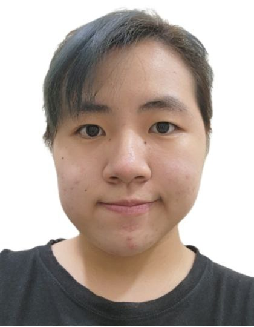
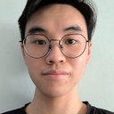
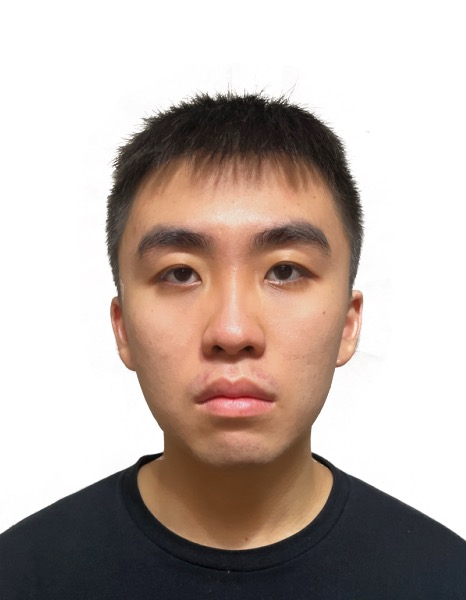
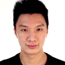

We are a team based in the [School of Computing, National University of Singapore](http://www.comp.nus.edu.sg).

You can reach us at the email `seer[at]comp.nus.edu.sg`

## Project team

### Joel Foo

[[homepage](http://www.comp.nus.edu.sg/~damithch)]
[[github](https://github.com/joel-foo)]
[[portfolio](team/johndoe.md)]

* Role: Team Lead

### Tan Teck Fang

[[github](http://github.com/tanteckfang)]
[[portfolio](team/johndoe.md)]

* Role: Documentation
* Responsibilities: Quality of various project documents

### Leon Tan

[[github](http://github.com/leontan2)] [[portfolio](team/johndoe.md)]

* Role: Code Quality
* Responsibilities: Looks after code quality, ensures adherence to coding standards, etc.

### Chew Jing Heng

[[github](http://github.com/chewjh1234)]
[[portfolio](team/johndoe.md)]

* Role: Deliverables and deadlines
* Responsibilities: Ensure project deliverables are done on time and in the right format

### Carlin Tan

[[github](http://github.com/carlintyj)]
[[portfolio](team/johndoe.md)]

* Role: Tool ABC
* Responsibilities: Helps other team member with matters related to tool ABC
