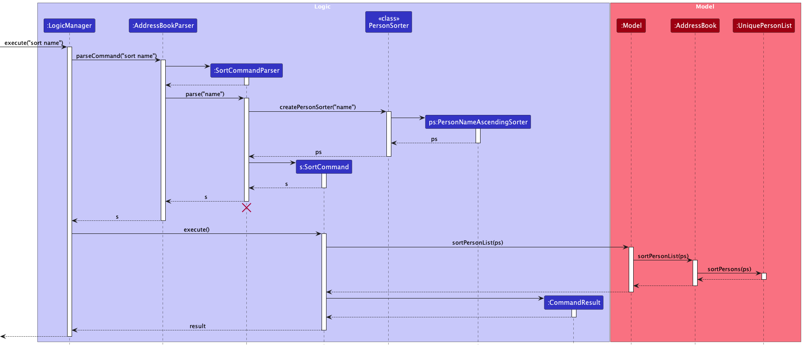
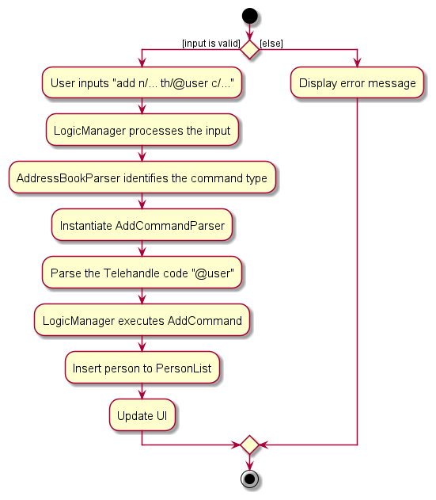

### Table of Contents

* Table of Contents
{:toc}

--------------------------------------------------------------------------------------------------------------------

## **1. Acknowledgements**

* The foundational code was derived from [Addressbook-level3](https://se-education.org/addressbook-level3/)

--------------------------------------------------------------------------------------------------------------------

## **2. Setting up, getting started**

Refer to the guide [_Setting up and getting started_](SettingUp.md).

--------------------------------------------------------------------------------------------------------------------

## **3. Design**

:bulb: **Tip:** The `.puml` files used to create diagrams in this document `docs/diagrams` folder. Refer to the [_PlantUML Tutorial_ at se-edu/guides](https://se-education.org/guides/tutorials/plantUml.html) to learn how to create and edit diagrams.

### 3.1 Architecture

The ***Architecture Diagram*** given above explains the high-level design of the App.

Given below is a quick overview of main components and how they interact with each other.

**Main components of the architecture**

**`Main`** (consisting of classes [`Main`](https://github.com/AY2324S1-CS2103T-T17-4/tp/blob/master/src/main/java/seedu/address/Main.java) and [`MainApp`](https://github.com/AY2324S1-CS2103T-T17-4/tp/blob/master/src/main/java/seedu/address/MainApp.java)) is in charge of the app launch and shut down.
* At app launch, it initializes the other components in the correct sequence, and connects them up with each other.
* At shut down, it shuts down the other components and invokes cleanup methods where necessary.

The bulk of the app's work is done by the following four components:

* [**`UI`**](#ui-component): The UI of the App.
* [**`Logic`**](#logic-component): The command executor.
* [**`Model`**](#model-component): Holds the data of the App in memory.
* [**`Storage`**](#storage-component): Reads data from, and writes data to, the hard disk.

[**`Commons`**](#common-classes) represents a collection of classes used by multiple other components.

**How the architecture components interact with each other**

The *Sequence Diagram* below shows how the components interact with each other for the scenario where the user issues the command `delete 1`.

Each of the four main components (also shown in the diagram above),

* defines its *API* in an `interface` with the same name as the Component.
* implements its functionality using a concrete `{Component Name}Manager` class (which follows the corresponding API `interface` mentioned in the previous point.

For example, the `Logic` component defines its API in the `Logic.java` interface and implements its functionality using the `LogicManager.java` class which follows the `Logic` interface. Other components interact with a given component through its interface rather than the concrete class (reason: to prevent outside component's being coupled to the implementation of a component), as illustrated in the (partial) class diagram below.

The sections below give more details of each component.

### 3.2 UI component

The **API** of this component is specified in [`Ui.java`](https://github.com/AY2324S1-CS2103T-T17-4/tp/blob/master/src/main/java/seedu/address/ui/Ui.java)

The UI consists of a `MainWindow` that is made up of parts e.g.`CommandBox`, `ResultDisplay`, `PersonListPanel`, `StatusBarFooter` etc. All these, including the `MainWindow`, inherit from the abstract `UiPart` class which captures the commonalities between classes that represent parts of the visible GUI.

The `UI` component uses the JavaFx UI framework. The layout of these UI parts are defined in matching `.fxml` files that are in the `src/main/resources/view` folder. For example, the layout of the [`MainWindow`](https://github.com/AY2324S1-CS2103T-T17-4/tp/blob/master/src/main/java/seedu/address/ui/MainWindow.java) is specified in [`MainWindow.fxml`](https://github.com/AY2324S1-CS2103T-T17-4/tp/blob/master/src/main/resources/view/MainWindow.fxml)

The `UI` component,

* executes user commands using the `Logic` component.
* listens for changes to `Model` data so that the UI can be updated with the modified data.
* keeps a reference to the `Logic` component, because the `UI` relies on the `Logic` to execute commands.
* depends on some classes in the `Model` component, as it displays `Person` object residing in the `Model`.

### 3.3 Logic component

**API** : [`Logic.java`](https://github.com/AY2324S1-CS2103T-T17-4/tp/blob/master/src/main/java/seedu/address/logic/Logic.java)

Here's a (partial) class diagram of the `Logic` component:

The sequence diagram below illustrates the interactions within the `Logic` component, taking `execute("delete 1")` API call as an example.

:information_source: **Note:** The lifeline for `DeleteCommandParser` should end at the destroy marker (X) but due to a limitation of PlantUML, the lifeline reaches the end of diagram.

How the `Logic` component works:

1. When `Logic` is called upon to execute a command, it is passed to an `AddressBookParser` object which in turn creates a parser that matches the command (e.g., `DeleteCommandParser`) and uses it to parse the command.
1. This results in a `Command` object (more precisely, an object of one of its subclasses e.g., `DeleteCommand`) which is executed by the `LogicManager`.
1. The command can communicate with the `Model` when it is executed (e.g. to delete a person).
1. The result of the command execution is encapsulated as a `CommandResult` object which is returned back from `Logic`.

Here are the other classes in `Logic` (omitted from the class diagram above) that are used for parsing a user command:

How the parsing works:
* When called upon to parse a user command, the `AddressBookParser` class creates an `XYZCommandParser` (`XYZ` is a placeholder for the specific command name e.g., `AddCommandParser`) which uses the other classes shown above to parse the user command and create a `XYZCommand` object (e.g., `AddCommand`) which the `AddressBookParser` returns back as a `Command` object.
* All `XYZCommandParser` classes (e.g., `AddCommandParser`, `DeleteCommandParser`, ...) inherit from the `Parser` interface so that they can be treated similarly where possible e.g, during testing.

### 3.4 Model component
**API** : [`Model.java`](https://github.com/AY2324S1-CS2103T-T17-4/tp/blob/master/src/main/java/seedu/address/model/Model.java)

The `Model` component,

* stores the address book data i.e., all `Person` objects (which are contained in a `UniquePersonList` object).
* stores the currently 'selected' `Person` objects (e.g., results of a search query) as a separate _filtered_ list which is exposed to outsiders as an unmodifiable `ObservableList<Person>` that can be 'observed' e.g. the UI can be bound to this list so that the UI automatically updates when the data in the list change.
* stores a `UserPref` object that represents the user’s preferences. This is exposed to the outside as a `ReadOnlyUserPref` objects.
* does not depend on any of the other three components (as the `Model` represents data entities of the domain, they should make sense on their own without depending on other components)

:information_source: **Note:** An alternative (arguably, a more OOP) model is given below. It has a `Tag` list in the `AddressBook`, which `Person` references. This allows `AddressBook` to only require one `Tag` object per unique tag, instead of each `Person` needing their own `Tag` objects. 

### 3.5 Storage component

**API** : [`Storage.java`](https://github.com/AY2324S1-CS2103T-T17-4/tp/blob/master/src/main/java/seedu/address/storage/Storage.java)

The `Storage` component,
* can save both address book data and user preference data in JSON format, and read them back into corresponding objects.
* inherits from both `AddressBookStorage` and `UserPrefStorage`, which means it can be treated as either one (if only the functionality of only one is needed).
* depends on some classes in the `Model` component (because the `Storage` component's job is to save/retrieve objects that belong to the `Model`)

### 3.6 Common classes

Classes used by multiple components are in the `seedu.addressbook.commons` package.

--------------------------------------------------------------------------------------------------------------------

## **4. Implementation**

This section describes some noteworthy details on how certain features are implemented.

### 4.1 Add Course feature

#### 4.1.1 Implementation
The add course mechanism is facilitated by `AddCommand`. It extends `Command` which overrides the following operation:
* `AddCommand#execute():` Adds a person into the AddressBook

Given below is an example usage scenario and how the add mechanism behaves at each step.

Step 1. The user will input the add command along with the person's name and the course that the person is taking.

Step 2. When `Logic` is called upon to execute the command, it will pass it to an `AddressBookParser` object which will call `parseCommand()` which creates a parser `AddCommandParser` and uses it to parse the command.

Step 3. This results in a `AddCommand` object which is executed by the `LogicManager`.

Step 4. The command will communicate with the `Model` to add a person with the inputted course. The course will be indicated by the `c/` prefix. 

Step 5. Upon success, the result of the command execution is encapsulated as a CommandResult object which is returned back from `Logic`.

The following sequence diagram shows how the add operation works:

:information_source: **Note:** The lifeline for `AddCommandParser` should end at the destroy marker (X) but due to a limitation of PlantUML, the lifeline reaches the end of diagram.

The following activity diagram shows how the add operation works:

#### 4.1.2 Design considerations:
**Aspect: Adding Courses to PersonList**
* **Alternative 1:** Create a new command specifically for adding courses to person records (e.g., "AddCourseCommand"). 
  * Pros: Offers a clear separation of concerns and commands, potentially reducing complexity. 
  * Cons: Introduces an additional command class, which might require extra development time.
* **Alternative 2 (current choice):** Reuse the existing "AddCommand" by adding a 'c/' prefix to specify course addition. 
  * Pros: Minimizes the need for creating new command classes, thus reducing code duplication. 
  * Cons: Slightly alters the behavior of the existing "AddCommand," which may increase complexity and potentially confuse users.

### 4.2 Edit feature

#### 4.2.1 Implementation

The edit person mechanism is facilitated by `EditCommand` and `EditCommandParser`.

Given below is an example usage scenario and how the edit behaves at each step.

Step 1. An existing user launches the application and the second person listed in his address book is John, and one of the courses he has is `MA2001`.

Step 2. The user executes `edit 2 c/MA2001-MA1521` command to edit the second person's MA2001 course to MA1521 in the address book. The `edit` command calls `LogicManager#execute()`. An `EditCommandParser` object is then created, and `EditCommandParser#parse` method is called on the object. `EditCommandParser#parse` makes sense of the arguments supplied by the user, where the types of arguments are distinguished by their prefixes.

Step 3: If there are course modifications present, as indicated by the presence of `c/` prefixes, the following methods will be called in order: `CourseAddition#isValidCourseAddition`, `CourseDeletion#isValidCourseDeletion`, `CourseEdit#isValidCourseEdit`. If any of these methods return true, the remaining method(s) following it will not be called. The purpose of this step is to check the signature of the sub-prefixes, ensuring they are in the correct format so they can be correctly parsed to their appropriate type. The order in which these methods are called must be adhered to, as one of the regex pattern matchers is a superset of the others.  

Step 4: The `EditCommand` is created, and then executed by `EditCommand#execute`.

Step 5: `EditCommand#execute` calls the following methods from `Model`:
* `Model#hasPerson(editedPerson)` which checks if the address book contains a duplicate person (a person with the same name).
* `Model#setPerson(personToEdit, editedPerson)` replaces `personToEdit` with `editPerson`
* `Model#updateFilteredPersonList(predicate)` updates the address book list with the edited person.

Step 6: `EditCommand#execute` returns a `CommandResult` to `LogicManager`.

The following sequence diagram shows how the edit operation works:

The following activity diagram sheds more light on how exactly the chain of edit operations work:

Here are some more notes for the activity diagram above:
* When parsing the list of course modifications, if any of the specified course are invalid (see earlier definition of what is considered a 'valid' course), then the end node is taken immediately.
* If the end node is taken before all courses in the list that the user passed, then no course modifications present earlier in the list will be performed at all, even if they are valid. 

#### 4.2.2 Design considerations:

**Aspect: Performing course edits**

* **Alternative 1 (current choice):** Retain the current c/ prefix in the edit command, but create additional sub-prefixes (i.e. c/add-, c/del-) after the c/ prefix.
    * Pros: A common edit interface which enables all types of course modifications to be executed all at once makes this a flexible and user-friendly solution. 
    * Cons: We must ensure that the implementation of each type of modification is correct, and ensure the changes are performed in the correct (listed) order.

* **Alternative 2:** Create a command for each type of modification, i.e. "addcourse" or "deletecourse".
    * Cons: Greatly reduced flexibility. Does not allow different types of modifications to be executed together at once, as each command can only handle one specific type of modification. There is also a lot more overhead, as three entirely new commands will have to be created, which leads to an arguably more bloated codebase.

### 4.3 Find Course feature

#### 4.3.1 Implementation  

The findcourse feature is facilitated by the FindCourseCommand class, which leverages a CourseContainsKeywordsPredicate object. This predicate object is responsible for checking if a person's course contains the specified keyword.
The following operations are central to this feature:

* `FindCourseCommand#execute(Model model)` —  Executes the command, updating the filtered person list in the model based on the criteria in the predicate.
* `CourseContainsKeywordsPredicate#test(Person person)` — Checks if the person's course matches the keyword criteria.

Given below is an example usage scenario and how the findcourse mechanism behaves at each step.

Step 1. The user wants to filter the list of persons to show only those enrolled in the course "MA2001". They execute the command "findcourse MA2001".

Step 2. The LogicManager receives this command string and passes it to the AddressBookParser.

Step 3. The AddressBookParser identifies the type of command and invokes the FindCourseCommandParser to parse the course keyword.

Step 4. The FindCourseCommandParser creates a CourseContainsKeywordsPredicate object with the keyword "MA2001" and then creates a FindCourseCommand object with this predicate.

Step 5. The FindCourseCommand is executed, and it uses the predicate to filter the list of persons in the model. The filtered list in the model is updated to only show persons enrolled in "MA2001".

Step 6. The result, which is the number of persons listed, is then shown to the user.

The following sequence diagram shows how the findcourse operation works:

:information_source: **Note:** The lifeline for FindCourseCommandParser should end at the destroy marker (X) but due to a limitation of PlantUML, the lifeline reaches the end of diagram.

The following activity diagram summarizes what happens when a user executes a new command:

#### 4.3.2 Design considerations:

**Aspect: How filter is done:**

* **Alternative 1 (current choice):** Use a predicate object (CourseContainsKeywordsPredicate) to handle filtering.
    * Pros: Modular approach. Easy to extend with more search features in the future. Decouples filtering logic from the command itself.
    * Cons: Might be over-engineered if no other search features are planned.

* **Alternative 2:** Implement filtering logic directly within the FindCourseCommand.
    * Pros: Simpler without the need for additional objects or classes.
    * Cons: Makes the command class more complex. Harder to extend with more search features in the future.

**Aspect: Case-sensitivity in search:**

* **Alternative 1 (current choice):** Case-insensitive search.
    * Pros: Offers flexibility and a better user experience. Users don't need to worry about the exact casing of course module IDs.
    * Cons: Might yield results that the user wasn't expecting if there are course module IDs with varied casing.

* **Alternative 2:** Case-sensitive search.
    * Pros: Precise search results based on exact casing.
    * Cons: Less flexible. Users need to input the exact casing of course module IDs.

### 4.4 Find Student feature

#### 4.4.1 Implementation
{Explain here how the feature will be implemented}

#### 4.4.2 Design considerations:
{Explain here how the feature will be implemented}

### 4.5 Sort feature

#### 4.5.1 Implementation
The sort feature sorts the students in the `UniquePersonList` object in `AddressBook` according to a specified sorting criterion.

The sorting mechanism is facilitated by `SortCommandParser` and `SortCommand`. The latter extends the existing `Command` class and overrides the following method: 
* `Command#execute()`: Executes the command and returns the result message 

After the user specifies the sorting criterion, the corresponding subclass of `PersonSorter` will be instantiated. There are different `PersonSorter` objects that each sorts the AddressBook differently. The `PersonSorter` object, which implements the Comparable interface, directly sorts the `UniquePersonList` object in `AddressBook`.

Format: `sort CRITERION`

There are 3 ways to sort the students in the address book:

1. **Sort by Name**
    - Function: Sorts students by name lexicographically
    - Criterion: name, name-ascending, name-descending
    - Example usage: `sort name-ascending`

2. **Sort by Course size**
    - Function: Sorts students by the number of courses taken
    - Criterion: course, course size-ascending, course size-descending
    - Example usage: `sort course size-ascending`

3. **Sort by Tags**
    - Function: Sorts students by their tags
    - Criterion: tags
    - Example usage: `sort tags`

Given below is an example usage scenario and how the sort mechanism behaves at each step.

Step 1. The user launches the application. The `AddressBook` will be initialized with the initial address book state.

Step 2. The user executes `sort name` command to sort the contacts in the address book by name (in lexicographic order). New `SortCommand` and `PersonNameAscendingSorter` objects are created.

Step 3. The `SortCommand` object will call `Model#sortPersonList()`, which will then call `#AddressBook.sortPersonList()` with the newly created `PersonNameAscendingSorter` object as well.

Step 4. Finally, `UniquePersonList#sortPersons` is called with the `PersonNameAscendingSorter` object and the students in the list will be sorted by the comparator.

The following UML Sequence diagram shows what happens when `sort name` is entered as an input. 

The following UML Activity diagram shows the workflow of sorting students in the address book:

#### 4.5.2 Design considerations:

Aspect: How the sorted list should be stored.

**Alternative 1 (current choice):** Sort the `UniquePersonList` object directly. This means that the original list will be modified as it is sorted. The resulting list is stored locally.

* Pros: Since the resulting list is stored locally, the user's preference is saved because he is able to see the same sorted list the next time he opens the application
* Pros: Smaller memory usage because there is no need to store copies of the lists are stored

* Cons: Potentially slower because the list is modified locally

**Alternative 2:** Make a copy of the original list for sorting before saving it.

* Pros: Original list is recoverable in case of an error
* Cons: More memory required to store copies of the original and sorted list
* Cons: Less efficient as it takes time to copy the list
* Cons: Prone to errors that may arise from the copying stage, as the list to be copied from and the list to be copied to will always change.

Ultimately, Alternative 1 is chosen over Alternative 2. Since the application is being used frequently, the user's preference should be saved so that he does not need to run the sort command again to see a sorted list.  
Moreover, there are checks and error handling to ensure that the `PersonSorter` objects are able to sort the list correctly.

### 4.6 List feature

#### 4.6.1 Implementation
{Explain here how the feature will be implemented}

#### 4.6.2 Design considerations:
{Explain here how the feature will be implemented}

### 4.7 Tag feature

#### 4.7.1 Implementation

The Tag feature is facilitated by the `Tag` class, which contains an attribute `TagType` to determine the type of tag. The creation and validation of tags are significantly associated with the `TagUtil` class.

* `TagUtil#canAddOrEditEmergencyTag(Person toAdd, List<Person> currentPersonList)` — Determines if a new "Emergency" tag can be added or edited based on existing contacts with the "Emergency" tag.
* `Tag#isEmergencyTag()` — Checks if a tag is of the type "Emergency".

Given below is an example usage scenario and how the Tag mechanism behaves at each step.

Step 1. The user wishes to add a new contact with a tag "Emergency". They execute the `add` command: add n/John Doe p/98765432 t/Emergency.

Step 2. The `LogicManager` receives this command string and passes it to the `AddressBookParser`.

Step 3. The `AddressBookParser` identifies the type of command and invokes the relevant parser, in this case, `AddCommandParser`, to process the command details.

Step 4. The `AddCommandParser` processes the input, and if a tag is provided, a new `Tag` object is created.

Step 5. Before the `Person` object is created, the `TagUtil#canAddOrEditEmergencyTag` method is called to ensure not more than two contacts have the "Emergency" tag.

Step 6. If the validation is successful, a new `Person` object is created with the provided details, including the tag, and added to the model. Otherwise, a CommandException is thrown, notifying the user of the error.

Step 7. The result, a successful addition or an error message, is displayed to the user.

The following class diagram shows the overview of the Tag mechanism.

The following sequence diagram shows how the Tag operation works by calling the add Command:

:information_source: **Note:** The lifeline for `AddCommandParser` should end at the destroy marker (X) but due to a limitation of PlantUML, the lifeline reaches the end of diagram.

"The following activity diagram summarizes what happens when a user executes a new 'add' command; the 'edit' command will be similar:

#### 4.7.2 Design considerations:

**Aspect: Validation of the "Emergency" tag count:**

* **Alternative 1 (current choice):** Use a utility class (`TagUtil`) to check the constraints.
    * Pros: Modular approach. Decouples the tag validation logic from the command classes. Easier to maintain and extend if more constraints are introduced in the future.
    * Cons: Another layer of abstraction. Might be an overkill if no other tag constraints are planned.

* **Alternative 2:** Implement the validation logic within the `AddCommand` class.
    * Pros: Simpler approach without additional utility classes. Direct handling within the main command.
    * Cons: Makes the command class more complicated. Difficult to maintain and extend if more constraints on tags are added in the future.

**Aspect: Extensibility of tags:**

* **Alternative 1 (current choice):** Use an enumeration (TagType) to define types of tags.
    * Pros: Clean and organized. Easy to add more types of tags in the future. Validation can be done based on enum values.
    * Cons: Might be restrictive if dynamic creation of new tag types is required in the future.

* **Alternative 2:** Store tag types as strings without an enumeration.
    * Pros: Dynamic creation of new tag types without changing the code.
    * Cons: Difficult to validate and handle specific tag types. Potential for typos and inconsistencies.

**Aspect:  Types and Limitations of Tags:**

* **Alternative 1 (current choice):** Limit the system to three specific types of tags.
    * Pros: Ensures that the tags used are relevant to the application's main purpose, which is to manage coursemates' contact information.
    * Pros: Simplifies the interface and experience for the user, ensuring consistency.
    * Pros: Reduces clutter and potential misuse by preventing users from adding arbitrary tags
    * Cons: Users might find it restrictive if they wish to add more customized tags for further categorization.
    * Cons: Possible need for future extensions or adjustments if more relevant tag categories emerge.

* **Alternative 2:** Allow users to add any type of tags.
    * Pros: Provides flexibility for users to categorize their contacts as they see fit.
    * Pros: Avoids potential limitations, giving room for diverse usage scenarios.
    * Cons: Might deviate from the main purpose of the application, leading to inconsistent use.
    * Cons: Users might add unrelated or inappropriate tags, leading to clutter.

### 4.8 Telehandle feature
    
#### 4.8.1 Implementation

The Telehandle mechanism is facilitated by the `Telehandle` and `AddCommand` classes.

Given below is an example usage scenario and how the `Telehandle` mechanism behaves at each step.

Step 1. The user wishes to add a new contact with their desired `Telehandle`. They execute the `add` command: add n/John Doe p/98765432 th/@johnndoee.

Step 2. The `LogicManager` receives this command string and passes it to the `AddressBookParser`.

Step 3. The `AddressBookParser` identifies the type of command and invokes the relevant parser, in this case, `AddCommandParser`, to process the command details.

Step 4. The `AddCommandParser` processes the input, and if a `Telehandle` is provided, a new `Telehandle` object is created, else an empty `Telehandle` would be created instead.

Step 5. Before the `Person` object is created, the `Telehandle#isValidTelehandle` method is called to check on the validity of the `Telehandle` according to the input contraints.

Step 6. If a valid `Telehandle` is provided, a new `Person` object is created with the telehandle and added to the model. Otherwise, a CommandException is thrown, notifying the user of the error.

Step 7. The result, a successful addition or an error message, is displayed to the user.

The following sequence diagram shows how the `Telehandle` works through the `AddCommand`:

The following activity diagram summarizes what happens when a user executes the `Add` command with a valid `Telehandle`:

#### 4.8.2 Design considerations:

**Aspect: Input constraints in `Telehandle`:**

* **Alternative 1 (current choice):** Requiring an @ sign in front of all `Telehandle` fields.
    * Pros: Increased clarity. The "@" sign provides a clear visual cue that the input is a `Telehandle`, helping users distinguish it from other fields such as `Address`.
    * Cons: Requiring an "@" sign may be unusual for users who are not familiar with social media or who have not encountered this format before. This requirement may feel counterintuitive to some.

* **Alternative 2:** Not requiring an @ sign in front of all `Telehandle` fields.
    * Pros: Offers flexibility and a better user experience. 
    * Cons: `Telehandle` fields that rely solely on user input may not differ significantly from other types of 
      user-provided data such as `Address` and `Email`. This may cause confusion to the users when viewing the details

### 4.9 Feedback feature

#### 4.9.1 Implementation

The Feedback mechanism is facilitated by `FeedbackCommand`.

Given below is an example usage scenario and how the Feedback mechanism works at each step.

Step 1. The user wishes to send a feedback in regard to the app. They execute the `feedback` command: feedback

Step 2. The `LogicManager` receives this command string and passes it to the `AddressBookParser`.

Step 3. The `AddressBookParser` identifies the type of command and invokes the relevant command, in this case, 
`FeedbackCommand`.

Step 4. The result of the command execution is encapsulated as a `CommandResult` object which is returned back from `Logic`.

Step 5. The success message is displayed to the user.

Step 6. The `Ui` updates and the `Feedback` popup window appears.

The following sequence diagram shows how the `Feedback` operation works:

The following activity diagram summarizes what happens when a user executes the `Feedback` command:

#### 4.9.2 Design considerations:

**Aspect:  Storage medium for the logging of feedback received**

* **Alternative 1 (current choice):** Use Google forms to store feedback of the users.
    * Pros: Google Forms are quick and easy to set up. No need for extensive development efforts.
    * Pros: Google Forms are user-friendly, making it simple for app users to submit feedback without any technical knowledge or app-specific requirements.
    * Pros: Data Organization. Google Forms automatically organize and store feedback responses in a Google Sheets 
      spreadsheet, making it convenient for review and analysis.

    * Cons: Data Security. Storing feedback data on external platforms like Google Forms introduces security and privacy concerns.

* **Alternative 2:** Link to an online forum where users can post feedback.
    * Pros: Peer Support. In addition to providing feedback, users can help each other by sharing solutions to 
      common issues.
  
    * Cons: Lack of Control. There would be lesser control over the structure and organization of feedback compared to a 
      dedicated feedback form.

--------------------------------------------------------------------------------------------------------------------

## **5. Documentation, logging, testing, configuration, dev-ops**

* [Documentation guide](Documentation.md)
* [Testing guide](Testing.md)
* [Logging guide](Logging.md)
* [Configuration guide](Configuration.md)
* [DevOps guide](DevOps.md)

--------------------------------------------------------------------------------------------------------------------

## **Appendix A: Requirements**

### A.1 Product scope

**Target user profile**:

* is a NUS School of Computing (SoC) student
* takes a number of courses in NUS
* has a need to manage a significant number of contacts
* prefer desktop apps over other types
* can type fast
* prefers typing to mouse interactions
* is reasonably comfortable using CLI apps

**Value proposition**: 

Students in SoC often face the challenge of identifying classmates who share their course schedules. NUSCourseMates is designed to alleviate this difficulty by helping them connect with peers who are taking the same courses, which can be a particularly valuable resource when assessments involve group work.

### A.2 User stories

Priorities: High (must have) - `* * *`, Medium (nice to have) - `* *`, Low (unlikely to have) - `*`

| Priority | As a …​                               | I want to …​                                                                                | So that I can…​                                                                              |
|----------|---------------------------------------|---------------------------------------------------------------------------------------------|----------------------------------------------------------------------------------------------|
| `* * *`  | SoC Student                           | add/create a student and the courses they take                                              | save their details in my address book                                                        |
| `* * *`  | Forgetful SoC student                 | have a one-stop place to view all the courses my friends are taking this semester           | try to go to class with them together                                                        |
 | `* * *`  | Organised SoC student                 | delete a contact in my address book                                                         | keep my address book clutter-free from the people I am no longer friends with                | 
 | `* * *`  | Novice with limited knowledge of CLI  | easily handle the various commands                                                          | smoothly navigate the address book                                                           | 
 | `* * *`  | First-time user of the app            | easily handle the various commands                                                          | smoothly navigate the address book                                                           |
 | `* * *`  | SoC Student                           | add contact details (telehandle, phone number) of student into the student's profile        | contact the student in another way                                                           |
 | `* * `   | Blur SoC student                      | read the user guide                                                                         | learn to use the application.                                                                |
 | `* * `   | Unorganised SoC student               | sort the courses by alphabetical order                                                      | find a specific course easily                                                                | 
 | `* * `   | SoC Student                           | sort my friends by alphabetical order                                                       | find a specific friend easily                                                                |
 | `* * `   | Unorganised SoC student               | filter the address book by course                                                           | find and track other students taking the same course as me                                   |
 | `* * `   | SoC Student                           | leave some data fields blank when adding a friend                                           | add my friend even if I do not have all their personal details                               | 
 | `* * `   | Overwhelmed SoC student               | view the contact details of a student                                                       | contact them via their email or phone anytime if required                                    | 
 | `* * `   | SoC Student                           | add the detail of my friend's tutorials                                                     | know which tutorial they choose                                                              |
 | `* * `   | SoC Student                           | remove friend from my friend's list                                                         | keep my address book's contact list relevant                                                 |
 | `* * `   | SoC Student                           | tag the course according to the semester in which it was taken                              | differentiate between friends who are taking the course now and in the past                  |
 | `* * `   | Careless SoC Student                  | undo commands I made                                                                        | have a better user experience                                                                |
 | `* * `   | SoC student with a huge social circle | view the total number of users in the address book                                          | have a good idea of how many users are in the address book                                   | 
 | `* * `   | SoC Student                           | give feedback to the developers                                                             | feedback any bugs or problems I faced while using the app                                    | 
 | `* `     | Confused SoC student                  | look at the common FAQs in the settings page                                                | get a better understanding of some of the features of the app to use the app more seamlessly | 
 | `* `     | SoC Student                           | add email address of students                                                               | easily access the email address of the student                                               | 
 | `* `     | SoC Student                           | edit the background of my address book                                                      | make my address book looks nicer and personalized                                            | 
 | `* `     | SoC Student                           | separate friends list from close friends list                                               | prioritize which class to take                                                               | 
 | `* `     | SoC Student                           | see my close friends' courses displayed first before other friends' courses                 | easily see which are the classes I should take                                               | 
 | `* `     | SoC Student                           | check the history of what contacts have been added                                          | make amendments to the contact list easily                                                   | 
 | `* `     | SoC Student with poor vision          | Edit the font size of my address book                                                       | see clearer                                                                                  | 
 | `* `     | SoC Student                           | change the theme of the app                                                                 | customize between dark and light themes                                                      | 
 | `* `     | SoC student with disability           | use the app seamlessly                                                                      | get to enjoy using this app too!                                                             | 
 | `* `     | Lazy SoC Student                      | get recommendations about what course(s) I should take without doing any computation myself | know which classes to take at one glance                                                     | 
 | `* `     | SoC Student                           | set my friend as an emergency contact                                                       | call the person if I face any serious issue                                                  |
 | `* `     | SoC Student                           | set a profile picture for my address book                                                   | personalize the address book                                                                 | 

*{More to be added}*

### A.3 Use cases

(For all use cases below, the **System** is the `AddressBook` and the **Actor** is the `user`, unless specified otherwise)

**Use Case: UC01 - Accessing the Help Page**

**MSS**

1. User enters the command help
2. AddressBook displays a message with a link to the help page

   Use case ends.

**Use Case: UC02 - Adding a Student**

**MSS**

1. User enters a valid add command with student information
2. AddressBook adds the person

    Use case ends.

**Extensions**

* 2a. User enters an invalid command format.
  * 2a1. AddressBook shows an error message.

**Use Case: UC03 - Deleting a Student**

1. User requests to list persons
2. AddressBook shows a list of persons
3. User requests to delete a specific person in the list
4. AddressBook deletes the person

    Use case ends.

**Extensions**

* 2a. The list is empty.

    Use case ends.

* 3a. The given index is invalid.
    * 3a1. AddressBook shows an error message.

    Use case resumes at step 2.

**Use Case: UC04 - Editing a Student**

**MSS**

1. User requests to list persons
2. AddressBook shows a list of persons
3. User requests to edit a specific person in the list
4. AddressBook edits the person

**Extensions**

* 2a. The list is empty.

  Use case ends.

* 3a. The given index is invalid.
    * 3a1. AddressBook shows an error message.

  Use case resumes at step 2.

**Use Case: UC05 - Locating Students by Name**

**MSS**

1. User enters a valid findstudent command with one or more keywords.
2. AddressBook displays a list of matching students with their details.

**Extensions**

* 1a. The list is empty.

  Use case ends.

* 1b. The given index is invalid.
    * 1b1. AddressBook shows an error message.

**Use Case: UC06 - Locating Students by Course**

**MSS**

1. User enters a valid findcourse command with one or more keywords.
2. AddressBook displays a list of matching students with their details.

**Extensions**

* 1a. The list is empty.

  Use case ends.

* 1b. The given index is invalid.
    * 1b1. AddressBook shows an error message.

**Use Case: UC07 - Clearing All Entries**

**MSS**

1. User enters the clear command.
2. AddresBook clears all entries from the address book.

**Extensions**

* 1a. The given command is invalid.
    * 1a1. AddressBook shows an error message.

**Use Case: UC08 - Listing All Students**

**MSS**

1. User enters the list command.
2. AddressBook displays a list of all students in the address book along with their details.

**Extensions**

* 1a. The list is empty.

  Use case ends.

* 1b. The given command is invalid.
    * 1b1. AddressBook shows an error message.

**Use Case: UC09 - Exiting the Program**

**MSS**

1. User enters the exit command.
2. AddressBook exits the program.

**Extensions**

* 1a. The given command is invalid.
    * 1a1. AddressBook shows an error message.

### A.4 Non-Functional Requirements

1.  Should work on any _mainstream OS_ as long as it has Java `11` or above installed.
2.  Should be able to hold up to 1000 students without a noticeable sluggishness in performance for typical usage.
3.  A user with above average typing speed for regular English text (i.e. not code, not system admin commands) should be able to accomplish most of the tasks faster using commands than using the mouse.
4.  The application should load within 30 seconds upon initiation on a standard modern-day PC.
5. The installed application should occupy no more than 100MB of disk space on the user's computer.
*{More to be added}*

### A.5 Glossary

* **SoC**: School of Computing, the computing faculty in National University of Singapore (NUS)
* **Mainstream OS**: Windows, Linux, Unix, OS-X
* **Private contact detail**: A contact detail that is not meant to be shared with others

--------------------------------------------------------------------------------------------------------------------

## **Appendix B: Instructions for manual testing**

Given below are instructions to test the app manually.

:information_source: **Note:** These instructions only provide a starting point for testers to work on;
testers are expected to do more *exploratory* testing.

### B.1 Launch and shutdown

1. Initial launch

   1. Download the jar file and copy into an empty folder

   1. Double-click the jar file Expected: Shows the GUI with a set of sample contacts. The window size may not be optimum.

1. Saving window preferences

   1. Resize the window to an optimum size. Move the window to a different location. Close the window.

   1. Re-launch the app by double-clicking the jar file. 
       Expected: The most recent window size and location is retained.

1. _{ more test cases …​ }_

### B.2 Deleting a person

1. Deleting a person while all persons are being shown

   1. Prerequisites: List all persons using the `list` command. Multiple persons in the list.

   1. Test case: `delete 1` 
      Expected: First contact is deleted from the list. Details of the deleted contact shown in the status message. Timestamp in the status bar is updated.

   1. Test case: `delete 0` 
      Expected: No person is deleted. Error details shown in the status message. Status bar remains the same.

   1. Other incorrect delete commands to try: `delete`, `delete x`, `...` (where x is larger than the list size) 
      Expected: Similar to previous.

1. _{ more test cases …​ }_

### B.3 Saving data

1. Dealing with missing/corrupted data files

   1. _{explain how to simulate a missing/corrupted file, and the expected behavior}_

1. _{ more test cases …​ }_
