### Table of Contents

* Table of Contents
{:toc}

--------------------------------------------------------------------------------------------------------------------

## **1. Acknowledgements**

* The foundational code was derived from [Addressbook-level3](https://se-education.org/addressbook-level3/)
* We also reused code from StackOverflow for [case-insensitive sorting](https://stackoverflow.com/a/57278437).

--------------------------------------------------------------------------------------------------------------------

## **2. Setting up, getting started**

Refer to the guide [_Setting up and getting started_](SettingUp.md).

--------------------------------------------------------------------------------------------------------------------

## **3. Design**

:bulb: **Tip:** The `.puml` files used to create diagrams in this document `docs/diagrams` folder. Refer to the [_PlantUML Tutorial_ at se-edu/guides](https://se-education.org/guides/tutorials/plantUml.html) to learn how to create and edit diagrams.

### 3.1 Architecture

The ***Architecture Diagram*** given above explains the high-level design of the App.

Given below is a quick overview of main components and how they interact with each other.

**Main components of the architecture**

**`Main`** (consisting of classes [`Main`](https://github.com/AY2324S1-CS2103T-T17-4/tp/blob/master/src/main/java/seedu/address/Main.java) and [`MainApp`](https://github.com/AY2324S1-CS2103T-T17-4/tp/blob/master/src/main/java/seedu/address/MainApp.java)) is in charge of the app launch and shut down.
* At app launch, it initializes the other components in the correct sequence, and connects them up with each other.
* At shut down, it shuts down the other components and invokes cleanup methods where necessary.

The bulk of the app's work is done by the following four components:

* [**`UI`**](#ui-component): The UI of the App.
* [**`Logic`**](#logic-component): The command executor.
* [**`Model`**](#model-component): Holds the data of the App in memory.
* [**`Storage`**](#storage-component): Reads data from, and writes data to, the hard disk.

[**`Commons`**](#common-classes) represents a collection of classes used by multiple other components.

**How the architecture components interact with each other**

The *Sequence Diagram* below shows how the components interact with each other for the scenario where the user issues the command `delete 1`.

Each of the four main components (also shown in the diagram above),

* defines its *API* in an `interface` with the same name as the Component.
* implements its functionality using a concrete `{Component Name}Manager` class (which follows the corresponding API `interface` mentioned in the previous point.

For example, the `Logic` component defines its API in the `Logic.java` interface and implements its functionality using the `LogicManager.java` class which follows the `Logic` interface. Other components interact with a given component through its interface rather than the concrete class (reason: to prevent outside component's being coupled to the implementation of a component), as illustrated in the (partial) class diagram below.

The sections below give more details of each component.

### 3.2 UI component

The **API** of this component is specified in [`Ui.java`](https://github.com/AY2324S1-CS2103T-T17-4/tp/blob/master/src/main/java/seedu/address/ui/Ui.java)

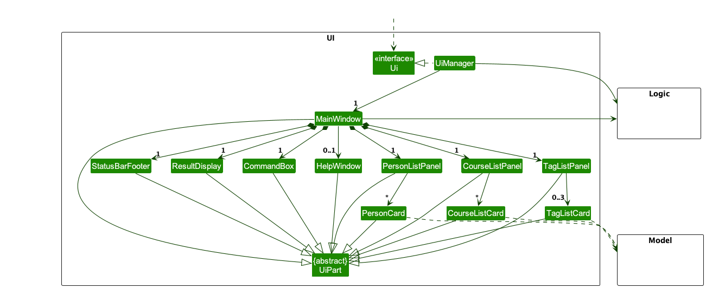

The UI consists of a `MainWindow` that is made up of parts e.g.`CommandBox`, `ResultDisplay`, `PersonListPanel`, `StatusBarFooter` etc. All these, including the `MainWindow`, inherit from the abstract `UiPart` class which captures the commonalities between classes that represent parts of the visible GUI.

The `UI` component uses the JavaFx UI framework. The layout of these UI parts are defined in matching `.fxml` files that are in the `src/main/resources/view` folder. For example, the layout of the [`MainWindow`](https://github.com/AY2324S1-CS2103T-T17-4/tp/blob/master/src/main/java/seedu/address/ui/MainWindow.java) is specified in [`MainWindow.fxml`](https://github.com/AY2324S1-CS2103T-T17-4/tp/blob/master/src/main/resources/view/MainWindow.fxml)

The `UI` component,

* executes user commands using the `Logic` component.
* listens for changes to `Model` data so that the UI can be updated with the modified data.
* keeps a reference to the `Logic` component, because the `UI` relies on the `Logic` to execute commands.
* depends on some classes in the `Model` component, as it displays `Person` object residing in the `Model`.

#### 3.2.1 List Panel

In the UI of the `MainWindow`, three major List Panels—`PersonListPanel`, `CourseListPanel`, and `TagListPanel`—implement the Observer Design Pattern using the `ObservableList` class. 
Each panel observes changes in its associated data, enabling dynamic updates in response to modifications. 

For instance, the `CourseListPanel`, observing the `ObservableList<Pair<String, Integer>>`, triggers updates to the `CourseListCard` upon any changes in the courses.
This implementation is replicated for `PersonListPanel` and `TagListPanel`. 

The following class diagram illustrates the relationships:

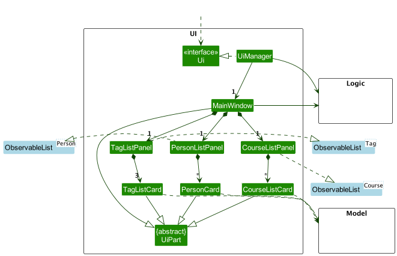

### 3.3 Logic component

**API** : [`Logic.java`](https://github.com/AY2324S1-CS2103T-T17-4/tp/blob/master/src/main/java/seedu/address/logic/Logic.java)

Here's a (partial) class diagram of the `Logic` component:

The sequence diagram below illustrates the interactions within the `Logic` component, taking `execute("delete 1")` API call as an example.

:information_source: **Note:** The lifeline for `DeleteCommandParser` should end at the destroy marker (X) but due to a limitation of PlantUML, the lifeline reaches the end of diagram.

How the `Logic` component works:

1. When `Logic` is called upon to execute a command, it is passed to an `AddressBookParser` object which in turn creates a parser that matches the command (e.g., `DeleteCommandParser`) and uses it to parse the command.
1. This results in a `Command` object (more precisely, an object of one of its subclasses e.g., `DeleteCommand`) which is executed by the `LogicManager`.
1. The command can communicate with the `Model` when it is executed (e.g. to delete a person).
1. The result of the command execution is encapsulated as a `CommandResult` object which is returned back from `Logic`.

Here are the other classes in `Logic` (omitted from the class diagram above) that are used for parsing a user command:

How the parsing works:
* When called upon to parse a user command, the `AddressBookParser` class creates an `XYZCommandParser` (`XYZ` is a placeholder for the specific command name e.g., `AddCommandParser`) which uses the other classes shown above to parse the user command and create a `XYZCommand` object (e.g., `AddCommand`) which the `AddressBookParser` returns back as a `Command` object.
* All `XYZCommandParser` classes (e.g., `AddCommandParser`, `DeleteCommandParser`, ...) inherit from the `Parser` interface so that they can be treated similarly where possible e.g, during testing.

### 3.4 Model component
**API** : [`Model.java`](https://github.com/AY2324S1-CS2103T-T17-4/tp/blob/master/src/main/java/seedu/address/model/Model.java)

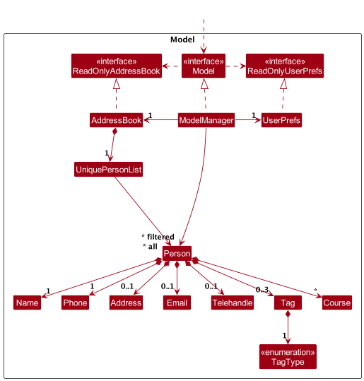

The `Model` component,

* stores NUSCoursemates data i.e., all `Person` objects (which are contained in a `UniquePersonList` object).
* stores the currently 'selected' `Person` objects (e.g., results of a search query) as a separate _filtered_ list which is exposed to outsiders as an unmodifiable `ObservableList<Person>` that can be 'observed' e.g. the UI can be bound to this list so that the UI automatically updates when the data in the list change.
* stores a `UserPref` object that represents the user’s preferences. This is exposed to the outside as a `ReadOnlyUserPref` objects.
* does not depend on any of the other three components (as the `Model` represents data entities of the domain, they should make sense on their own without depending on other components)

:information_source: **Note:** An alternative (arguably, a more OOP) model is given below. It has a `Tag` list in the `AddressBook`, which `Person` references. This allows `AddressBook` to only require one `Tag` object per unique tag, instead of each `Person` needing their own `Tag` objects. 

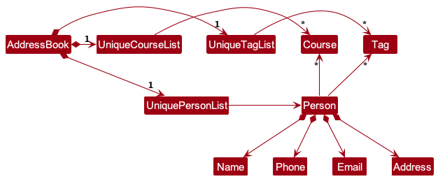

### 3.5 Storage component

**API** : [`Storage.java`](https://github.com/AY2324S1-CS2103T-T17-4/tp/blob/master/src/main/java/seedu/address/storage/Storage.java)

The `Storage` component,
* can save both NUSCoursemates data and user preference data in JSON format, and read them back into corresponding objects.
* inherits from both `AddressBookStorage` and `UserPrefStorage`, which means it can be treated as either one (if only the functionality of only one is needed).
* depends on some classes in the `Model` component (because the `Storage` component's job is to save/retrieve objects that belong to the `Model`)

### 3.6 Common classes

Classes used by multiple components are in the `seedu.addressbook.commons` package.

--------------------------------------------------------------------------------------------------------------------

## **4. Implementation**

This section describes some noteworthy details on how certain features are implemented.

### 4.1 Add Course feature

#### 4.1.1 Implementation
The add course mechanism is facilitated by `AddCommand`. It extends `Command` which overrides the following operation:
* `AddCommand#execute():` Adds a person into NUSCoursemates

Given below is an example usage scenario and how the add mechanism behaves at each step focusing on the `Course` field.

Step 1. The user executes `add n/John p/81234567 c/CS2103T` to add a new person.

Step 2. When `LogicManager` is called upon to execute the command, it will pass it to an `AddressBookParser` object which will call `parseCommand()` which creates a parser `AddCommandParser` object.

Step 3. The parser `AddCommandParser` will then parse the command and create objects for each field. The course will be indicated by the `c/` prefix.

Step 4. Using all the parsed fields (`Name, Phone, Email, Address, Telehandle, Tag, Courses`), a `Person` object is constructed.

Step 5. This results in a `AddCommand` object which is executed by the `LogicManager`.

Step 6. The command will communicate with the `Model` to add a person. 

Step 7. Upon success, the result of the command execution is encapsulated as a CommandResult object which is returned back from `LogicManager`.

The following sequence diagram shows how the add operation works:

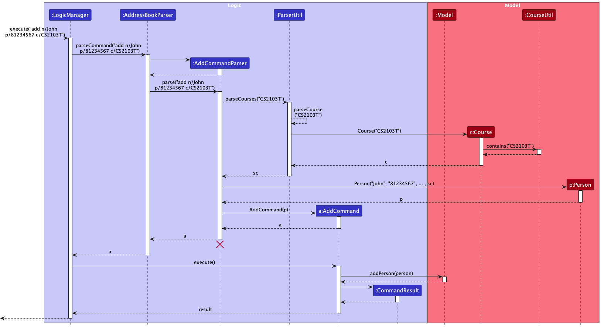

:information_source: **Note:** 
* The lifeline for `AddCommandParser` should end at the destroy marker (X) but due to a limitation of PlantUML, the lifeline reaches the end of diagram.
* During the `AddCommandParser`, `Name, Phone, Email, Address, Telehandle, Tag` objects are created as well but due to space constraint and simplification, the details have been omitted
* There are other classes in `Logic` (omitted from the class diagram above) that are used for parsing a user command and can be found [here](#33-logic-component) 

The following activity diagram shows how the add operation works:

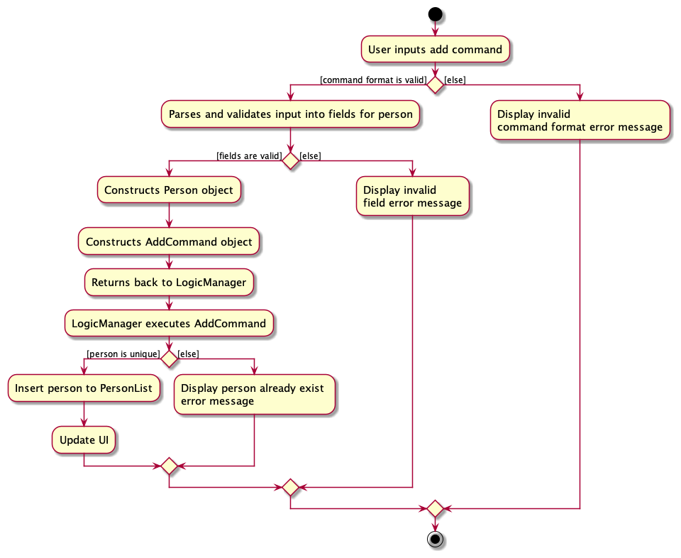

#### 4.1.2 Design considerations:
**Aspect: Adding Courses to PersonList**
* **Alternative 1:** Create a new command specifically for adding courses to person records (e.g., "AddCourseCommand"). 
  * Pros: Offers a clear separation of concerns and commands, potentially reducing complexity. 
  * Cons: Introduces an additional command class, which might require extra development time.
* **Alternative 2 (current choice):** Reuse the existing "AddCommand" by adding a 'c/' prefix to specify course addition. 
  * Pros: Minimizes the need for creating new command classes, thus reducing code duplication. 
  * Cons: Slightly alters the behavior of the existing "AddCommand," which may increase complexity and potentially confuse users.

### 4.2 Edit feature

#### 4.2.1 Implementation

The edit person mechanism is facilitated by `EditCommand` and `EditCommandParser`.

Given below is an example usage scenario and how the edit behaves at each step.

Step 1. An existing user launches the application and the second person listed in NUSCoursemates is John, and one of the courses he has is `MA2001`.

Step 2. The user executes `edit 2 c/MA2001-MA1521` command to edit the second person's MA2001 course to MA1521 in NUSCoursemates. The `edit` command calls `LogicManager#execute()`. An `EditCommandParser` object is then created, and `EditCommandParser#parse` method is called on the object. `EditCommandParser#parse` makes sense of the arguments supplied by the user, where the types of arguments are distinguished by their prefixes.

Step 3. `ParserUtil#parseCourseChanges(courseChanges)` is called, which parses the list of course changes supplied 
for the second person. This method checks that the course changes are supplied in the correct format, and if so,
it checks that all the supplied courses within those course changes are valid.

Step 4. The `EditCommand` is created, and then executed by `EditCommand#execute`.

Step 5. `EditCommand#execute` calls the following methods from `Model`:
* `Model#hasPerson(editedPerson)` which checks if the address book contains a duplicate person (a person with the same name).
* `Model#setPerson(personToEdit, editedPerson)` replaces `personToEdit` with `editPerson`
* `Model#updateFilteredPersonList(predicate)` updates the address book list with the edited person.

Step 6. `EditCommand#execute` returns a `CommandResult` to `LogicManager`.

The following sequence diagram shows how the edit operation works:

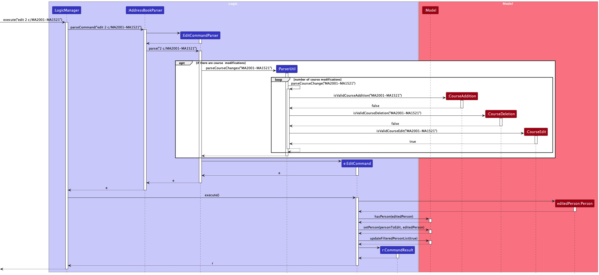

:information_source: **Note:** The lifeline for EditCommandParser should end at the destroy marker (X) but due to a limitation of PlantUML, the lifeline reaches the end of diagram. 

The following activity diagram sheds more light on how exactly the chain of edit operations work:

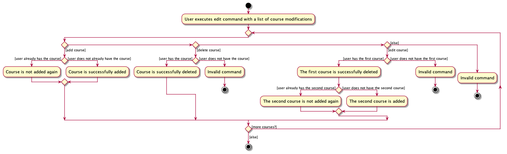

Here are some more notes for the activity diagram above:
* When parsing the list of course modifications, if any of the specified course are invalid (see earlier definition of what is considered a 'valid' course), then the end node is taken immediately.
* If the end node is taken before all courses in the list that the user passed, then no course modifications present earlier in the list will be performed at all, even if they are valid. 

#### 4.2.2 Design considerations:

**Aspect: Performing course edits**

* **Alternative 1 (current choice):** Retain the current c/ prefix in the edit command, but create additional sub-prefixes (i.e. c/add-, c/del-) after the c/ prefix.
    * Pros: A common edit interface which enables all types of course modifications to be executed all at once makes this a flexible and user-friendly solution. 
    * Cons: We must ensure that the implementation of each type of modification is correct, and ensure the changes are performed in the correct (listed) order.

* **Alternative 2:** Create a command for each type of modification, i.e. "addcourse" or "deletecourse".
    * Cons: Greatly reduced flexibility. Does not allow different types of modifications to be executed together at once, as each command can only handle one specific type of modification. There is also a lot more overhead, as three entirely new commands will have to be created, which leads to an arguably more bloated codebase.

### 4.3 Find Course feature

#### 4.3.1 Implementation  

The findcourse feature is facilitated by the FindCourseCommand class, which leverages a CourseContainsKeywordsPredicate object. This predicate object is responsible for checking if a person's course contains the specified keyword.
The following operations are central to this feature:

* `FindCourseCommand#execute(Model model)` —  Executes the command, updating the filtered person list in the model based on the criteria in the predicate.
* `CourseContainsKeywordsPredicate#test(Person person)` — Checks if the person's course matches the keyword criteria.

Given below is an example usage scenario and how the findcourse mechanism behaves at each step.

Step 1. The user wants to filter the list of persons to show only those enrolled in the course "MA2001". They execute the command "findcourse MA2001".

Step 2. The `LogicManager` receives this command string and passes it to the `AddressBookParser`.

Step 3. The `AddressBookParser` identifies the type of command and invokes the `FindCourseCommandParser` to parse the course keyword.

Step 4. The `FindCourseCommandParser` creates a `CourseContainsKeywordsPredicate` object with the keyword "MA2001" and then creates a `FindCourseCommand` object with this predicate.

Step 5. The `FindCourseCommand` is executed, and it uses the predicate to filter the list of persons in the model. The filtered list in the model is updated to only show persons enrolled in "MA2001".

Step 6. The result, which is the number of persons listed, is then shown to the user.

The following sequence diagram shows how the `findcourse` operation works:

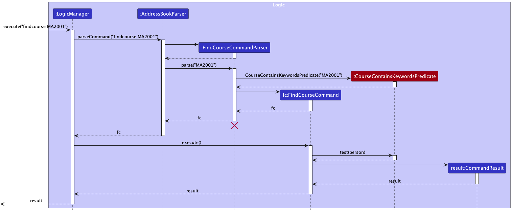

:information_source: **Note:** The lifeline for FindCourseCommandParser should end at the destroy marker (X) but due to a limitation of PlantUML, the lifeline reaches the end of diagram.

The following activity diagram summarizes what happens when a user executes a new `findcourse` command:

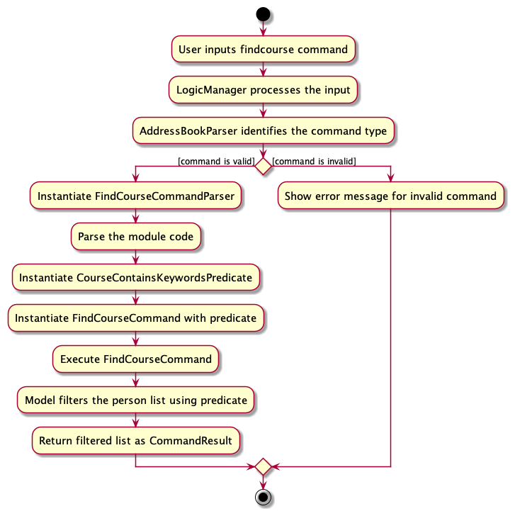

#### 4.3.2 Design considerations:

**Aspect: How filter is done:**

* **Alternative 1 (current choice):** Use a predicate object (`CourseContainsKeywordsPredicate`) to handle filtering.
    * Pros: Modular approach. Easy to extend with more search features in the future. Decouples filtering logic from the command itself.
    * Cons: Might be over-engineered if no other search features are planned.

* **Alternative 2:** Implement filtering logic directly within the `FindCourseCommand`.
    * Pros: Simpler without the need for additional objects or classes.
    * Cons: Makes the command class more complex. Harder to extend with more search features in the future.

**Aspect: Case-sensitivity in search:**

* **Alternative 1 (current choice):** Case-insensitive search.
    * Pros: Offers flexibility and a better user experience. Users do not need to worry about the exact casing of course module IDs.
    * Cons: Might yield results that the user was not expecting if there are course module IDs with varied casing.

* **Alternative 2:** Case-sensitive search.
    * Pros: Precise search results based on exact casing.
    * Cons: Less flexible. Users need to input the exact casing of course module IDs.

### 4.4 Find Student feature

#### 4.4.1 Implementation

The `findstudent` feature is facilitated by the `FindCommand` class, which uses a `NameContainsKeywordsPredicate` object. This predicate object is designed to check if a person's name matches any of the specified keywords.
The following operations are central to this feature:

* `FindCommand#execute(Model model)` —  Executes the command, updating the filtered person list in the model based on the criteria set by the predicate.
* `NameContainsKeywordsPredicate#test(Person person)` — Determines if the person's name matches any of the keyword criteria.

Outlined below is an example usage scenario and how the `findstudent` mechanism functions at each stage.

Step 1. The user aims to filter the list of persons to display only those whose names include "Alice" or "Bob". They input the command "findstudent alice bob".

Step 2. The `LogicManager` obtains this command string and forwards it to the `AddressBookParser`.

Step 3. The `AddressBookParser` discerns the type of command and engages the `FindCommandParser` to parse the name keywords.

Step 4. The `FindCommandParser` constructs a `NameContainsKeywordsPredicate` object with the keywords "Alice" and "Bob" and subsequently initiates a `FindCommand` object using this predicate.

Step 5. The `FindCommand` is then executed. Utilizing the predicate, it filters the list of persons in the model. The model's filtered list is updated to only show persons with names "Alice" or "Bob".

Step 6. The outcome, which indicates the number of persons found, is presented to the user.

The following sequence diagram shows how the `findstudent` operation works:

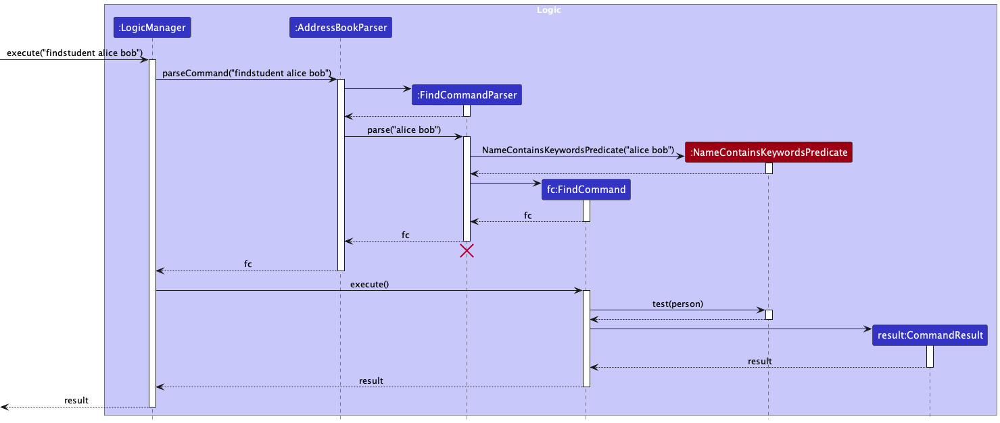

:information_source: **Note:** 
The lifeline for FindCommandParser should end at the destroy marker (X) but due to a limitation of PlantUML, the lifeline reaches the end of diagram.

The following activity diagram summarizes what happens when a user executes a new `findstudent` command:

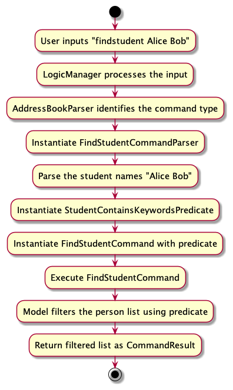

#### 4.4.2 Design considerations:

**Aspect: How filter is done:**

* **Alternative 1 (current choice):** Use a predicate object (`NameContainsKeywordsPredicate`) to handle filtering.
    * Pros: Modular approach. Easy to extend with more search features in the future. Decouples filtering logic from the command itself.
    * Cons: Might be over-engineered if no other search features are planned.

* **Alternative 2:** Implement filtering logic directly within the `FindCommand`.
    * Pros: Simpler without the need for additional objects or classes.
    * Cons: Makes the command class more complex. Harder to extend with more search features in the future.

**Aspect: Case-sensitivity in search:**

* **Alternative 1 (current choice):** Case-insensitive search.
    * Pros: Offers flexibility and a better user experience. Users do not need to worry about the exact casing of student names.
    * Cons: Might yield results that the user was not expecting if there are student names with varied casing.

* **Alternative 2:** Case-sensitive search.
    * Pros: Precise search results based on exact casing.
    * Cons: Less flexible. Users need to input the exact casing of student names.

### 4.5 Sort feature

#### 4.5.1 Implementation
The sort feature sorts the students in the `UniquePersonList` object in `AddressBook` according to a specified sorting criterion.

The sorting mechanism is facilitated by `SortCommandParser` and `SortCommand`. The latter extends the existing `Command` class and implements the following method: 
* `SortCommand#execute()`: Executes the sort command and returns the result message 

After the user specifies the sorting criterion, the corresponding subclass of `PersonSorter` will be instantiated. There are different `PersonSorter` objects that each sorts differently. The `PersonSorter` object, which implements the Comparable interface, directly sorts the `UniquePersonList` object in `AddressBook`.

Format: `sort CRITERION`

There are 3 ways to sort the students in NUSCoursemates:

1. **Sort by Name**
    - Function: Sorts students by name in alphabetical order
    - Criterion: name, name-ascending, name-descending
    - Example usage: `sort name-ascending`

2. **Sort by Course size**
    - Function: Sorts students by the number of courses taken
    - Criterion: course, course size-ascending, course size-descending
    - Example usage: `sort course size-ascending`

3. **Sort by Tags**
    - Function: Sorts students by their tags
    - Criterion: tags
    - Example usage: `sort tags`

Given below is an example usage scenario and how the sort mechanism behaves at each step.

Step 1. The user will input `sort name`, where `sort` is the command word and `name` is a valid sort criterion.

Step 2. When `LogicManager` is called upon to execute the command, it will call `parseCommand()` of an `AddressBookParser` object which creates a `SortCommandParser` object.

Step 3. `SortCommandParser` will then parse the sort criterion, which in this case, is `name`.

Step 4. The `createPersonSorter()` method of the `PersonSorter` class is called along with the sort criterion. 

Step 5. A new `PersonNameAscendingSorter` object is constructed. 

Step 6. A new `SortCommand` object is constructed with the `PersonNameAscendingSorter` object created in the previous step. 

Step 7. The `SortCommand` object is then executed by the `LogicManager`.

Step 8. As a result, the `SortCommand` object will call `Model#sortPersonList()` with the `PersonNameAscendingSorter` object created in the earlier steps.  

The following UML Sequence diagram shows what happens when `sort name` is entered as an input up to this step.

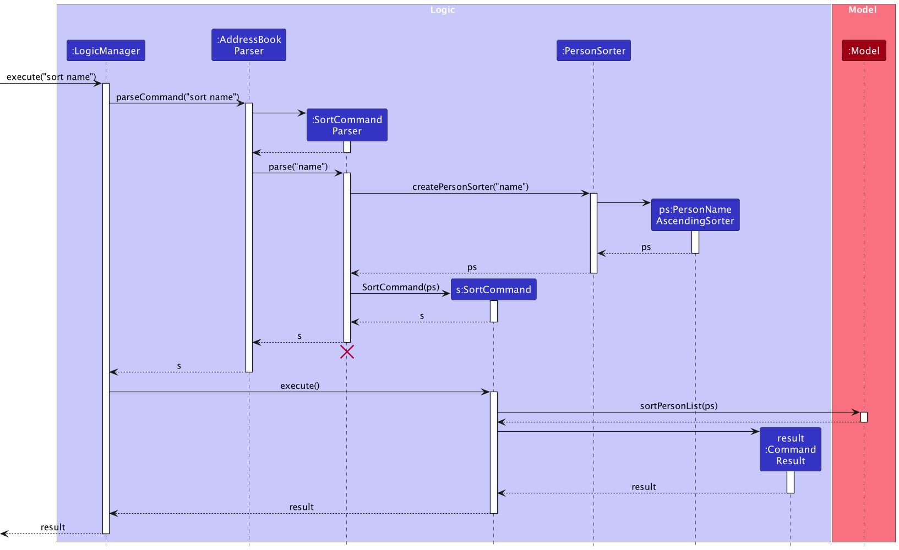 

Step 9. Afterwards, `AddressBook#sortPersonList()` is called with the same `PersonNameAscendingSorter` object.

Step 10. Consequently, `UniquePersonList#sortPersons()` is called with the `PersonNameAscendingSorter` object that sorts the list. As a result, we get a list that is sorted according to the specified sort criterion. 

The following UML Sequence diagram shows what happens within the `Model` component. 

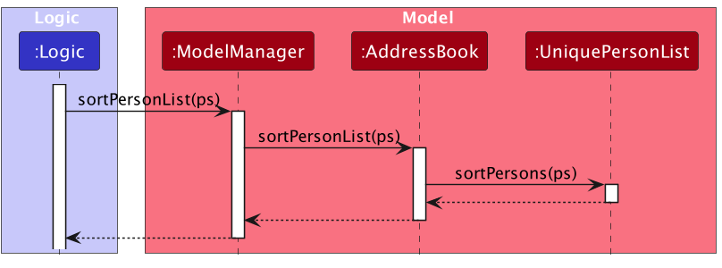  

Step 11. Finally, after the sorting process is successful, the result of the `sort` command execution is encapsulated as a CommandResult object which is returned back from Logic.

:information_source: **Note:**
* The lifeline for `SortCommandParser` should end at the destroy marker (X) but due to a limitation of PlantUML, the lifeline reaches the end of diagram.

The following UML Activity diagram shows the workflow of sorting students in NUSCoursemates, based on different sorting criterion:
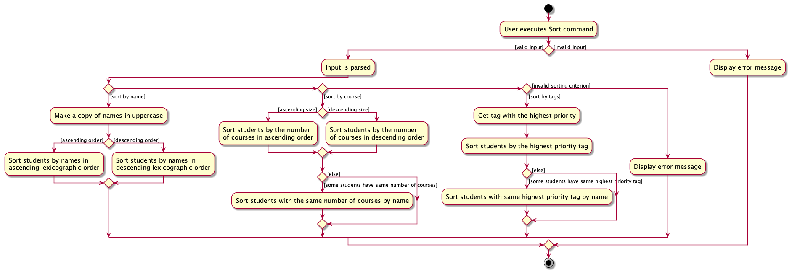

#### 4.5.2 Design considerations:

**Aspect: How the sorted list should be stored.**

**Alternative 1 (current choice):** Sort the `UniquePersonList` object directly. This means that the original list will be modified as it is sorted. The resulting list is stored locally.

* Pros: Since the resulting list is stored locally, the user's preference is saved because he is able to see the same sorted list the next time he opens the application.
* Pros: Smaller memory usage because there is no need to store copies of the lists are stored.
* Cons: Potentially slower because the list is modified locally.

**Alternative 2:** Make a copy of the original list for sorting before saving it.

* Pros: Original list is recoverable in case of an error.
* Cons: More memory required to store copies of the original and sorted list.
* Cons: Less efficient as it takes time to copy the list.
* Cons: Prone to errors that may arise from the copying stage, as the list to be copied from and the list to be copied to will always change.

Ultimately, Alternative 1 is chosen over Alternative 2. Since the application is being used frequently, the user's preference should be saved so that he does not need to run the sort command again to see a sorted list.  
Moreover, there are checks and error handling to ensure that the `PersonSorter` objects are able to sort the list correctly.

### 4.6 Tag feature

#### 4.6.1 Implementation

The Tag feature is facilitated by the `Tag` class, which contains an attribute `TagType` to determine the type of tag. The creation and validation of tags are significantly associated with the `TagUtil` class.

* `TagUtil#canAddOrEditEmergencyTag(Person toAdd, List<Person> currentPersonList)` — Determines if a new "Emergency" tag can be added or edited based on existing contacts with the "Emergency" tag.
* `Tag#isEmergencyTag()` — Checks if a tag is of the type "Emergency".

Given below is an example usage scenario and how the Tag mechanism behaves at each step.

Step 1. The user wishes to add a new contact with a tag "Emergency". They execute the `add` command: add n/John Doe p/12345678 t/Emergency.

Step 2. The `LogicManager` receives this command string and passes it to the `AddressBookParser`.

Step 3. The `AddressBookParser` identifies the type of command and invokes the relevant parser, in this case, `AddCommandParser`, to process the command details.

Step 4. The `AddCommandParser` processes the input, and if a tag is provided, a new `Tag` object is created.

Step 5. Before the `Person` object is created, the `TagUtil#canAddOrEditEmergencyTag()` method is called to ensure not more than two contacts have the "Emergency" tag.

Step 6. If the validation is successful, a new `Person` object is created with the provided details, including the tag, and added to the model. Otherwise, a CommandException is thrown, notifying the user of the error.

Step 7. The result, a successful addition or an error message, is displayed to the user.

The following class diagram shows the overview of the Tag mechanism.

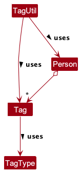

The following sequence diagram shows how the Tag operation works by calling the `add` Command:

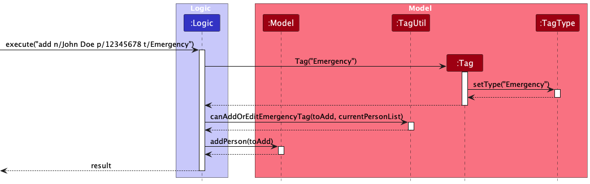

:information_source: **Note:**  
* For simplicity in the diagrams, all interactions with different components of the Logic are represented under a single 'Logic' participant.

The following activity diagram summarizes what happens when a user executes a new `add` command; the `edit` command will be similar:

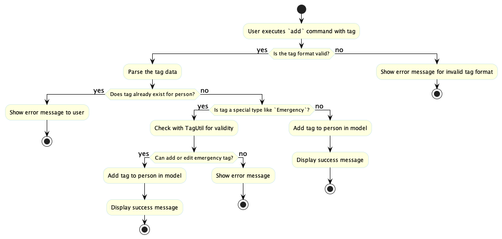

#### 4.6.2 Design considerations:

**Aspect: Validation of the "Emergency" tag count:**

* **Alternative 1 (current choice):** Use a utility class (`TagUtil`) to check the constraints.
    * Pros: Modular approach. Decouples the tag validation logic from the command classes. Easier to maintain and extend if more constraints are introduced in the future.
    * Cons: Another layer of abstraction. Might be an overkill if no other tag constraints are planned.

* **Alternative 2:** Implement the validation logic within the `AddCommand` class.
    * Pros: Simpler approach without additional utility classes. Direct handling within the main command.
    * Cons: Makes the command class more complicated. Difficult to maintain and extend if more constraints on tags are added in the future.

**Aspect: Extensibility of tags:**

* **Alternative 1 (current choice):** Use an enumeration (TagType) to define types of tags.
    * Pros: Clean and organized. Easy to add more types of tags in the future. Validation can be done based on enum values.
    * Cons: Might be restrictive if dynamic creation of new tag types is required in the future.

* **Alternative 2:** Store tag types as strings without an enumeration.
    * Pros: Dynamic creation of new tag types without changing the code.
    * Cons: Difficult to validate and handle specific tag types. Potential for typos and inconsistencies.

**Aspect:  Types and Limitations of Tags:**

* **Alternative 1 (current choice):** Limit the system to three specific types of tags.
    * Pros: Ensures that the tags used are relevant to the application's main purpose, which is to manage coursemates' contact information.
    * Pros: Simplifies the interface and experience for the user, ensuring consistency.
    * Pros: Reduces clutter and potential misuse by preventing users from adding arbitrary tags
    * Cons: Users might find it restrictive if they wish to add more customized tags for further categorization.
    * Cons: Possible need for future extensions or adjustments if more relevant tag categories emerge.

* **Alternative 2:** Allow users to add any type of tags.
    * Pros: Provides flexibility for users to categorize their contacts as they see fit.
    * Pros: Avoids potential limitations, giving room for diverse usage scenarios.
    * Cons: Might deviate from the main purpose of the application, leading to inconsistent use.
    * Cons: Users might add unrelated or inappropriate tags, leading to clutter.

### 4.7 Telehandle feature
    
#### 4.7.1 Implementation

The Telehandle mechanism is facilitated by the `Telehandle` and `AddCommand` classes.

Given below is an example usage scenario and how the `Telehandle` mechanism behaves at each step.

Step 1. The user wishes to add a new contact with their desired `Telehandle`. They execute the `add` command: `add n/john p/98765432 th/@john2`.

Step 2. The `LogicManager` receives this command string and passes it to the `AddressBookParser`.

Step 3. The `AddressBookParser` identifies the type of command and invokes the relevant parser, in this case, `AddCommandParser`, to process the command details.

Step 4. The parser `AddCommandParser` will then parse the command and create objects for each field. `Telehandle` will be indicated by the `th/` prefix.
For this scenario, we will be focusing on the `Telehandle`.

Step 5. The `AddCommandParser` processes the input and if a `Telehandle` is provided, the `ParserUtil#parseTelehandle()` method will then be invoked within `AddCommandParser`, else an empty `Telehandle` would be created instead.

Step 6. Using all the parsed fields (`Name, Phone, Email, Address, Telehandle, Tag, Courses`), a `Person` object is constructed.

Step 7. This results in a `AddCommand` object which is executed by the `LogicManager`.

Step 8. The command will communicate with the `Model` to add a person with the inputted `Telehandle`.

Step 9. Upon success, the result of the command execution is encapsulated as a CommandResult object which is returned back from `Logic`.

The following sequence diagram shows how the `Telehandle` works through the `AddCommand`:

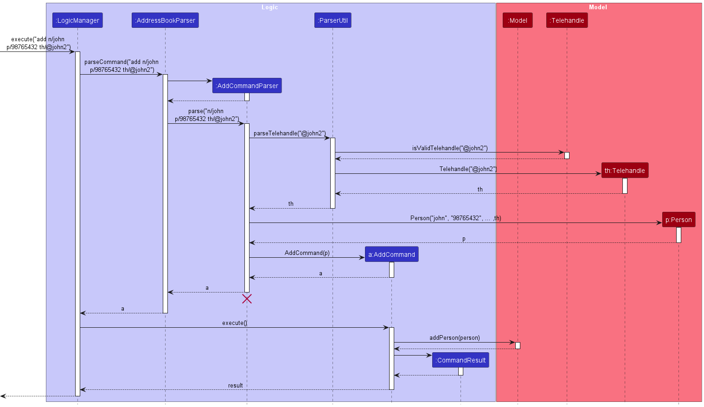

:information_source:**Note:**
* The lifeline for `AddCommandParser` should end at the destroy marker (X) but due to a limitation of PlantUML, the lifeline reaches the end of diagram.
* During the `AddCommandParser`, `Name, Phone, Email, Address, Tag, Course` objects are created as well but due to space constraint and simplification, the details have been omitted
* There are other classes in `Logic` (omitted from the class diagram above) that are used for parsing a user command and can be found [here](#33-logic-component)

The following object diagram below shows the new `Person` object created when the user executes the `Add` command with a valid `Telehandle`.

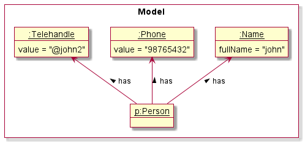 

#### 4.7.2 Design considerations:

**Aspect: Input constraints in `Telehandle`:**

* **Alternative 1 (current choice):** Requiring an @ sign in front of all `Telehandle` fields.
    * Pros: Increased clarity. The "@" sign provides a clear visual cue that the input is a `Telehandle`, helping users distinguish it from other fields such as `Address`.
    * Cons: Requiring an "@" sign may be unusual for users who are not familiar with social media or who have not encountered this format before. This requirement may feel counterintuitive to some.

* **Alternative 2:** Not requiring an @ sign in front of all `Telehandle` fields.
    * Pros: Offers flexibility and a better user experience. 
    * Cons: `Telehandle` fields that rely solely on user input may not differ significantly from other types of 
      user-provided data such as `Address` and `Email`. This may cause confusion to the users when viewing the details

### 4.8 Feedback feature

#### 4.8.1 Implementation

The Feedback mechanism is facilitated by `FeedbackCommand`.

Given below is an example usage scenario and how the Feedback mechanism works at each step.

Step 1. The user wishes to send a feedback in regard to the app. They execute the `feedback` command.

Step 2. The `LogicManager` receives this command string and passes it to the `AddressBookParser`.

Step 3. The `AddressBookParser` identifies the type of command and invokes the relevant command, in this case, 
`FeedbackCommand`.

Step 4. This results in a `FeedbackCommand` object which is executed by the `LogicManager`.

Step 5. The result of the command execution is encapsulated as a `CommandResult` object which is returned back from `LogicManager`.

Step 6. Then the `CommandResult` object will cause the `MainWindow#handleFeedback()` to be executed. 

Step 7. The `Ui` will be updated, and the success message will be displayed to the user.

Step 8. Lastly, the `Feedback` popup window will appear.

The following sequence diagram shows how the `Feedback` operation works:

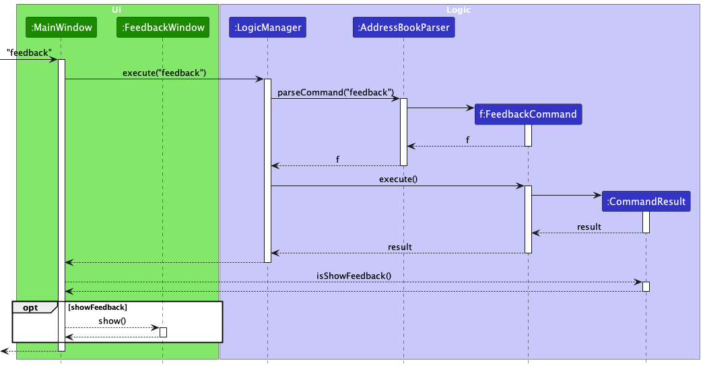

The following activity diagram summarizes what happens when a user executes the `Feedback` command:

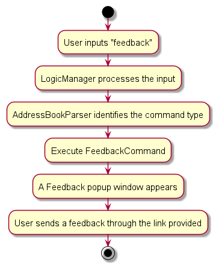

#### 4.8.2 Design considerations:

**Aspect:  Storage medium for the logging of feedback received**

* **Alternative 1 (current choice):** Use Google forms to store feedback of the users.
    * Pros: Google Forms are quick and easy to set up. No need for extensive development efforts.
    * Pros: Google Forms are user-friendly, making it simple for app users to submit feedback without any technical knowledge or app-specific requirements.
    * Pros: Data Organization. Google Forms automatically organize and store feedback responses in a Google Sheets 
      spreadsheet, making it convenient for review and analysis.

    * Cons: Data Security. Storing feedback data on external platforms like Google Forms introduces security and privacy concerns.

* **Alternative 2:** Link to an online forum where users can post feedback.
    * Pros: Peer Support. In addition to providing feedback, users can help each other by sharing solutions to 
      common issues.
  
    * Cons: Lack of Control. There would be lesser control over the structure and organization of feedback compared to a 
      dedicated feedback form.

### 4.9 Theme feature

#### 4.9.1 Implementation

The add course mechanism is facilitated by `ThemeCommand`. It extends `Command` which overrides the following operation:
* `ThemeCommand#execute():` Changes the Theme of NUSCoursemates

Given below is an example usage scenario and how the theme mechanism behaves at each step.

Step 1. The user launches the application for the first time. The current default theme will be a light theme.

Step 2. The user executes `theme DARK` command to change the theme from light to dark.

Step 2. When `LogicManager` is called upon to execute the command, it will pass it to an `AddressBookParser` 
object which will call `parseCommand()` which creates a parser `ThemeCommandParser` and uses it to parse the command.

Step 3. This results in a `ThemeCommand` object which is executed by the `LogicManager`.

Step 4. The result of the command execution is encapsulated as a `CommandResult` object which is returned back from `LogicManager`.

Step 5. The `CommandResult` object will cause `MainWindow#handleTheme()` to be executed. 

Step 6. The `Ui` will then be updated to DARK theme.

The following sequence diagram shows how the theme operation works:

:information_source:**Note:**
* The lifeline for `ThemeCommandParser` should end at the destroy marker (X) but due to a limitation of PlantUML, the lifeline reaches the end of diagram.
* There are other classes in `Logic` (omitted from the class diagram above) that are used for parsing a user command and can be found [here](#33-logic-component)

The following activity diagram summarizes what happens when a user executes the `theme` command:

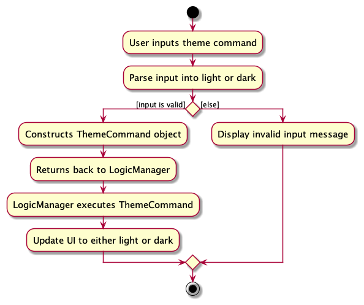

#### 4.9.2 Design considerations:

**Aspect: User Interaction for Theme Change**

* **Alternative 1:** CLI Command.
    * Pros: Consistency. Aligns with the CLI nature of the application, providing a consistent interface for users accustomed to command-based interactions.
    * Pros: Efficiency. Users familiar with CLI commands can quickly change the theme without navigating through graphical menus.

    * Cons: Learning Curve. Users unfamiliar with CLI commands may face a learning curve.

* **Alternative 2:** Menu Bar Button
    * Pros: Intuitiveness. A graphical button on the menu bar may be more intuitive for users who prefer visual interactions.

    * Cons: Inconsistency. May deviate from the overall CLI theme of the application.

* **Alternative 3 (current choice):** Hybrid Approach - CLI Command and Graphical Button
    * Pros: Flexibility. Providing both options caters to a wider audience, accommodating users with different preferences.
    * Pros: User Preference. Users can choose their preferred method of interaction, enhancing the overall user experience. 
    * Pros: Discoverability. The graphical button enhances discoverability for users who might not be familiar with CLI commands.

   * Cons: Development Effort. Implementing and maintaining both CLI and graphical options may require additional development effort.

### 4.10 Course List Panel and Tag List Panel Feature

NUSCoursemates comes with three major List Panels — `PersonListPanel`, `CourseListPanel`, and `TagListPanel` as stated [above](#321-list-panel).
The three panels can be seen in the UI below:

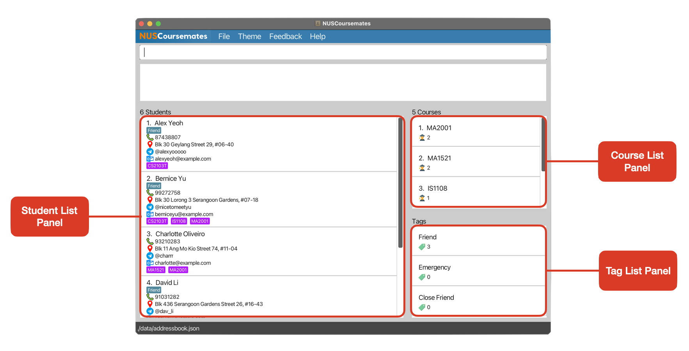

#### 4.10.1 Implementation

The panels mechanism is facilitated by `MainWindow`. It houses the three following panels:
* `PersonListPanel`: Displays the list of all the students
* `CourseListPanel`: Displays the list of the summary of courses
* `TagListPanel`: Displays the list of the summary of tags

**Course List Panel (CourseListPanel):**

The `CourseListPanel` class is implemented as a `JavaFX` component responsible for presenting a summarised list of courses. 
It uses a `ListView` to display each course, with each item represented by a `CourseCard`. 
The `CourseCard` class encapsulates the visual representation of a course, displaying the course name 
and the number of students taking the course. The panel is dynamically updated by binding 
it to an `ObservableList<Pair<String, Integer>>`, where each pair represents the string of the course and the 
integer corresponds to number of students taking that course. The `CourseListViewCell` class which extends the `ListCell`, 
controls the rendering of each course item in the list.

**Tag List Panel (TagListPanel):**

Similar to the `CourseListPanel`, the `TagListPanel` is implemented as a `JavaFX` component utilising a `ListView` 
to display a summarised list of tags. Each tag is represented by `TagCard`. 
The panel is linked to an `ObservableList<Pair<String, Integer>>` containing tag names and number of students having the tag names, 
and the `TagListViewCell` class customises the rendering of each tag item.

#### 4.10.2 Design considerations:

**Aspect: Unified Panel for Tags and Courses**

* **Alternative 1 (current choice):** Separate Panels for Tags and Courses
    * Pros: Distinct Categorization. Maintaining separate panels ensures clear categorization. 
    * Pros: Focused Interaction. Users interact with tags and courses in dedicated spaces. 

    * Cons: Increased Navigation Steps. Users need to switch between panels for tags and courses, potentially adding extra steps.

* **Alternative 2:** Merge Tags and Courses into a Unified Panel
    * Pros: Simplicity. Combining tags and courses into a single panel simplifies the interface. 
    * Pros: Streamlined Navigation. Users access both tags and courses from one centralised location. 

    * Cons: Potential Information Overload. 

--------------------------------------------------------------------------------------------------------------------

## **5. Documentation, logging, testing, configuration, dev-ops**

* [Documentation guide](Documentation.md)
* [Testing guide](Testing.md)
* [Logging guide](Logging.md)
* [Configuration guide](Configuration.md)
* [DevOps guide](DevOps.md)

--------------------------------------------------------------------------------------------------------------------

## **Appendix A: Requirements**

### A.1 Product scope

**Target user profile**:

* is a School of Computing (SoC) student in NUS
* takes a number of courses in NUS
* has a need to manage a significant number of contacts
* prefer desktop apps over other types
* can type fast
* prefers typing to mouse interactions
* is reasonably comfortable using CLI apps

**Value proposition**: 

Students in SoC often face the challenge of identifying classmates who share their course schedules. NUSCourseMates is designed to alleviate this difficulty by helping them connect with peers who are taking the same courses, which can be a particularly valuable resource when assessments involve group work.

### A.2 User stories

Priorities: High (must have) - `* * *`, Medium (nice to have) - `* *`, Low (unlikely to have) - `*`

| Priority | As a …​                               | I want to …​                                                                                | So that I can…​                                                                              |
|----------|---------------------------------------|---------------------------------------------------------------------------------------------|----------------------------------------------------------------------------------------------|
| `* * *`  | SoC Student                           | add/create a student and the courses they take                                              | save their details in my address book                                                        |
| `* * *`  | Forgetful SoC student                 | have a one-stop place to view all the courses my friends are taking this semester           | try to go to class with them together                                                        |
 | `* * *`  | Organised SoC student                 | delete a contact in my address book                                                         | keep my address book clutter-free from the people I am no longer friends with                | 
 | `* * *`  | Novice with limited knowledge of CLI  | easily handle the various commands                                                          | smoothly navigate the address book                                                           | 
 | `* * *`  | First-time user of the app            | easily handle the various commands                                                          | smoothly navigate the address book                                                           |
 | `* * *`  | SoC Student                           | add contact details (telehandle, phone number) of student into the student's profile        | contact the student in another way                                                           |
 | `* * `   | Blur SoC student                      | read the user guide                                                                         | learn to use the application.                                                                |
 | `* * `   | Unorganised SoC student               | sort the courses by sizes                                                                   | find a student with more similar courses                                                     | 
 | `* * `   | SoC Student                           | sort my friends by alphabetical order                                                       | find a specific friend easily                                                                |
 | `* * `   | Unorganised SoC student               | filter the address book by course                                                           | find and track other students taking the same course as me                                   |
 | `* * `   | SoC Student                           | leave some data fields blank when adding a friend                                           | add my friend even if I do not have all their personal details                               | 
 | `* * `   | Overwhelmed SoC student               | view the contact details of a student                                                       | contact them via their email or phone anytime if required                                    | 
 | `* * `   | SoC Student                           | add the detail of my friend's tutorials                                                     | know which tutorial they choose                                                              |
 | `* * `   | SoC Student                           | remove friend from my friend's list                                                         | keep my address book's contact list relevant                                                 |
 | `* * `   | SoC Student                           | tag the course according to the semester in which it was taken                              | differentiate between friends who are taking the course now and in the past                  |
 | `* * `   | Careless SoC Student                  | undo commands I made                                                                        | have a better user experience                                                                |
 | `* * `   | SoC student with a huge social circle | view the total number of users in the address book                                          | have a good idea of how many users are in the address book                                   | 
 | `* * `   | SoC Student                           | give feedback to the developers                                                             | feedback any bugs or problems I faced while using the app                                    | 
 | `* `     | Confused SoC student                  | look at the common FAQs in the User Guide                                                   | get a better understanding of some of the features of the app to use the app more seamlessly | 
 | `* `     | SoC Student                           | add email address of students                                                               | easily access the email address of the student                                               | 
 | `* `     | SoC Student                           | edit the background of my address book                                                      | make my address book looks nicer and personalized                                            | 
 | `* `     | SoC Student                           | separate friends list from close friends list                                               | prioritize which class to take                                                               | 
 | `* `     | SoC Student                           | see my close friends' courses displayed first before other friends' courses                 | easily see which are the classes I should take                                               | 
 | `* `     | SoC Student                           | check the history of what contacts have been added                                          | make amendments to the contact list easily                                                   | 
 | `* `     | SoC Student with poor vision          | Edit the font size of my address book                                                       | see clearer                                                                                  | 
 | `* `     | SoC Student                           | change the theme of the app                                                                 | customize between dark and light themes                                                      |  
 | `* `     | Lazy SoC Student                      | get recommendations about what course(s) I should take without doing any computation myself | know which classes to take at one glance                                                     | 
 | `* `     | SoC Student                           | set my friend as an emergency contact                                                       | call the person if I face any serious issue                                                  |

### A.3 Use cases

(For all use cases below, the **System** is the `NUSCoursemates` and the **Actor** is the `user`, unless specified otherwise)

**Use Case: UC01 - Accessing the Help Page**

**MSS**

1. User requests to view help window.
2. NUSCoursemates displays a message with a link to the help page.

   Use case ends.

**Use Case: UC02 - Accessing the Feedback Page**

**MSS**

1. User requests to view feedback window.
2. NUSCoursemates displays a message with a link to the feedback form.

   Use case ends.

**Use Case: UC03 - Adding a Student**

**MSS**

1. User requests to add a student with their details.
2. NUSCoursemates adds the student and displays the updated details.

    Use case ends.

**Extensions**

* 1a. User enters an invalid command format.
  * 1a1. NUSCoursemates shows an error message.
  
    Use case ends.
* 1b. User enters an invalid parameter.
  * 1b1. NUSCoursemates shows an error message.
  
    Use case ends.

**Use Case: UC04 - Listing All Students**

**MSS**

1. User requests to view the list of students.
2. NUSCoursemates displays a list of all students along with their details.

   Use case ends.

**Use Case: UC05 - Deleting a Student**

1. User requests to <u>list persons (UC04)</u>.
2. NUSCoursemates shows a list of students.
3. User requests to delete a specific person in the list.
4. NUSCoursemates deletes the student.

    Use case ends.

**Extensions**

* 2a. The list is empty.

    Use case ends.

* 3a. The given index is invalid.
    * 3a1. NUSCoursemates shows an error message.

      Use case resumes at step 2.

**Use Case: UC06 - Editing a Student**

**MSS**

1. User requests to <u>list persons (UC04)</u>.
2. NUSCoursemates shows a list of persons.
3. User requests to edit a specific person in the list.
4. NUSCoursemates edits the person.

   Use case ends.

**Extensions**

* 2a. The list is empty.

  Use case ends.

* 3a. The given index is invalid.
    * 3a1. NUSCoursemates shows an error message.

      Use case resumes at step 2.

* 3b. The fields are invalid.
    * 3b1. NUSCoursemates shows an error message.

      Use case resumes at step 2.

* 3c. The command format is invalid.
    * 3c1. NUSCoursemates shows an error message.

      Use case resumes at step 2.

**Use Case: UC07 - Searching for students by name**

**MSS**

1. User requests to find students by their names 
2. NUSCoursemates displays matching students with their details.

    Use case ends.

**Extensions**

* 1a. User requests to find students in an empty NUSCoursemates.

  Use case ends.

**Use Case: UC08 - Searching for students by course**

**MSS**

1. User requests to find students by their courses.
2. NUSCoursemates displays matching students with their details.

    Use case ends.

**Extensions**

* 1a. User requests to find students by courses in an empty NUSCoursemates.

  Use case ends.

**Use Case: UC09 - Clearing All Entries**

**MSS**

1. User requests to clear the entire NUSCoursemates.
2. NUSCoursemates removes all students and displays the updated view.

    Use case ends.

**Extensions**

* 1a. The given command is invalid.
    * 1a1. NUSCoursemates shows an error message.
      
       Use case ends.

**Use Case: UC10 - Clearing All Courses**

**MSS**

1. User requests to clear all courses from students in NUSCoursemates.
2. NUSCoursemates removes the courses from students and displays the updated view.

   Use case ends.

**Extensions**

* 1a. The given command is invalid.
    * 1a1. NUSCoursemates shows an error message.

      Use case ends.

**Use Case: UC11 - Changing Themes**

**MSS**

1. User request to change the theme to dark.
2. GUI of the NUSCoursemates changes from light to dark theme.

    Use case ends.

**Extensions**

* 1a. The theme of the NUSCoursemates is already dark.
  * 1a1. GUI of the NUSCoursemates does not change.

    Use case ends.

* 1b. The given command is invalid.
    * 1b1. NUSCoursemates shows an error message.

      Use case ends.

**Use Case: UC12 - Exiting the Program**

**MSS**

1. User request to exit the program.

2. NUSCoursemates exits the program.

   Use case ends.

**Extensions**

* 1a. The given command is invalid.
    * 1a1. NUSCoursemates shows an error message.
  
      Use case ends.

**Use Case: UC13 - Sorting NUSCoursemates**

**MSS**

1. User requests for a sorted list of students based on a specified sort criterion.
2. NUSCoursemates sorts the list of students.
3. The updated list of students is shown to the user.

   Use case ends.

**Extensions**

* 1a. The given command is invalid.
    * 1a1. NUSCoursemates displays an error message. 
    
      Use case ends.
* 1b. The given sort criterion is invalid.
    * 1b1. NUSCoursemates displays an error message.
  
      Use case ends.

### A.4 Non-Functional Requirements

1.  Should work on any _mainstream OS_ as long as it has Java `11` or above installed.
2.  Should be able to hold up to 1000 students without a noticeable sluggishness in performance for typical usage.
3.  A user with above average typing speed for regular English text (i.e. not code, not system admin commands) should be able to accomplish most of the tasks faster using commands than using the mouse.
4.  The application should load within 30 seconds upon initiation on a standard modern-day PC.
5. The installed application should occupy no more than 100MB of disk space on the user's computer.
6. The application should respond to user inputs within 5 seconds, ensuring a smooth and interactive user experience.
7. The application should work on both 32-bit and 64-bit environments.
8. The application should be usable by both novice and seasoned Command Line Interface (CLI) users.
9.  Users should be able to view and edit existing data locally. Changes made are also saved offline and locally.
10. The application should only work for a single user. It should not support simultaneous access or user accounts.

### A.5 Glossary

* **SoC**: School of Computing, the computing faculty in National University of Singapore (NUS)
* **NUS**: Abbreviation for the National University of Singapore
* **Mainstream OS**: Windows, Linux, Unix, OS-X
* **Tag**: A label or keyword assigned to a contact in an NUSCoursemates, to categorize, annotate, or identify specific characteristics or affiliations of that person.
* **Command Line Interface (CLI)**: A text-driven user interface used for program execution, file management, and overall computer interaction.
* **Graphical User Interface (GUI)**: An operating system interface reliant on graphics, utilising icons, menus, and a mouse for user interaction.
* **Main Success Scenario (MSS)**: Describes the most direct interaction path for a given use case, assuming no errors or complications.
* **Actor**: Within use cases, an actor represents the role a person assumes while interacting with the system.
* **Application Programming Interface(API)**: Facilitates communication between distinct components of a program.
* **Architecture**: In the realm of software, architecture illustrates the systematic organization of the entire system.
* **Framework**: Comprises pre-written code with predefined classes and functions, aiding developers in constructing software.

--------------------------------------------------------------------------------------------------------------------

## **Appendix B: Instructions for manual testing**

Given below are instructions to test the app manually.

:information_source: **Note:**
* These instructions only provide a starting point for testers to work on; testers are expected to do more *exploratory* testing. 

### B.1 Launch and shutdown

1. Initial launch:

   1. Download the jar file and copy into an empty folder.
   2. Double-click the jar file.   If nothing happens after double-clicking the jar file, run `java -jar NUSCoursemates.jar` in the folder containing the jar file.   
      **Expected Outcome**: Shows the GUI with a set of sample contacts. The window size may not be optimum.

2. Saving window preferences:
   1. Resize the window to an optimum size. Move the window to a different location. Close the window.
   2. Re-launch the app by double-clicking the jar file.  
   **Expected Outcome**: The most recent window size and location is retained.

### B.2 List all students
**Prerequisites:**  There should be at least one student in NUSCoursemates.
1. Listing all students:
   1. **Test case:** `list`  
      **Expected Outcome:** All students are listed in the left panel. 
   2. **Test case:** `list 1`, `list 3h4fk4hr`  
   **Expected Outcome:** Same as before.

### B.3 Help
1. Seeking help:
    1. **Test case:** `help`  
       **Expected Outcome:** A new window is opened. A link to the help page is provided. An acknowledgement message "Opened help window." is shown. 
    2. **Test case:** `help 1`, `help 3h4fk4hr`  
       **Expected Outcome:** Same as before.

       
### B.4 Feedback
1. Providing feedback:
    1. **Test case:** `feedback`  
       **Expected Outcome:** A new window is opened. A link to the feedback page is provided. An acknowledgement message "Opened feedback window." is shown.
    2. **Test case:** `feedback 1`, `feedback qefjhbcvhj`  
       **Expected Outcome:** Same as before.

### B.5 Adding a student
1. Adding a student with only compulsory fields specified:
   1. **Test case:** `add n/John Doe p/81234567`  
      **Expected Outcome:** A new student with the provided name and phone number is added to the bottom of the left panel. All optional fields such as address, email, and course are left blank.  

2. Adding a student with all compulsory fields and some optional fields specified:
   1. **Test case:** `add n/Mary Tan p/81234567 e/mtan@gmail.com a/123 NUS Rd th/@maryyy c/CS1231S c/CS2103T`  
         **Expected Outcome:** A new student with the provided details is added to the bottom of the left panel. Only some fields are populated with the provided details.  

3. Adding a student with all compulsory and optional fields specified:
   1. **Test case:** `add n/Bob Lee p/91234567 e/BL@gmail.com a/123 Clementi Rd th/@boblee t/close friend c/CS2030S c/CS2040S`  
   **Expected Outcome:** A new student with the provided details is added to the bottom of the left panel. All fields are populated with the provided details. 

4. Adding a student with compulsory fields missing:
   1. **Test case:** `add n/Bobby Lim`  
      **Expected Outcome:** The command entered is now highlighted in red. An error message is shown, stating that the command format is invalid. The command format and an example is also shown in the error message.
   2. **Test case:** `add n/`  
   **Expected Outcome:** Same as previous.

5. Adding a student with an invalid field:
    1. **Test case:** `add n/!@#$%#$#$ p/91234567`  
       **Expected Outcome:** The command entered is now highlighted in red. An error message is shown, stating that the format for the name is invalid. 
   

### B.6 Editing a student
**Prerequisites:**  Completed all steps in the previous sections and have at least 3 student records stored. Afterwards, enter the `list` command to view the student records. Repeat this for every test case.

1. Editing a student with a valid index and at least one field specified:

   1. **Test case:** `edit 1 e/random@gmail.com a/123 Clementi Rd`  
      **Expected Outcome:** The email and address fields for the first student in the left panel is updated with the new information provided. All other fields remain unchanged. 
   
   2. **Test case:** `edit 2 e/ a/ th/`  
   **Expected Outcome:** The email, address and telehandle fields for the second student in the left panel are cleared. All other fields are left unchanged.
   
   3. **Test case:** `edit 3 c/add-ec2101 c/add-ec2102`  
   **Expected Outcome:** These 2 courses are listed in the record of the third student. All other fields are unchanged.

2. Editing a student with a valid index but invalid fields are specified:
   1. **Test case:** `edit 2 n/`  
   **Expected Outcome:** The command entered is now highlighted in red. An error message is shown stating the correct requirements for the name field. 
   2. **Additional prerequisite:** The first student does not take course `EC2101`.  
   **Test case:** `edit 1 c/del-ec2101`  
      **Expected Outcome:** The command entered is now highlighted in red. An error message is shown, stating that the student does not have course `EC2101`.

3. Editing a student with an invalid index specified:
   1. **Test case:** `edit x n/Johnny Tan`, where `x` is larger than the total count of students.   
      **Expected Outcome:** The command entered is now highlighted in red. An error message is shown, stating that the person index provided is invalid.

4. Editing a student with only a valid index specified:
   1. **Test case:** `edit 3`  
     **Expected Outcome:** The command entered is now highlighted in red. An error message is shown, stating that at least one field to edit must be provided.

### B.7 Deleting a student
**Prerequisites:**  There should be at least 3 student records stored. 
Enter the `list` command to view the student records. Repeat this for every test case.

1. Deleting a student with a valid index:
   1.  **Test case:** `delete 1`  
       **Expected Outcome:** First student in the list is deleted. Details of the deleted student are shown in the status message. 
   

2. Deleting a student with an invalid index:
   1.  **Test case:** `delete 0`  
       **Expected Outcome:** No student is deleted. An error message is displayed, stating that the command format is invalid. 
   2. **Test case:** `delete x`, where `x` is larger than the total student count.  
      **Expected Outcome:** No student is deleted. An error message is displayed, stating that the person index provided is invalid.

3. Deleting a student with no index provided:
   1.  **Test case:** `delete`  
       **Expected Outcome:** No student is deleted. An error message is displayed, stating that the command format is invalid.

### B.8 Finding a student
**Prerequisites:** Enter the `list` command to view the student records. Repeat this for every test case.

1. Finding students that exist:
    1.  **Additional prerequisite:** There exists at least one student whose name contains `John`  
        **Test case:** `findstudent john`  
        **Expected Outcome:** The left panel shows the list of students whose names include `john` (case-insensitive). 

2. Finding multiple students by name:
    1.  **Additional prerequisite:** There exist students named `Bob` and `Doe`  
        **Test case:** `findstudent bob doe`  
        **Expected Outcome:** The left panel shows the list of students whose names include either `Bob`, `Doe`, or both (case-insensitive). 

3. Finding a student that does not exist:
    1.  **Additional prerequisite:** All students' names do not contain `Mary`  
        **Test case:** `findstudent mary`  
        **Expected Outcome:** The left panel is empty.

### B.9 Finding a course 
**Prerequisites:** Enter the `list` command to view the student records. Repeat this for every test case.

1. The course is taken by at least one student:
    1.  **Additional prerequisite:** There exists a course `MA1521` which is taken by at least one student  
        **Test case:** `findcourse ma1521`  
        **Expected Outcome:** The left panel shows the list of students who are taking the specified course.

   2. **Additional prerequisite:** There exists at least one course starting with `MA15` which is taken by at least one student  
      **Test case:** `findcourse ma15`  
      **Expected Outcome:** The left panel shows the list of students who are taking any course that starts with `MA15`.

2. Finding students enrolled in multiple courses: 
    1.  **Additional prerequisite:** There exist courses `MA1521` and `MA1522` which are each taken by at least one student
        **Test case:** `findcourse ma1521 ma1522`  
        **Expected Outcome:** The left panel shows the list of students who are taking any of the specified courses.

3. The course is not taken by any student: 
    1.  **Additional prerequisite:** All students do not take `EC3102`  
        **Test case:** `findcourse ec3102`  
        **Expected Outcome:** The left panel is empty.

### B.10 Sort by name
**Prerequisites:** There should be at least 3 student records stored.

1. Valid sort criterion is provided:
   1. **Test case:** `sort name` or `sort name-ascending`  
       **Expected Outcome:** The left panel shows the students' names arranged in alphabetical order.

2. Additional sort criterion is specified:
   1. **Test case:** `sort name-descending`  
        **Expected Outcome:** The left panel shows the students' names arranged in reverse alphabetical order.

3. Invalid or missing sort criterion:  
    1. **Test case:** `sort name-random`  
       **Expected Outcome:** The list of students remains unchanged. An error message is displayed, stating that the command format is invalid. It also provides the command format and an example. 
   2. **Test case:** `sort`  
      **Expected Outcome:** Same as above.

### B.11 Sort by course size
**Prerequisites:** There should be at least 3 student records stored, with varying number of courses taken for each student.

1. Valid sort criterion is provided:
    1. **Test case:** `sort course` or `sort course size-descending`  
       **Expected Outcome:** The left panel shows the students' arranged in decreasing number of courses taken.

2. Additional sort criterion is specified:
    1. **Test case:** `sort course size-ascending`  
       **Expected Outcome:** The left panel shows the students' arranged in increasing number of courses taken.

3. Invalid sort criterion is provided:
    1. **Test case:** `sort course random`  
       **Expected Outcome:** The list of students remains unchanged. An error message is displayed, stating that the command format is invalid. It also provides the command format and an example.
   
### B.12 Sort by tags
**Prerequisites:** There should be at least 3 student records stored, with different tags attached to each student.

1. Valid sort criterion is provided:
    1. **Test case:** `sort tags`  
       **Expected Outcome:** The left panel shows the students' arranged in order of decreasing tag importance.

2. Invalid sort criterion is provided:
    1. **Test case:** `sort tags random`  
       **Expected Outcome:** The list of students remains unchanged. An error message is displayed, stating that the command format is invalid. It also provides the command format and an example.

### B.13 Clearing courses
**Prerequisites:** There should be multiple students with at least one course added. Otherwise, add courses for these students with `edit` command. Repeat this for every test case.

1. Valid command
   1. **Test case:** `clear-courses`  
          **Expected Outcome:** Courses are removed for every student. A message is displayed, stating that all courses have been cleared. 
   2. **Test case:** `clear-courses ekvbe`  
   **Expected Outcome:** Same as above. 

### B.14 Changing themes
1. Valid theme:
    1. **Test case:** `theme dark`  
       **Expected Outcome:** The GUI enters the dark theme. Student records remain unchanged. 
    2. **Test case:** `theme light`  
       **Expected Outcome:** The GUI enters the light theme. Student records remain unchanged.

2. Invalid theme specified:
   1. **Test case:** `theme yellow`  
         **Expected Outcome:** An error message is displayed, stating that the command format is invalid. The command format and an example are provided. 
   2. **Test case:** `theme dark 123`  
      **Expected Outcome:** Same as above.

### B.15 Clearing all students
**Prerequisites:** There should be multiple students already stored.

1. Clearing students:
    1. **Test case:** `clear`  
       **Expected Outcome:** All students are cleared, and NUSCoursemates is now empty.
    2. **Test case:** `clear 1`, `clear qefjhbcvhj`  
       **Expected Outcome:** Same as before.

### B.16 Issues with saving data

1. Dealing with missing data file:    

   **Test case:** Remove the data file to simulate a missing file
   1. Go to the location of the data file indicated in the bottom left corner of the application. 
   2. Delete the file named `addressbook.json`. 
   3. Relaunch NUSCoursemates.  
   **Expected Outcome:** A new file with sample student records is created. Sample student records are shown in the application. 

2. Dealing with corrupted file:  
   **Test case:** Modify the data file to simulate a corrupted data file
   1. Go to the location of the data file indicated in the bottom left corner of the application.
   2. Open the file named `addressbook.json`.
   3. Modify the file. For example, you could remove the first few lines of the file. 
   4. Relaunch NUSCoursemates.  
      **Expected Outcome:** The left panel is now empty. No student records are shown in the application. 

--------------------------------------------------------------------------------------------------------------------

## **Appendix C: Planned Enhancements**

### C.1 Allow Duplicate Student Names
The current implementation of the Address Book in NUSCoursemates restricts users from adding multiple students who share the same name. This limitation can be problematic as it does not reflect real-world scenarios where multiple students might have identical names, hindering the user's ability to accurately manage their contacts in such cases.
   * Proposed Enhancement:
     * To improve user experience and reflect real-world scenarios more accurately, we propose an enhancement to the NUSCoursemates feature that will allow the addition of multiple students with the same name. This change will eliminate the current restriction on duplicate names, ensuring users can manage their contacts more effectively, even in cases of identical names.
   
   
   * Implementation Details:
     * Step 1: Modify the `isSamePerson` method in `Person.java` to no longer consider identical names as a criteria for duplicate entries.
     * Step 2: Adjust the logic in `UniquePersonList#setPerson()` to allow the addition of persons with duplicate names, removing the current check that prevents this.
     * Step 3: Update relevant documentation and user guides to reflect the new capability of handling duplicate names in the NUSCoursemates, ensuring users are aware of this change and can use it effectively.
   

### C.2 Do not allow duplicate Telehandles   

The current implementation of the NUSCoursemates allows for duplicate Telegram handles across contacts. This flexibility can lead to confusion and inaccuracies in managing contact information.
   * Proposed Enhancement:
     * To enhance data integrity and streamline contact management, we are planning to implement a change that enforces the uniqueness of Telegram handles within the Address Book. This improvement will prevent the inclusion of duplicate contact information, ensuring that each entry remains distinct.
   

   * Implementation Details:
     * Step 1: In the `Person.java`, we will add an additional check in the `isSamePerson` method to check whether the `Telehandle` added is equal, similar to how AB3 checks for equality of `Name`.
     * Step 2: The future implementation of the additional check for `Person#isSamePerson()` could be `otherPerson.getTelehandle().equals(getTelehandle());`  
     * Step 3: This would then throw a duplication error in `UniquePersonList#setPerson()` whenever it receives a duplicated `Telehandle` similar to when it receives a duplicated `Name`.

### C.3 Improve Error Messaging for 'theme' Command

Currently, our system's error message for invalid input related to the 'theme' command does not effectively communicate the nature of the error. Users may receive an error message that implies a problem with the command format, even when the issue is with the parameter itself. 
   * Proposed Enhancement:
     * To improve user understanding and minimise confusion, we plan to enhance the error message associated with the 'theme' command. Rather than attributing the error to the command format, we will explicitly communicate that the error is due to an invalid parameter and provide clear guidance on the accepted inputs. 

   * Implementation Details:
     * Step 1: In the `ThemeCommand.java`, we will include a new `INVALID_PARAMETER` message string.
     * Step 2: Afterwards, in the `ThemeCommandParser.java`, we will change the parameters of the thrown `ParseException` to the new `INVALID_PARAMETER` message string instead of the current implementation of `MESSAGE_INVALID_COMMAND_FORMAT`.

   * Possible Error Message:
   `Invalid Parameter! The error is not related to the command format but rather due to an invalid parameter. To set the theme of NUSCoursemates, please use one of the accepted options:
     'dark' for dark mode
     'light' for light mode
     Example: theme dark`

### C.4 Improve error message for commands which take in an INDEX
Currently, when an unrealistically large positive integer is entered as the `INDEX` for commands such as `delete` and `edit`, the error message displayed suggests that there is a problem with the command format even if the command format is correct. The inaccurate error message is shown because `INDEX` is too big to be parsed, resulting in an integer overflow. 
   * Proposed Enhancement:
     We plan to conduct validation checks on the positive integer input by ensuring that it is within an acceptable range imposed by us. Moreover, we will enhance the error messages returned from these features by providing clear guidance on the accepted inputs in the error message. 
   * Implementation Details:
     * Step 1: The user input is deconstructed into the various parts. 
     * Step 2: The length of `INDEX` (a string) will be determined for commands which take in an `INDEX`.  
     * Step 3: If the length of `INDEX` exceeds the length of the size of the student list, the string will not be passed into `ParserUtil#parseIndex()` for parsing. An error message will be returned, stating that the `INDEX` entered is invalid. 
     * Step 4: Otherwise, `INDEX` will be parsed and the process thereafter remains unchanged. 
     * Possible Error Message (in Step 3):
         `Invalid Parameter! The INDEX you have entered is invalid. You must only enter a positive integer after the command word that is within the size of the student list.`

### C.5 Incorporate courses from Special Terms 1 and 2 into NUSCourseMates
Currently, NUSCoursemates recognises courses from Semesters 1 and 2 only. It does not recognise courses from Special Term (ST) semesters. Therefore, users are not able to enter these ST courses into NUSCoursemates as it will deem ST courses as invalid. In addition, new courses may be rolled out throughout the semester. 
* Proposed Enhancement:
  We plan to include these ST courses in the list of valid courses. We also plan to update the list of valid courses in NUSCoursemates regularly. 
* Implementation Details:
  * We plan to update the list of valid courses throughout the semester by regularly and periodically fetching this 
  list of courses, which includes ST courses, from the NUSMods API.
  * The `CourseUtil` class would be need to be populated with new courses on a regular basis. To make this more 
    extensible and remove the need for hardcoded values, we would need to configure the app to fetch data from the NUSModsAPI instead, which is out of the scope of this course.

### C.6 Customising the sort functions
While there are various sort features implemented for users to sort NUSCoursemates, these sort features are fully pre-determined by us. Therefore, users may not be able to sort NUSCoursemates in a way they prefer. For example, for `sort tags`, students tagged as 'Close Friend' are arranged before students tagged as 'Friend' and 'Emergency'. Users are currently not able to customise this feature by changing the order. 
* Proposed Enhancement:
  We plan to allow users to customise the various sort functions to suit their preferences by introducing new parameters which increase the capabilities and versatility of these sort functions.
* Implementation Details (with reference to the `sort tags` command):
    * Step 1: The user determines the priority of tags. For example, the `Close Friend`, `Friend` and `Emergency` tags could have the priorities of 1, 2 and 3 respectively.  
    * Step 2: The user enters the priorities of these tags in order, giving rise to the `sort tags 123` command. 
    * Step 3: The command is parsed, and a priority is attached to each tag. 
    * Step 4: The students in NUSCoursemates are arranged by their highest priority tags according to the tag priorities given by the user.  

--------------------------------------------------------------------------------------------------------------------

## **Appendix D: Effort**

Overall, we felt that the difficulty level for NUSCoursemates was moderate. When creating NUSCoursemates, which evolved from AB-3, we meticulously considered the overall design, architecture, and testing aspects to ensure the development of meaningful features for our intended users, SoC students. 

  Justification for effort: 
* **Changing existing commands** - While some commands, such as `list`, were adapted from AB-3, there were many cases where the code for these commands had to be rewritten or tweaked for NUSCoursemates. For example, the `find` feature was heavily modified and separated into new `findcourse` and `findstudent` commands.
* **Creating new classes** - We created multiple new classes (such as `course`, `tags` and `telehandle`) which are common and important attributes of our target users. 
* **Implementing new features** - We implemented new features which deal with these new classes too. The `sort` and 
  `edit c/add-` are examples. Moreover, there are validation checks for each of the new attributes. 
* **Huge improvement in UI** - With JavaFX AND FXML, we are able to create the current NUSCoursemates UI which is made up of different components and gives users the option to switch between different themes.
* ...and many more!

We faced numerous challenges in this project:
* **Learning new technologies** - Adjusting and familiarising ourselves to new technologies such as Git and GitHub were difficult for us. For example, we often made edits to the same piece of code which resulted in messy merge conflicts that took up valuable time to resolve. 
* **Time constraint** - We were also faced with tight deadlines for the various milestones and submissions. This also meant that we had to learn these new technologies in order to implement new features fast. 
* **Immediately applying what we learnt** - Juggling between the project and the concepts taught in the course was particularly difficult. For example, although heuristics for test cases were only taught towards the end of the course, we were already expected to apply them in the testing component of our project.

Achievements: 
We are definitely proud of our final product. We have picked up many invaluable soft skills (such as teamwork and collaboration) in a short amount of time, and expanded our technical proficiency in ways we had not anticipated at the project's onset.

It has been a wonderful (but really tiring) journey for all of us! 
