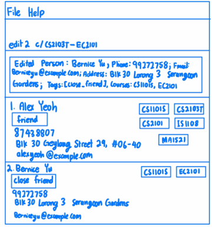
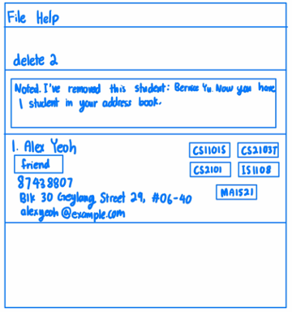
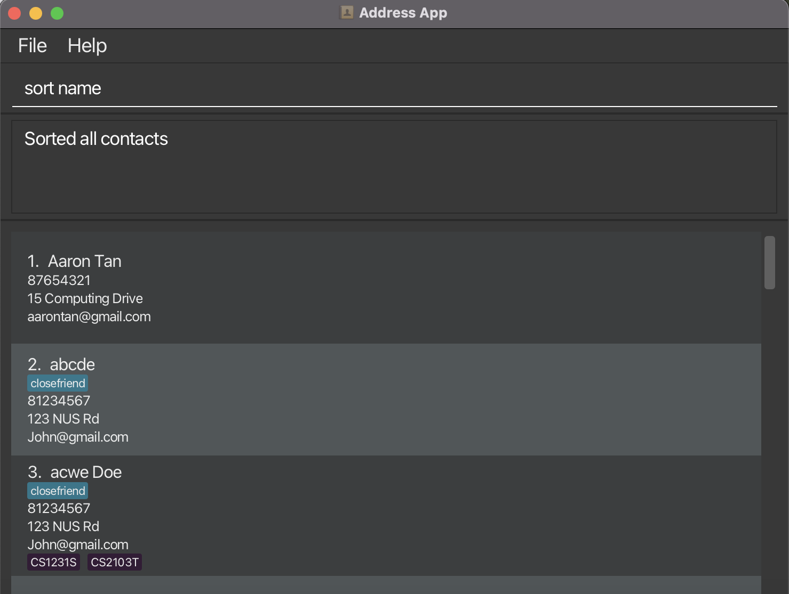

NUSCourseMates is a **desktop app for managing contacts and their courses, optimized for use via a Command Line Interface** (CLI) while still having the benefits of a Graphical User Interface (GUI). If you can type fast, NUSCourseMates can get your contact management tasks done faster than traditional GUI apps.

* Table of Contents
{:toc}

--------------------------------------------------------------------------------------------------------------------

## Quick start

1. Ensure you have Java `11` or above installed in your Computer.

2. Download the latest `NUSCourseMates.jar` from [here](https://github.com/AY2324S1-CS2103T-T17-4/tp/releases).

3. Copy the file to the folder you want to use as the _home folder_ for your NUSCourseMates.

4. Open a command terminal, `cd` into the folder you put the jar file in, and use the `java -jar NUSCourseMates.jar` command to run the application. 
   A GUI similar to the below should appear in a few seconds. Note how the app contains some sample data. 
   

5. Type the command in the command box and press Enter to execute it. e.g. typing **`help`** and pressing Enter will open the help window. 
   Some example commands you can try:

   * `list` : Lists all contacts.

   * `add n/John Doe p/98765432 e/johnd@example.com a/John street, block 123, #01-01` : Adds a contact named `John Doe` to the Address Book.

   * `delete 3` : Deletes the 3rd contact shown in the current list.

   * `clear` : Deletes all contacts.

   * `exit` : Exits the app.

6. Refer to the [Features](#features) below for details of each command.

--------------------------------------------------------------------------------------------------------------------

## Features

**:information_source: Notes about the command format:** 

* Words in `UPPER_CASE` are the parameters to be supplied by the user. 
  e.g. in `add n/NAME`, `NAME` is a parameter which can be used as `add n/John Doe`.

* Items in square brackets are optional. 
  e.g `n/NAME [t/TAG]` can be used as `n/John Doe t/friend` or as `n/John Doe`.

* Items with `…`​ after them can be used multiple times including zero times. 
  e.g. `[t/TAG]…​` can be used as ` ` (i.e. 0 times), `t/close friend`, `t/friend t/emergency` etc.

* Parameters can be in any order. 
  e.g. if the command specifies `n/NAME p/PHONE_NUMBER`, `p/PHONE_NUMBER n/NAME` is also acceptable.

* Extraneous parameters for commands that do not take in parameters (such as `help`, `list`, `exit` and `clear`) will be ignored. 
  e.g. if the command specifies `help 123`, it will be interpreted as `help`.

* If you are using a PDF version of this document, be careful when copying and pasting commands that span multiple lines as space characters surrounding line-breaks may be omitted when copied over to the application.

### Adding a person: `add`  
> "Every new friend is a new adventure…the start of more memories."
> — Patrick Lindsay

Adds a person to the address book.

Format: `add n/NAME p/PHONE_NUMBER [e/EMAIL] [a/ADDRESS] [th/TELEHANDLE] [t/TAG]… [c/COURSE]…​`

**:information_source: Note:** 

* A person MUST have a name and phone number

* A person can have any number of tags or courses (including 0)

* Only unique students can be added. It is considered a duplicate if an existing students and the current students to be added have name.

* Courses added have to be existing and valid courses.

* If you want to add a close friend tag , the format will be `t/cf`, it is case insensitive.

* The tags 'Emergency', 'close friend', and 'friend' are case-insensitive; they will be saved as 'Emergency', 'Close Friend', and 'Friend' in our address book.

* We can only tag up to two contacts with the Emergency tag.

Examples:
* `add n/John Doe p/81234567 e/John@gmail.com a/123 NUS Rd th/@johnny t/close friend c/CS1231S c/CS2103T`
* `add n/Bob Lee p/91234567 e/BL@gmail.com a/123 Clementi Rd th/@boblee c/CS2030S c/CS2040S c/GEA1000 c/NUR1113a`
* `add n/Tom Lee p/81289900`

### Listing all persons : `list`

Shows a list of all persons in the address book.

Format: `list`

Examples:

### Editing a student : `edit`

Edits an existing student in the address book.

Format: `edit INDEX [n/NAME] [p/PHONE] [e/EMAIL] [a/ADDRESS] [th/TELEHANDLE] [t/TAG]…​ [c/add-COURSE_TO_ADD]…​ 
[c/del-COURSE_TO_DELETE]…​ [c/ORIGINAL_COURSE-NEW_COURSE]…​`

* Edits the student at the specified `INDEX`. The index refers to the index number shown in the displayed student list. The index **must be a positive integer** 1, 2, 3, …​
* At least one of the optional fields must be provided.
* Existing values will be updated to the input values.
* When editing tags, the existing tags of the person will be removed i.e adding of tags is not cumulative.
* You can remove all the person’s tags or courses by typing `t/` or `c/` respectively without
    specifying any tags after it.
* Here are the 3 types of course modifications:
  1. To add a course, use c/add-[COURSE_TO_ADD]. 
  2. To delete a course, use c/del-[COURSE_TO_DELETE].
  3. To edit a course directly, use c/[ORIGINAL_COURSE-NEW_COURSE].
* The three types of course modifications can be chained together in any amount in a single command.
  * However, the collective chain of modifications will not be executed if any one modification in the chain is invalid.
  * Invalidity arises from either:
  
     (1) Invalid course provided (i.e. CS210333) 
  
     (2) The course you are trying to delete (Type ii) or the course you are trying to modify directly (Type iii) does not exist. There are two possible reasons:
      1. The student does not have the specified course originally. if a student does not have CS2103T originally, performing "c/del-CS2103T" alone will cause an error.
      2. The student has the specified course originally, but because you can chain a list of modifications together, and the modifications are performed in order, it is possible that the course might not exist after a certain change. Performing "c/del-CS2103T c/del-CS2103T" will cause an error, because the first change is performed before the second, and CS2103T does not exist after the first change.

  
Examples:
*  `edit 1 p/91234567 e/johndoe@example.com c/add-MA1521 c/del-CS2103T c/MA2001-ST2334` Assuming the first person in the address book list has courses CS2103T and MA2001 originally, this command edits his phone number and email address to be `91234567` and `johndoe@example.com` respectively, and performs the following course modifications in order: add MA1521, delete CS2103T (valid because CS2103T exists originally), change MA2001 to ST2334 (valid because MA2001 exists originally). The first person now has courses MA1521 and ST2334. 
*  `edit 2 n/Betsy Crower t/` Edits the name of the 2nd person to be `Betsy Crower` and clears all existing tags.
   

### Locating students by name: `findstudent`

Finds students whose names contain any of the given keywords.

Format: `findstudent KEYWORD [MORE_KEYWORDS]`

* The search is case-insensitive. e.g `hans` will match `Hans`
* The order of the keywords does not matter. e.g. `Hans Bo` will match `Bo Hans`
* Only the name is searched.
* Only full words will be matched e.g. `Han` will not match `Hans`
* Persons matching at least one keyword will be returned (i.e. `OR` search).
  e.g. `Hans Bo` will return `Hans Gruber`, `Bo Yang`

Examples:
* `findstudent John` returns `john` and `John Doe`
* `findstudent alex david` returns `Alex Yeoh`, `David Li` 
  

### Locating courses by name: `findcourse`

Finds courses whose names contain any of the given keywords.

Format: `findcourse KEYWORD [MORE_KEYWORDS]`
* The search is case-insensitive. e.g cs2030s will match CS2030S
* Only the course name is searched.
* Partial words will be matched e.g. CS2030 will match  CS2030 and CS2030S
* Courses matching at least one keyword will be returned (i.e. OR search). e.g. cs210 will return CS2103, CS2106

Examples:
* `findcourse cs2030s` returns `CS2030` and `CS2030S`
* `findcourse cs2103t ma1521` returns `CS2103T` and `MA1521`
  

### Deleting a student : `delete`

> "It's really amazing when two strangers become the best of friends, but it's really sad when the best of friends become two strangers."
> — Unknown

Deletes the specified student from the address book.

Format: `delete INDEX`

* Deletes the student at the specified `INDEX`.
* The index refers to the index number shown in the displayed person list.
* The index **must be a positive integer** 1, 2, 3, …​
* The deleted student will no longer appear when the `findcourse`, `findstudent` or `list` commands are entered.

Examples:
* `list` followed by `delete 2` deletes the 2nd person in the address book.
* `find Betsy` followed by `delete 1` deletes the 1st person in the results of the `find` command.

### Sorting all entries : `sort` 

Sorts all contacts according to the specified criterion. 

Format: `sort SORT_CRITERION`

Examples:
* `sort course` returns a sorted address book based on the number of courses taken in **descending** order.
* `sort course size-ascending` returns a sorted address book based on the number of courses taken in **ascending** order.
* `sort name` returns a sorted address book based on the names of the persons in **ascending** lexicographic order.
* `sort name-descending` returns a sorted address book based on the names of the persons in **descending** lexicographic order.
* `sort tags` returns a sorted address book according to the tags tagged to each person. 

### Clearing all entries : `clear`

Clears all entries from the address book.

Format: `clear`

Examples:

### Exiting the program : `exit`

Exits the program.

Format: `exit`
* Program closes.
* `Unknown command` appears when the user does not type the correct exit command.
  * Examples of invalid commands: `exits`, `EXIT` etc.

### Viewing help : `help`

Shows a message which explains how the user should access the help page.

Format: `help`

* A message containing the hyperlink to the help page will be displayed.
* The prompt `Opened Help Window` is also displayed on screen.
* `Unknown command` appears when the user does not type the correct help command. 
  * Examples of invalid commands: `helps`, `HELP` etc.

### Viewing Feedback : `feedback`

Shows a message which explains how the user should access the feedback page to give their feedback with regard
to NUSCourseMates.

Format: `feedback`

* A message containing the hyperlink to the feedback page will be displayed.
* The prompt `Opened Feedback Window` is also displayed on screen.
* `Unknown command` appears when the user does not type the correct feedback command.
    * Examples of invalid commands: `feedbacks`, `FEEDBACK` etc.

### Saving the data

NUSCourseMates data are saved in the hard disk automatically after any command that changes the data. There is no need to save manually.

### Editing the data file

NUSCourseMates data are saved automatically as a JSON file `[JAR file location]/data/addressbook.json`. Advanced users are welcome to update data directly by editing that data file.

:exclamation: **Caution:**
If your changes to the data file makes its format invalid, NUSCourseMates will discard all data and start with an empty data file at the next run. Hence, it is recommended to take a backup of the file before editing it.

### Archiving data files `[coming in v2.0]`

_Details coming soon ..._

--------------------------------------------------------------------------------------------------------------------

## FAQ
**Q**: How do I check the Java version I am using? 
**A**: Open the Terminal application (if you are using MacOS) or Command Prompt (if you are using Windows). Type `java -version` and hit Enter. The first number that appears in the response refers to the Java version you are currently using.    

**Q**: How do I install Java 11, the Java version required by NUSCourseMates? 
**A**: You may download Java 11 from this [link](https://www.oracle.com/sg/java/technologies/javase/jdk11-archive-downloads.html).  

**Q**: I accidentally closed the application. Is my data lost? 
**A**: Fret not! NUSCourseMates saves your data after every change you make, so you won't lose any data.

**Q**: Do I need an active internet connection to use NUSCourseMates? 
**A**: You can use NUSCourseMates offline, but you'll need an internet connection to download it to your device.  

**Q**: How do I transfer my data to another Computer? 
**A**: Install the app in the other computer and overwrite the empty data file it creates with the file that contains the data of your previous NUSCourseMates home folder.

--------------------------------------------------------------------------------------------------------------------

## Known issues

1. **When using multiple screens**, if you move the application to a secondary screen, and later switch to using only the primary screen, the GUI will open off-screen. The remedy is to delete the `preferences.json` file created by the application before running the application again.

--------------------------------------------------------------------------------------------------------------------

## Command summary

| Action           | Format, Examples                                                                                                                                                                                                                                                               |
|------------------|--------------------------------------------------------------------------------------------------------------------------------------------------------------------------------------------------------------------------------------------------------------------------------|
| **Add**          | `add n/NAME p/PHONE_NUMBER e/EMAIL a/ADDRESS th/TELEHANDLE [t/TAG] c/COURSE_1…​`   e.g., `add n/John Doe p/81234567 e/John@gmail.com a/123 NUS Rd t/close friend c/CS1231S CS2103T`                                                                                         |
| **Clear**        | `clear`                                                                                                                                                                                                                                                                        |
| **Delete**       | `delete INDEX`  e.g., `delete 3`                                                                                                                                                                                                                                            |
| **Edit**         | `edit INDEX [n/NAME] [p/PHONE_NUMBER] [e/EMAIL] [a/ADDRESS] [th/TELEHANDLE] [t/TAG] [c/add-COURSE_TO_ADD] [c/add-COURSE_TO_DELETE] [c/ORIGINAL_COURSE-NEW_COURSE]…​`  e.g.,`edit 1 p/91234567 e/johndoe@example.com c/add-MA1521 c/del-MA1521 c/add-MA2001 c/MA2001-ST2334` |
| **Find Student** | `findstudent KEYWORD [MORE_KEYWORDS]`  e.g., `findstudent James Jake`                                                                                                                                                                                                       |
| **Find Course**  | `findcourse KEYWORD [MORE_KEYWORDS]`  e.g., `findcourse CS2103T CS2040S `                                                                                                                                                                                                   |
| **Sort**         | `sort SORT_CRITERION`  e.g., `sort name`                                                                                                                                                                                                                                    |
| **List**         | `list`                                                                                                                                                                                                                                                                         |
| **Help**         | `help`                                                                                                                                                                                                                                                                         |
