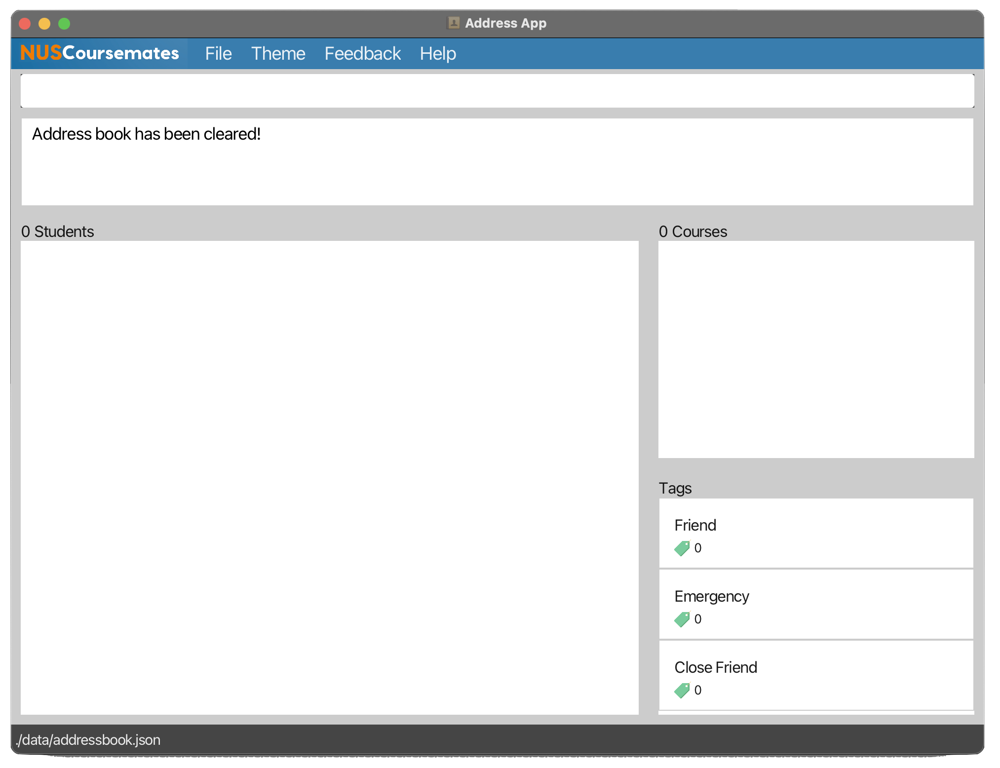

Hello, School of Computing (SoC) students in the National University of Singapore (NUS)! 

A warm welcome to this user guide, your essential companion for navigating and maximizing the full potential of our application, **NUSCoursemates**.

### Table of Contents
* Table of Contents
{:toc}

--------------------------------------------------------------------------------------------------------------------

## Introduction
Are you a SoC student looking to build new and meaningful connections with others in university? Do you find a lack of suitable applications for you to conveniently connect with your coursemates? Or is connecting with others too exhausting for you? 

**NUSCoursemates** steps in as the comprehensive solution, making it easier than ever for you to connect with your coursemates! 

With this desktop application, you can effortlessly 
* **find** fellow students in your courses, 
* **add** their contacts into your own NUSCoursemates application, 
* **sort** these contacts, 
* and do **much more**!

**NUSCoursemates** is purposefully designed for use via a [Command Line Interface (CLI)](https://www.w3schools.com/whatis/whatis_cli.asp), which is tailored to the needs of SoC students like you.

## Using this Guide

Whether you're a novice just beginning your journey into the world of NUS SoC student connections, or a seasoned expert seeking new ways to enhance your experience with **NUSCoursemates**, this guide will cater to your needs. 

We will walk you through every step, from the basics of setting up your profile to advanced features that empower you to make the most of your SoC connections.

**Novice Users:** For those taking their first steps with **NUSCoursemates**, our [Quick Start Guide](#quick-start) will be your trusted ally, providing a seamless entry into the world of SoC networking.

**Amateur Users:** You will find the answers you seek and step-by-step instructions for customizing **NUSCoursemates** to your preferences in our comprehensive [table of contents](#table-of-contents).

**Seasoned Users:** We have streamlined your access to crucial information with our [command summary](#command-summary) and prefix summary, allowing you to find the commands you need with ease.

If you have any doubts while using **NUSCoursemates**, do head over to [FAQ](#faq) to view comprehensive answers to some frequently asked questions. You may also contact us at [_NUSCoursemates@gmail.com_](mailto:NUSCoursemates@gmail.com). 

In addition, here are some symbols that will give you a more enjoyable time using our guide:

| Symbol               | Meaning                                                                                        |
|----------------------|------------------------------------------------------------------------------------------------|
| :information_source: | Note. Provides additional information.                                                         |
| :bulb:               | Helpful tip that will improve your experience.                                                 |
| :exclamation:        | Warning. Attempting to perform an action with a warning will lead to undesirable consequences. |

**:information_source: Notes about the command format:** 
* These symbols will be encapsulated in a box as such.

--------------------------------------------------------------------------------------------------------------------
## User Interface
In NUSCoursemates, we've designed our user interface with your convenience and ease of use in mind. Let's take a closer look at the key components of our user interface:

| No  | Component          | Description                                                                                                                                           |
|-----|--------------------|-------------------------------------------------------------------------------------------------------------------------------------------------------|
| 1   | Menu Bar           | Provides access to various commands, including options to switch between dark and light mode, and other miscellaneous features.                       |
| 2   | Command Box        | The Command Box is where you can input commands to interact with NUSCoursemates. You can execute a wide range of operations through this input field. |
| 3   | Command Result     | Displays the results and feedback for the executed commands. It provides information and feedback on the outcomes of your actions.                    |
| 4   | Student List Panel | Presents a list of students, and it is where you can view your fellow student records.                                                                |
| 5   | Course List Panel  | Displays a summary of all the courses in your address book, along with the total number of students in each course.                                   |
| 6   | Tag List Panel     | Displays a summary of your tags, including options like 'Friend,' 'Close Friend,' and 'Emergency.'                                                    |

### 1. Menu Bar

The Menu Bar is your command center, offering access to a variety of functions, including the ability to switch between dark and light modes, and other useful features.

| Menu Item | Description                                                             |
|-----------|-------------------------------------------------------------------------|
| File      | Exit the application to close it.                                       |
| Theme     | Choose between Light or Dark mode for your preferred look.              |
| Feedback  | Share your thoughts and suggestions with us through the feedback link.  |
| Help      | Access the User Guide to get assistance and answers to your questions.  |

### 2. Command Box
The Command Box is where the magic happens. It's your gateway to NUSCoursemates, allowing you to input commands and perform a wide range of operations with ease.

You can locate the list of commands you can perform in our [Command Summary](#command-summary).
### 3. Command Result

The Command Result section is your information hub. Here, you'll find the outcomes and feedback from your executed commands, helping you stay informed about the impact of your actions.

### 4. Student List Panel
 

The Student List Panel simplifies your connections. It provides a list of fellow students, offering a convenient way to explore and manage student records, fostering collaboration and community.

You will be able to view each student's details such as:
* Phone number
* Address
* Telehandle
* Email
* Courses
* Tags

### 5. Course List Panel

The Course List Panel is your academic overview. It presents a summary of all the courses in your address book, along with the total number of students in each course. It's your academic compass.

e.g. `MA2001: 2` means that there are 2 students in NUSCoursemates that takes MA2001.

### 6. Tag List Panel

The Tag List Panel allows you to personalize your connections. Here, you'll find a summary of your tags, including options like 'Friend,' 'Close Friend,' and 'Emergency.' It helps you categorize and manage your contacts with ease.

e.g. `Friend: 3` means that there are 3 students in NUSCoursemates that have "Friend" tag.

--------------------------------------------------------------------------------------------------------------------
## Quick start

1. Ensure you have **Java 11** installed in your Computer.
   * The method to check the Java version you use will be different for every operating system. 
     * **Windows** users:  
     Click on the '**Windows**' key and search for '**Command Prompt**'   
     * **Mac** users:   
     Click on '**F4**' and search for '**Terminal**'
     * **Linux** users:  
     Click on '**Ctrl**' + '**Alt**' + '**T**' keys simultaneously
   * Once the application is open, type `java -version` and hit '**Enter/ Return**'. 
   * The application should state your Java version, as shown in the red circle below:
     

         
     

    
    * If you do not see `11`, or if you do not have Java installed, follow the instructions [here](https://www.codejava.net/java-se/download-and-install-java-11-openjdk-and-oracle-jdk.) to download **Java 11**. 
    
2. Download the latest `NUSCoursemates.jar` from [here](https://github.com/AY2324S1-CS2103T-T17-4/tp/releases).
     

         
     
  
3. Copy the file to the folder you want to use as the _home folder_, such as the **Desktop** folder, for your NUSCoursemates. 
4. Open the command terminal in Step 1.
5. `cd` into the folder with the `NUSCoursemates.jar` file. For example, if your file is in the **Desktop** folder, simply type `cd Desktop`. 
6. Enter the next command, `java -jar NUSCoursemates.jar`. Your commands should look like this:
     

          
     
  
7. Hit '**Enter**'. An interface similar to the image below should appear:
     

        
     

8. **Absolutely well done!** You are now ready to move on to the next section to learn about the [Command Line Interface (CLI)](#using-the-command-line-interface--cli-).

## Using the Command Line Interface (CLI)  
**NUSCoursemates** uses the Command Line Interface (CLI). CLI is a means of interacting with a computer program that runs on **text-based inputs** to execute different tasks. 

Do not worry! CLI is definitely less scary than it sounds. In fact, this is all there is to it: 

Recall that the image above shows the [Command Box](#2-command-box) of **NUSCoursemates**. It is the _heart_ of **NUSCoursemates**. 

Therefore, it is no surprise that you will be keying in commands, which are text-based inputs, in the [Command Box](#2-command-box) to execute different tasks. 

While we know that you cannot wait to try out some new commands, let us first learn what a command consists of:

 

    
 

A command is made up of multiple components: 

| Component    | Example    | Description                                                                                                                                                     |
|--------------|------------|-----------------------------------------------------------------------------------------------------------------------------------------------------------------|
| Command Word | `add`      | Specifies the task to be performed                                                                                                                              |
| Prefix       | `n/`       | Indicates the field to be edited (e.g., name)                                                                                                                   |
| Field        | `John Doe` | Represents the updated value or content.   These values, which are provided by the user, are used to replace the `UPPER_CASE` letters in the command format |

Additionally, certain symbols in the command format are used to indicate additional properties.
For example (with reference to the `add` command above): 

| Prefix/Field Format | Example             | Description                                                                         |
|---------------------|---------------------|-------------------------------------------------------------------------------------|
| `n/NAME`            | `n/John Doe`        | Denotes a compulsory `name` field                                                   |
| `[e/EMAIL]`         | `e/johnd@gmail.com` | Denotes an optional `email` field with a maximum of one email for the student       |
| `[t/TAG]…​`         | `t/friend`          | Denotes an optional `tag` field with no limit on the number of tags for the student |

Let us look at an example for the `add` command:
 

    
 

When adding your new connections, you would modify the fields accordingly. Note that the command words and prefixes are case-sensitive, and their spelling must be accurate. 

Now that you have learnt about the components of a command, you are ready to use our application! Admittedly, we are as excited as you are! 

You could try typing one of the following commands in the command box. Afterwards, press **'Enter'** to see the magic happen!

* `list` : Lists all contacts.

* `add n/John Doe p/98765432 e/johnd@example.com a/15 Computing Ave, #01-01 c/cs2101` : Adds a contact named `John Doe` to the Address Book.

* `delete 3` : Deletes the 3rd contact shown in the current list.

**Great job!** You are now ready to learn about the exciting [features](#features) we have designed for you. Enjoy!

**:information_source: Notes about CLI:** 
* As a SoC student, you will encounter the CLI in some SoC courses.
* It is beneficial for you to start learning the CLI early!

--------------------------------------------------------------------------------------------------------------------
## Features

**:information_source: Notes about the command format:** 

* Parameters can be in any order. 
  e.g. if the command specifies `n/NAME p/PHONE_NUMBER`, `p/PHONE_NUMBER n/NAME` is also acceptable.

* Extraneous parameters for commands that do not take in parameters (such as `help`, `list`, `exit` and `clear`) will be ignored. 
  e.g. if the command specifies `help 123`, it will be interpreted as `help`.

* If you are using a PDF version of this document, be careful when copying and pasting commands that span multiple lines as space characters surrounding line-breaks may be omitted when copied over to the application.

## Basic Administration
This subsection covers the basic processes that you will encounter when adding students to NUSCoursemates.

### Adding a student: `add`  
> "Every new friend is a new adventure…the start of more memories."
> — Patrick Lindsay

Embrace the opportunity to expand your circle and make lasting connections by adding new friends to your address book. Our user-friendly "Add" feature makes it simple and convenient to do just that.

**How to do it:** With the `add` command, you can include a variety of details to create a comprehensive profile for your new friend. Here's what each element represents:

Format: `add n/NAME p/PHONE_NUMBER [e/EMAIL] [a/ADDRESS] [th/TELEHANDLE] [t/TAG]… [c/COURSE]…​`

* `n/NAME`: Your friend's name, because every name carries a unique story.
* `p/PHONE_NUMBER`: Their contact number, ensuring you're always just a call or message away.
* `e/EMAIL` (optional): Include their email address, making digital connections seamless.
* `a/ADDRESS` (optional): Specify their physical address, ideal for planning meetups.
* `th/TELEHANDLE` (optional): Provide their telehandle, ensuring quick and easy communication.
* `t/TAG` (optional): Categorize your friend with relevant tags, simplifying your contact management.
* `c/COURSE` (optional): Associate your friend with the courses they are enrolled in, for easy reference in your academic journey.

**:information_source: Note:** 
* You can include any number of tags or courses (including none).
* Only three tag types are allowed: 'Friend,' 'Close Friend,' and 'Emergency.'
* To add a 'Close Friend' tag, use t/cf (case-insensitive).
* Tags and Courses are case-insensitive when entered.

**:exclamation: Caution:**  
* A student **MUST** have a name and phone number.  
* Duplicate students are identified by their names; ensure the name is unique.  
* Make sure the courses you add exist and are valid.  
* You can tag up to two contacts with the 'Emergency' tag.  

Examples:
* `add n/John Doe p/81234567 e/John@gmail.com a/123 NUS Rd th/@johnny t/close friend c/CS1231S c/CS2103T`
* `add n/Bob Lee p/91234567 e/BL@gmail.com a/123 Clementi Rd th/@boblee c/CS2030S c/CS2040S c/GEA1000 c/NUR1113a`
* `add n/Tom Lee p/81289900`

### Listing all students : `list`

Discover the power of the "List" feature – your ultimate tool for staying organized and in the know about your student contacts. It's like having your address book at your fingertips, ready to provide you with a clear, comprehensive view of your network.

**How to do it:** With the straightforward `list` command, you can effortlessly generate a list of all the students in your address book. It's as simple as typing "list."

Format: `list`

Examples:

### Editing a student : `edit`

Picture this: your best friend has changed his phone number, and you want to ensure his details are updated. With the "edit" feature, modifying any of your contact's details is a piece of cake.

Format: `edit INDEX [n/NAME] [p/PHONE] [e/EMAIL] [a/ADDRESS] [th/TELEHANDLE] [t/TAG]…​ [c/add-COURSE_TO_ADD]…​ 
[c/del-COURSE_TO_DELETE]…​ [c/ORIGINAL_COURSE-NEW_COURSE]…​`

- Provide the **index number** of the student based on the **student list currently displayed**, along with the updated details you wish to change to.
- At least one of the optional fields must be provided.
- Existing values will be updated to the input values. The values of the unspecified fields will remain unchanged. 

| Field            | Tag | Description                                | Requirement | Special Notes                                                                                                                                                               |
|------------------|-----|--------------------------------------------|-------------|-----------------------------------------------------------------------------------------------------------------------------------------------------------------------------|
| `INDEX`          | -   | Index of contact in displayed list         | Compulsory  | -                                                                                                                                                                           |
| `NAME`           | n/  | Updated name of contact                    | Optional    | Cannot provide a name that already exists in the address book.                                                                                                              |
| `PHONE`          | p/  | Updated phone number of contact            | Optional    | -                                                                                                                                                                           |
| `EMAIL`          | e/  | Updated email of contact                   | Optional    | -                                                                                                                                                                           |
| `ADDRESS`        | a/  | Updated address of contact                 | Optional    | -                                                                                                                                                                           |
| `TELEHANDLE`     | th/ | Updated telehandle of contact              | Optional    | - A student can only have one telehandle.   - Telehandles must start with "@".                                                                                          |
| `TAG`            | t/  | Updated tag of contact                     | Optional    | - Only 3 types of tags (Friend, Close Friend and Emergency) are allowed.   -The rule that there is a maximum of 2 persons with emergency tags is enforced here as well. |
| `COURSE_CHANGE`  | c/  | Course change to be performed for contact  | Optional    | See below for more information.                                                                                                                                             |

**More information about the `COURSE_CHANGE` field:**
- As mentioned above, course changes are specified using the `c/` tag. In addition, they need to be in one of three formats specified below.
- All course names specified must be valid. For example, `CS2103T` is valid while `CS210333` is invalid. 
- You can chain any amount of any type of modification together. The modifications will be performed in the listed order, from left to right.
  - E.g. `c/add-MA1521 c/del-CS2030S c/MA1521-ST2334 c/add-MA2001` can all be specified in one edit command. 

| Required Format                    | Description                                               | Special Notes                                                                     |
|------------------------------------|-----------------------------------------------------------|-----------------------------------------------------------------------------------|
| `c/add-[COURSE_TO_ADD]`            | Adds a course for the student                             | If the student already has the course, the course will not be added again.        |
| `c/add-[COURSE_TO_DELETE]`         | Deletes a course for the student                          | If the student does not have the course, an error message will be displayed.      |
| `c/[ORIGINAL_COURSE]-[NEW_COURSE]` | Changes `ORIGINAL_COURSE` to `NEW_COURSE` for the student | If the student does not `ORIGINAL_COURSE`, an error message will be displayed.    |

**:exclamation: Caution:**  
* Although it is very convenient to be able to chain together multiple types of modifications, please be mindful when trying to delete or change a course even though the specified student does not possess it. 
* For example, if Student 1 has `CS2103T`, and you perform `edit 1 c/del-CS2103T c/del-CS2103T`, while the first delete is valid, the second delete is not - because you are trying to remove a course that no longer exists for Student 1.  
* An error message will be displayed if such errors occur and all changes in the chain of modifications will not be performed if any one of them are deemed to be invalid. 

**:information_source: Pro Tip:** 
* You can include `t/` in your edit command to remove all of a person's tags.
* You can include `c/` your edit command to remove all of a peron's courses.

Examples:
* `edit 1 p/91234567 e/johndoe@example.com c/add-MA1521 c/del-CS2103T c/MA2001-ST2334`. This command is targeted at the first person in the address book, which as seen in the "Before" picture below, is John. 
  * This command edits his phone number and email address to be `91234567` and `johndoe@example.com` respectively, and performs the following course modifications in order - add MA1521, delete CS2103T (valid because John has CS2103T), change MA2001 to ST2334 (valid because John has MA2001). John now has courses MA1521 and ST2334, as shown in "After" below. 

Before:

After:

* `edit 2 n/Betsy Crower t/` Edits the name of Person 2 to be `Betsy Crower` and clears all existing tags.

### Clearing courses of all students: `clear-courses`

A new semester has begun, and you want to reset all the courses of all your friends - but you don't want to remove your friends from the address book? We've got you covered - this `clear-courses` command is extremely simple and fast.

**How to do it:** With the straightforward `clear-courses` command, you can effortlessly clear the courses of all your contacts in the address book. It's as simple as typing "clear-courses."

Before:

After:

### Locating students by name: `findstudent`

Finds students whose names contain any of the given keywords.

Format: `findstudent KEYWORD [MORE_KEYWORDS]`

* The search is case-insensitive. e.g `hans` will match `Hans`
* The order of the keywords does not matter. e.g. `Hans Bo` will match `Bo Hans`
* Only the name is searched.
* Only full words will be matched e.g. `Han` will not match `Hans`
* Persons matching at least one keyword will be returned (i.e. `OR` search).
  e.g. `Hans Bo` will return `Hans Gruber`, `Bo Yang`

Examples:
* `findstudent John` returns `john` and `John Doe`
* `findstudent alex david` returns `Alex Yeoh`, `David Li` 
  

### Discover Coursemates with `findcourse`

Ever wondered who in your address book has taken the same courses as you? With `findcourse`, you can effortlessly locate fellow NUS SoC students you've saved who have enrolled in specific courses.

Here’s how to make the most of this handy tool:

Format: `findcourse KEYWORD [MORE_KEYWORDS]`
* Case-Insensitive: Type in any case, like 'cs2030s' or 'CS2030S', and we'll find a match.
* Search By Course Names: This tool zeroes in on the course names associated with your contacts, giving you precise results.
* Partial Words Are Okay: Entering 'CS2030' will identify students who have taken both 'CS2030' and 'CS2030S'.
* Multiple Course Searches: Use multiple keywords, and we'll show you students who have enrolled in any of the courses. For instance, 'cs210' will reveal students who took 'CS2103' or 'CS2106'.

Examples:
* `findcourse cs2030s` returns `CS2030` and `CS2030S`
* `findcourse cs2103t ma1521` returns `CS2103T` and `MA1521`

  

### Deleting a student : `delete`

> "It's really amazing when two strangers become the best of friends, but it's really sad when the best of friends become two strangers."
> — Unknown

In your journey with NUSCoursemates, you may find it necessary to part ways with a student entry in your address book. Maybe a friend has graduated or you've made an error. Whatever the reason, the delete command is your tool for decluttering and maintaining a neat address book.

Format: `delete INDEX`

* `INDEX`: Deletes the student at the specified mark.

**:information_source: Note:** 
* The index refers to the index number shown in the displayed person list.
* The index **must be a positive integer** 1, 2, 3, …​
* The deleted student will no longer appear when the `findcourse`, `findstudent` or `list` commands are entered.

Examples:
* `list` followed by `delete 2` deletes the 2nd person in the address book.
* `find Betsy` followed by `delete 1` deletes the 1st person in the results of the `find` command.

### Sorting by Course: `sort course`

Picture this: Your NUS address book is teeming with contacts, each with their unique set of courses. Curious about who's taken on the most courses or who's just starting out?

At its core, the `sort course` command rearranges your address book, bringing those with the most courses to the forefront in **descending order**.

For a twist in perspective, and to cheer on those just embarking on their academic journey, use `size-ascending`. This flips the narrative, showcasing contacts with fewer courses in **ascending** order.

#### Format: `sort course`
* Revel in the contacts who've ventured into many courses, displayed in **descending order**.

Example:
Before Sorting:

After `sort course`:

#### Format: `sort course size-ascending`:
* Highlight the newcomers, those with the fewest courses, arranged in ascending order.

Example:
Before Sorting:

After `sort course size-ascending`:

### Sorting by Name: `sort name`
As time passes, you might encounter students with incredibly hard-to-spell names. You might vaguely recall the first letter of the name but struggle to spell it out completely.

Here's the good news: The sort name command neatly **arranges the students** in your address book **by their names**, making it easier than ever to look up a student.

Plus, you have the flexibility to specify whether you would like to sort their names in **ascending** or **descending** lexicographic order.

Format: `sort name-SORT_CRITERION`

Examples:
* `sort name-descending` sorts students by their names in descending order.
* `sort name` or `sort name-ascending` sorts students by their names in ascending order.

### Sorting by Tags: `sort tags`
The greatest joy in university is, without a doubt, to attend boring classes with your close friends. 

With the `sort tags` command, NUSCoursemates helps you keep a _close_ track of students tagged as 'Close Friend' by placing them right at the top of the address book. 

These will be followed by students tagged as 'Friend', and 'Emergency', in that order of decreasing importance.  

Format: `sort tags`

**:information_source: Note on students with multiple tags:** 
Students with multiple tags will be sorted by the tag with the greatest importance.  
For example, a student with both 'Friend' and 'Emergency' tags will be placed in the address book with other students tagged as 'Friend'

### Clearing all students : `clear`
>"Every sunset is an opportunity to reset. Every sunrise begins with new eyes."
> — Richie Norton

Clearing all entries is your path to a new chapter in your NUSCoursemates. In NUSCoursemates, we've made it easy for you to clear all student entries when needed.

This feature helps you start fresh or declutter your address book with a single command. Follow the simple steps below to clear all entries from your address book:

Format: `clear`

Examples:

**:exclamation: This action cannot be undone!:** 
* Only enter the `clear` command if you are sure that you wish to remove all existing contacts. Once you run this command, you lose all data immediately. 

## Additional Features
Congratulations, you've reached the end of our core features to modify NUSCoursemates, and that's a job well done! We know it's a lot of information to digest, but don't worry. We've got your back.

But before you go, let's talk about a few extra features that can make your NUSCoursemates experience even better. We've designed these features with you in mind, making sure your journey with us is as seamless as it gets.

### Seeking help : `help`
> "Ignorance has always been the weapon of tyrants; enlightenment the salvation of the free."
> — Bill Richardson

Still feeling a little lost? Just type "help" to access our User Guide and find the issue you are facing. Alternatively, you can simply click on the help button located on the Menu bar. It is as simple as that.

Once you use the help command, you'll receive a message containing a hyperlink to our comprehensive User Guide.

Format: `help`

**:exclamation: Caution:**  
* If your command isn't recognized and you see "Unknown command," simply check your spelling and try again. Avoid variants like "helps" or "HELP."

### Providing Valuable Feedback : `feedback`
> "Your voice is the most powerful tool you have. Be the change you want to see."
> — Anonymous

When you use the feedback command, you'll receive a message containing a link to our dedicated Google feedback form. Alternatively, you can simply click on the feedback button located on the Menu bar. Your journey towards change starts there.

Format: `feedback`

**:exclamation: Caution:**  
* If your command isn't recognized and you see "Unknown command," simply check your spelling and try again. Avoid variants like `feedbacks` or `FEEDBACK`."

### Exiting the program : `exit`
> "The pain of parting is nothing to the joy of meeting again."
> — Charles Dickens

When you're ready to take a break or end your session, simply use the `exit` command.
Alternatively, you can also click the close button on the window to exit. It's like closing the door on your way out, knowing that your friends will be right here when you return.

Format: `exit`

**:information_source: Note:** 
* Your data would be saved automatically, feel free to exit anytime!  
* If your command isn't recognized and you see "Unknown command," simply check your spelling and try again. Avoid variants like `exits` or `EXIT`."  

### Saving the data

NUSCoursemates data is saved in the hard disk automatically after any command that changes the data. There is no need to save manually.

### Editing the data file

NUSCoursemates data are saved automatically as a JSON file `[JAR file location]/data/addressbook.json`. Advanced users are welcome to update data directly by editing that data file.

:exclamation: **Caution:**
* If your changes to the data file makes its format invalid, NUSCoursemates will discard all data and start with an empty data file at the next run. Hence, it is recommended to take a backup of the file before editing it.

### Archiving data files `[coming in v2.0]`

_Details coming soon ..._

--------------------------------------------------------------------------------------------------------------------

## FAQ
**Q**: How do I install Java 11, the Java version required by NUSCourseMates? 
**A**: You may download Java 11 from this [link](https://www.oracle.com/sg/java/technologies/javase/jdk11-archive-downloads.html).  

**Q**: I accidentally closed the application. Is my data lost? 
**A**: Fret not! NUSCoursemates saves your data after every change you make, so you won't lose any data.

**Q**: Do I need an active internet connection to use NUSCoursemates? 
**A**: You can use NUSCoursemates offline, but you'll need an internet connection to download it to your device.  

**Q**: How do I transfer my data to another Computer? 
**A**: Install the app in the other computer and overwrite the empty data file it creates with the file that contains the data of your previous NUSCoursemates home folder.

--------------------------------------------------------------------------------------------------------------------

## Glossary

| Term      | Description                                                                                                                                                                                                                                                                                            |
|-----------|--------------------------------------------------------------------------------------------------------------------------------------------------------------------------------------------------------------------------------------------------------------------------------------------------------|
| CLI       | **Command Line Interface (CLI):** A text-based interface that allows users to interact with a computer or software by entering text commands. It's often preferred by power users and developers for its efficiency and scriptability.                                                                 |
| Parameter | **Parameter:** In the context of software, a parameter is a variable or value that is passed into a function, method, or command. Parameters are used to customize the behavior of the function or command.                                                                                            |
| GUI       | **Graphical User Interface (GUI):** A user interface that utilizes graphical elements such as icons, buttons, windows, and menus to allow users to interact with software or applications. GUIs are known for their visual appeal and user-friendliness.                                               |
| JSON      | **JSON (JavaScript Object Notation):** A lightweight data interchange format that is easy for humans to read and write, and easy for machines to parse and generate. JSON is commonly used for data storage and exchange in web applications. It consists of key-value pairs enclosed in curly braces. |
| JAR       | **JAR (Java ARchive):** A file format used for aggregating multiple files (typically Java class files, metadata, and resources) into a single compressed archive. JAR files are commonly used to package and distribute Java applications or libraries.                                                |
| Integer   | **Integer:** In computer programming, an integer is a whole number without a fractional or decimal component. Integers are used to represent whole quantities in mathematics and computer science. They can be positive, negative, or zero.                                                            |

-----
## Known issues

1. **When using multiple screens**, if you move the application to a secondary screen, and later switch to using only the primary screen, the GUI will open off-screen. The remedy is to delete the `preferences.json` file created by the application before running the application again.

--------------------------------------------------------------------------------------------------------------------

## Command summary

| Action            | Format, Examples                                                                                                                                                                                                                                                               |
|-------------------|--------------------------------------------------------------------------------------------------------------------------------------------------------------------------------------------------------------------------------------------------------------------------------|
| **Add**           | `add n/NAME p/PHONE_NUMBER [e/EMAIL] [a/ADDRESS] [th/TELEHANDLE] [t/TAG]… [c/COURSE]…​`   e.g., `add n/John Doe p/98765432 e/johnd@example.com a/John street, block 123, #01-01 c/cs2101 c/cs2103t`                                                                         |
| **Clear**         | `clear`                                                                                                                                                                                                                                                                        |
| **Delete**        | `delete INDEX`  e.g., `delete 3`                                                                                                                                                                                                                                            |
| **Edit**          | `edit INDEX [n/NAME] [p/PHONE_NUMBER] [e/EMAIL] [a/ADDRESS] [th/TELEHANDLE] [t/TAG] [c/add-COURSE_TO_ADD] [c/add-COURSE_TO_DELETE] [c/ORIGINAL_COURSE-NEW_COURSE]…​`  e.g.,`edit 1 p/91234567 e/johndoe@example.com c/add-MA1521 c/del-MA1521 c/add-MA2001 c/MA2001-ST2334` |
| **Find Student**  | `findstudent KEYWORD [MORE_KEYWORDS]`  e.g., `findstudent James Jake`                                                                                                                                                                                                       |
| **Find Course**   | `findcourse KEYWORD [MORE_KEYWORDS]`  e.g., `findcourse CS2103T CS2040S `                                                                                                                                                                                                   |
| **Sort**          | `sort SORT_CRITERION`  e.g., `sort name`                                                                                                                                                                                                                                    |
| **List**          | `list`                                                                                                                                                                                                                                                                         |
| **Help**          | `help`                                                                                                                                                                                                                                                                         |
| **Feedback**      | `feedback`                                                                                                                                                                                                                                                                     |
| **Clear Courses** | `clear-courses`                                                                                                                                                                                                                                                                |
