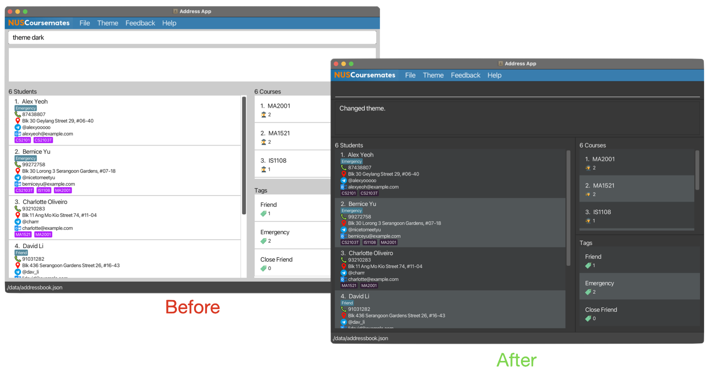

Hello, School of Computing (SoC) students in the National University of Singapore (NUS)! 

A warm welcome to this user guide, your essential companion for navigating and maximising the full potential of our application, **NUSCoursemates**.

### Table of Contents

* Table of Contents
{:toc}

--------------------------------------------------------------------------------------------------------------------

## Introduction
Are you a SoC student looking to build new and meaningful connections with others in university? Do you find a lack of suitable applications for you to conveniently connect with your coursemates? Or is connecting with others too exhausting for you? 

**NUSCoursemates** steps in as the comprehensive solution, making it easier than ever for you to connect with your coursemates! 

With this desktop application, you can easily  
* **add** their contacts into your own NUSCoursemates application
* **find** students saved in NUSCoursemates for their names or the courses they are enrolled
* **sort** these contacts
* and do **much more**!

**NUSCoursemates** is purposefully designed for use via a [Command Line Interface (CLI)](https://www.w3schools.com/whatis/whatis_cli.asp), which is tailored to the needs of SoC students like you.

## Using this Guide

Whether you're a novice just beginning your journey into the world of NUS SoC student connections, or a seasoned expert seeking new ways to enhance your experience with **NUSCoursemates**, this guide will cater to your needs. 

We will walk you through every step, from the basics of setting up your profile to advanced features that empower you to make the most of your SoC connections.

**Novice Users:**  
> For those taking their first steps with **NUSCoursemates**, our [Quick Start Guide](#quick-start) will be your trusted ally, providing a seamless entry into the world of SoC networking.

**Amateur Users:**  
> You will find the answers you seek and step-by-step instructions for customising **NUSCoursemates** to your preferences in our comprehensive [table of contents](#table-of-contents).

**Seasoned Users:**  
> We have streamlined your access to crucial information with our [command summary](#command-summary) and prefix summary, allowing you to find the commands you need with ease.

If you have any doubts while using **NUSCoursemates**, do head over to [FAQ](#faq) to view comprehensive answers to some frequently asked questions. You may also contact us at _NUSCoursemates@gmail.com_. 

In addition, there will be symbols encapsulated in boxes to give you a more enjoyable time using our guide:

**:information_source: Notes:** 
* Provides additional information.

**:exclamation: Caution:** 
* Attempting to perform an action with a warning will lead to undesirable consequences.

**:bulb: Pro Tip:** 
* Helpful tips that will improve your experience.

[Back to Table of Contents](#table-of-contents)

--------------------------------------------------------------------------------------------------------------------
## User Interface
In NUSCoursemates, we've designed our user interface with your convenience and ease of use in mind. Let's take a closer look at the key components of our user interface:

| No  | Component          | Description                                                                                                                                           |
|-----|--------------------|-------------------------------------------------------------------------------------------------------------------------------------------------------|
| 1   | Menu Bar           | Provides access to various commands, including options to switch between dark and light mode, and other miscellaneous features.                       |
| 2   | Command Box        | The Command Box is where you can input commands to interact with NUSCoursemates. You can execute a wide range of operations through this input field. |
| 3   | Command Result     | Displays the results and feedback for the executed commands. It provides information and feedback on the outcomes of your actions.                    |
| 4   | Student List Panel | Presents a list of students, and it is where you can view your fellow student records.                                                                |
| 5   | Course List Panel  | Displays a summary of all the courses in your NUSCoursemates, along with the total number of students in each course.                                 |
| 6   | Tag List Panel     | Displays a summary of your tags, including options like 'Friend,' 'Close Friend,' and 'Emergency.'                                                    |

### 1. Menu Bar

The Menu Bar is your command center, offering access to a variety of functions, including the ability to switch between dark and light modes, and other useful features.

| Menu Item | Description                                                             |
|-----------|-------------------------------------------------------------------------|
| File      | Exit the application to close it.                                       |
| Theme     | Choose between Light or Dark mode for your preferred look.              |
| Feedback  | Share your thoughts and suggestions with us through the feedback link.  |
| Help      | Access the User Guide to get assistance and answers to your questions.  |

### 2. Command Box
The Command Box is where the magic happens. It's your gateway to NUSCoursemates, allowing you to input commands and perform a wide range of operations with ease.

You can locate the list of commands you can perform in our [Command Summary](#command-summary).
### 3. Command Result

The Command Result section is your information hub. Here, you'll find the outcomes and feedback from your executed commands, helping you stay informed about the impact of your actions.

### 4. Student List Panel
 

The Student List Panel simplifies your connections. It provides a list of fellow students, offering a convenient way to explore and manage student records, fostering collaboration and community.

You will be able to view each student's details such as:
* Phone number
* Address
* Telehandle
* Email
* Courses
* Tags

**:information_source: Notes:** 
* Text that exceeds the UI boundaries will be truncated and not wrapped.

### 5. Course List Panel

The Course List Panel is your academic overview. It presents a summary of all the courses in your NUSCoursemates, along with the total number of students in each course. It's your academic compass.

e.g. `MA2001: 2` means that there are 2 students in NUSCoursemates that takes MA2001.

### 6. Tag List Panel

The Tag List Panel allows you to personalise your connections. Here, you'll find a summary of your tags, including options like 'Friend,' 'Close Friend,' and 'Emergency.' It helps you categorise and manage your contacts with ease.

e.g. `Friend: 3` means that there are 3 students in NUSCoursemates that have "Friend" tag.

[Back to Table of Contents](#table-of-contents)

--------------------------------------------------------------------------------------------------------------------

## Quick start

1. Ensure you have **Java 11** installed in your Computer. Click [here](#faq) to check how. 
2. Download the latest `NUSCoursemates.jar` from [here](https://github.com/AY2324S1-CS2103T-T17-4/tp/releases).
     

         
     
  
3. Copy the file to the folder you want to use as the _home folder_, such as the **Desktop** folder, for your NUSCoursemates. 
4. Open the command terminal in Step 1.
5. `cd` into the folder with the `NUSCoursemates.jar` file. For example, if your file is in the **Desktop** folder, simply type `cd Desktop`. 
6. Enter the next command, `java -jar NUSCoursemates.jar`. Your commands should look like this:
     

          
     
  
7. Hit '**Enter**'. An interface similar to the image below should appear:
     

        
     

8. **Absolutely well done!** You are now ready to move on to the next section to learn about the Command Line Interface (CLI).

[Back to Table of Contents](#table-of-contents)

--------------------------------------------------------------------------------------------------------------------

## Using the Command Line Interface (CLI)
**NUSCoursemates** uses the [Command Line Interface (CLI)](#glossary). CLI is a means of interacting with a computer program that runs on **text-based inputs** to execute different tasks.

Do not worry! CLI is definitely less scary than it sounds. In fact, this is all there is to it: 

Recall that the image above shows the [Command Box](#2-command-box) of **NUSCoursemates**. It is the _heart_ of **NUSCoursemates**. 

Therefore, it is no surprise that you will be keying in **commands**, which are text-based inputs, in the Command Box to execute different tasks.

The CLI offers several advantages, including:
* **Faster** and more **efficient** operation
* **Reduced memory usage** compared to non-CLI applications

However, to fully benefit from the advantages of the CLI, you will have to:
* Familiarise yourself with the various commands and their formats
* Ensure **accuracy** in spelling and formatting

Nevertheless, with this comprehensive user guide, you will be a proficient CLI user in no time.

While we know that you cannot wait to try out some exciting commands, let us learn about commands in the [Command Format](#command-format) section.

**:bulb: Tips for CLI:** 
* As a SoC student, you will encounter the CLI in some SoC courses.
* Therefore, it is beneficial for you to start learning the CLI early!

[Back to Table of Contents](#table-of-contents)

--------------------------------------------------------------------------------------------------------------------

## Command Format

In the [previous section](#using-the-command-line-interface-cli), we learnt that commands must be spelt and formatted correctly.

In this section, let us explore the components that constitute a command in **NUSCoursemates**:

| Component    | Example    | Description                                                                                                                                                     |
|--------------|------------|-----------------------------------------------------------------------------------------------------------------------------------------------------------------|
| Command word | `add`      | Specifies the task to be performed                                                                                                                              |
| Prefix       | `n/`       | Indicates the field to be edited (e.g., name)                                                                                                                   |
| Field        | `John Doe` | Represents the updated value or content.   These values, which are provided by the user, are used to replace the `UPPER_CASE` letters in the command format |

Each feature has a unique command format composed of up to three components. The command format for each feature is explicitly described in the [Features](#features---managing-student-profiles) section below.

Using the format for `add` command as an example, we can deconstruct it into the three components:
 

    
 
 

Additionally, notice how symbols surrounding the prefixes and fields are used to indicate additional properties for the respective fields.

For example (with reference to the `add` command above): 

| Symbol  | Description                                           | Example        | Interpretation                                    |
|---------|-------------------------------------------------------|----------------|---------------------------------------------------|
| None    | Compulsory field                                      | `n/NAME`       | The student's name is required                    |
| `[ ]`   | Optional field with a maximum of one entry            | `[e/EMAIL]`    | The student can have at most one email            |
| `[ ]…​` | Optional field with no limit on the number of entries | `[c/COURSE]…​` | The student can have a variable number of courses |

**:information_source: More notes about the command format:** 

* Extraneous characters for commands made up of a command word only (such as `help`, `list`, `exit` and `clear`) will be ignored. 
  e.g. if the command specifies `help 123`, it will be interpreted as `help`.

* If you are using a PDF version of this document, be careful when copying and pasting commands that span multiple lines! Space characters surrounding line-breaks may be omitted when copied over to the application.

### Input Table
Moreover, you should also take note of the specific requirements for each field as outlined by the table below.

| Field        | Valid Input(s)                                  | Invalid Input(s)                   | Case-sensitive? | Requirement(s)                                                                                                                        |
|--------------|-------------------------------------------------|------------------------------------|-----------------|---------------------------------------------------------------------------------------------------------------------------------------|
| Name         | Alex the 3rd, John Doe                          | (Empty)                            | Yes             | Name must be [alphanumeric](#glossary) and unique.                                                                                    |
| Phone Number | 98765432, 5136850137                            | ABC123                             | -               | At least 3 digits and only contain numbers.                                                                                           |
| Email        | e01234567@u.nus.edu, jinHeng@gmail.com, asd@asd | joe@g, asdas@@!#!@                 | Yes             | Must be in [local-part@domain format](#email-format-requirement) and cannot be left blank.                                            |
| Address      | 123 Main St                                     |                                    | Yes             | N.A.                                                                                                                                  |
| Telehandle   | @johndoe, @a12                                  | @111, @!@#$@#$, johndoe, @john doe | Yes             | Must be in the [telehandle format](#telehandle-format-requirement).                                                                   |
| Tag          | friend, close friend, cf, emergency             | Colleague, Lecturer, Family        | No              | Must be in the [tag format](#tag-format-requirement) and only a maximum of 2 emergency contacts allowed.                              |
| Course       | CS2101, MA2001                                  | CS2103X, CS9999                    | No              | Course offered in [NUSMods 2023/2024 Sem 1 or Sem 2](https://nusmods.com/courses?sem[0]=1&sem[1]=2) (Updated as of 11 November 2023). |

**:exclamation: Caution:** 
* Courses that are added after 11 November 2023 are deemed invalid by NUSCoursemates.
* Live update of courses will be made available in v2.0.

Now that you know what constitutes a command, you can head over to our [tutorial section](#nuscoursemates-tutorial) to quickly learn how to navigate
and utilise the various features of NUSCoursemates. Happy learning!

[Back to Table of Contents](#table-of-contents)

--------------------------------------------------------------------------------------------------------------------

## NUSCoursemates Tutorial
Embark on this tutorial journey with us, whether you're a newcomer eager to explore or someone looking to sharpen your 
skills. We've tailored the tutorial to cater to all levels, ensuring everyone can make the most of NUSCoursemates. 

Firstly, let's try to open the app, and if you have forgotten on how to do so, you can refer to our [Quick Start](#quick-start).

Upon opening the app for the first time, you'll be greeted with sample data ready for you to experiment with, as depicted below!

Before we dive into our tutorial, ensure you have understood the following:
* How the [command line interface](#using-the-command-line-interface-cli) works
* How to utilise the [command format](#command-format) for inputting instructions into our application

### Clearing the sample data!
Not a fan of the imaginary friends we've set up for you? No problem! Simply use the `clear` command to start with a clean 
slate before adding your own friends in the upcoming sections. 

 

    
 

### Adding your new friend!

If you want to add a new friend, `John Doe`, you would modify the fields accordingly. The resulting command should look like this:

 

    
 

Type the command above into the [Command Box](#2-command-box) and press **'Enter'** to see the magic happen!

 

    
 

Poof! You've successfully added your new friend, `John Doe`. Congratulations! 

### Making changes to your friends' details

Oops! Made some typos in the details while using the `add` command? No worries! In this section, we'll guide you on
quickly correcting those errors.

For example, suppose you made typos in his name and forgot one of his courses; no worries! You can easily correct it 
using the `edit` command, as shown below:

 

    
 

Type the command above into the [Command Box](#2-command-box) and press **'Enter'** to see the magic happen once again!

 

    
 

Congratulations! You've successfully made the changes, and your friend's information is now saved correctly!

**:bulb: Practice makes perfect! Here are more commands you should try:** 

* `list` : Lists all contacts.

* `delete 1` : Deletes the 1st contact shown in the current list.

* `add n/Mary Tan p/98865432 e/marytan@example.com a/15 Computing Ave, #01-01 c/cs2101` : Adds a student named `Mary Tan`.

You are now well-equipped to navigate our application. **Great job!** Feel free to explore the exciting [features](#features---managing-student-profiles)
we've crafted for you. Enjoy!

[Back to Table of Contents](#table-of-contents)

--------------------------------------------------------------------------------------------------------------------
## Features - Managing Student Profiles
In the realm of student profiles, NUSCoursemates redefines the way you manage and connect with fellow students. It's not just about data; it's about fostering meaningful connections and streamlining your student network. NUSCoursemates offers a range of features designed with you, the student, in mind. 

These features make it easy to add new friends, maintain your contact list, and engage with your academic community. All your student profiles are neatly organised for a seamless and user-centric experience.

Let's dive into the details of each feature to enhance your student profile management.

### Adding a student: `add`  
> "Every new friend is a new adventure…the start of more memories."
> — Patrick Lindsay

Embrace the opportunity to expand your circle and make lasting connections by adding new friends to your NUSCoursemates. Our user-friendly "Add" feature makes it simple and convenient to do just that.

With the `add` command, you can include a variety of details to create a comprehensive profile for your new friend. Here's what each field represents:

Format: `add n/NAME p/PHONE_NUMBER [e/EMAIL] [a/ADDRESS] [th/TELEHANDLE] [t/TAG]… [c/COURSE]…​`

| Field            | Requirement | Description                                                                                                                                           |
|------------------|-------------|-------------------------------------------------------------------------------------------------------------------------------------------------------|
| n/NAME           | Compulsory  | Your friend's name, because every name carries a unique story. If you want to add multiple "Johns" like "John 1, John 2, John 3," feel free to do so! |
| p/PHONE_NUMBER   | Compulsory  | Stay connected with your local and overseas friends whose phone numbers may be of different lengths.                                                  |
| e/EMAIL          | Optional    | Make digital connections seamless with their email address.                                                                                           |
| a/ADDRESS        | Optional    | Specify their physical address, ideal for planning meetups.                                                                                           |
| th/TELEHANDLE    | Optional    | Provide their telehandle, ensuring quick and easy communication.                                                                                      |
| t/TAG            | Optional    | Categorise your friend with relevant tags, simplifying your contact management.                                                                       |
| c/COURSE         | Optional    | Associate your friend with the courses they are enrolled in, for easy reference in your academic journey.                                             |

**:bulb: Quick Tip:**  
* You can always refer back to the [Input Table](#input-table) provided previously to see the constraints of each field.

Examples:
* `add n/John Doe p/81234567 e/John@gmail.com a/123 NUS Rd th/@johnny t/close friend c/CS1231S c/CS2103T`
* `add n/Bob Lee p/91234567 e/BL@gmail.com a/123 Clementi Rd th/@boblee c/CS2030S c/CS2040S c/GEA1000 c/NUR1113a`
* `add n/John Doe 2 p/5136850137`

| Before    |  |
|-----------|--------------------------------------------------|
| **After** |    |

**:exclamation: Caution:**  
* A student **MUST** have a name and phone number.  
* Duplicate students are identified by their names; ensure the name is unique.  
* Make sure the courses you add exist and are valid.  
* You can tag up to two contacts with the 'Emergency' tag.  

**:bulb: Pro Tips:** 
* To save time, you can add a 'Close Friend' tag by simply using t/cf (case-insensitive) instead of t/Close Friend.
* You would be happy to learn that the various `prefix/field` can be entered in any order. 
  For example, if the command specifies `n/NAME p/PHONE_NUMBER`, `p/PHONE_NUMBER n/NAME` is also acceptable.

[Back to Table of Contents](#table-of-contents)

### Editing a student : `edit`

Picture this: your best friend has changed his phone number, and you want to ensure his details are updated. With the "edit" feature, modifying any of your contact's details is a piece of cake.

Format: `edit INDEX [n/NAME] [p/PHONE] [e/EMAIL] [a/ADDRESS] [th/TELEHANDLE] [t/TAG]…​ [c/add-COURSE_TO_ADD]…​ 
[c/del-COURSE_TO_DELETE]…​ [c/ORIGINAL_COURSE-NEW_COURSE]…​`

* `INDEX`: [Unsigned positive integer](#glossary) that denotes the position of the student.

| Field             | Requirement | Description                               |
|-------------------|-------------|-------------------------------------------|
| `INDEX`           | Compulsory  | Index of contact in displayed list        |
| `n/NAME`          | Optional    | Updated name of contact                   |
| `p/PHONE_NUMBER`  | Optional    | Updated phone number of contact           |
| `e/EMAIL`         | Optional    | Updated email of contact                  |
| `a/ADDRESS`       | Optional    | Updated address of contact                |
| `th/TELEHANDLE`   | Optional    | Updated telehandle of contact             |
| `t/TAG`           | Optional    | Updated tag of contact                    |
| `c/COURSE_CHANGE` | Optional    | Course change to be performed for contact |

**:exclamation: Caution:**  
* At least one of the optional fields must be present.

**:bulb: Quick Tips:**  
* You can always refer back to the [Input Table](#input-table) provided previously to see the constraints of each field. 
* You can include `t/` in your edit command to remove all of a student's tags.
* You can include `c/` in your edit command to remove all of a student's courses.

**More information about the `COURSE_CHANGE` field:** 
Making changes to your friends' courses is like a walk in a park with the `c/` prefix in NUSCoursemates. 
This prefix empowers you to easily modify your enrolled courses in one of three user-friendly formats:

| Required Format                    | Description                                               | Special Notes                                                                         |
|------------------------------------|-----------------------------------------------------------|---------------------------------------------------------------------------------------|
| `c/add-[COURSE_TO_ADD]`            | Adds a course for the student                             | If the student already has the course, the course will not be added again.            |
| `c/del-[COURSE_TO_DELETE]`         | Deletes a course for the student                          | If the student does not have the course, an error message will be displayed.          |
| `c/[ORIGINAL_COURSE]-[NEW_COURSE]` | Changes `ORIGINAL_COURSE` to `NEW_COURSE` for the student | If the student does not have `ORIGINAL_COURSE`, an error message will be displayed.   |

**:information_source: Notes:** 
* You can chain any amount of any type of modification together. The modifications will be performed in the listed order, from left to right. 
E.g. `c/add-MA1521 c/del-CS2030S c/MA1521-ST2334 c/add-MA2001` can all be specified in one edit command.

Examples:
* `edit 1 p/91234567 e/johndoe@example.com c/add-MA1521 c/del-CS2103T c/MA2001-ST2334`
* `edit 2 n/Betsy Crower t/`

| Before    |    |
|-----------|-------------------------------------------------|
| **After** |     |

**:exclamation: Caution: Chaining of multiple modifications**  
* When chaining multiple modifications, attempting to delete or change a course that the specified student does not possess will lead to an error.
* If such an error occur, an error message is displayed, and all changes in the chain of modifications will be invalidated.

[Back to Table of Contents](#table-of-contents)

### Deleting a student : `delete`

> "It's really amazing when two strangers become the best of friends, but it's really sad when the best of friends become two strangers."
> — Unknown

In your journey with NUSCoursemates, you may find it necessary to part ways with a student entry in your NUSCoursemates. Maybe a friend has graduated or you've made an error. Whatever the reason, the delete command is your tool for decluttering and maintaining a neat NUSCoursemates.

Format: `delete INDEX`

* `INDEX`: [Unsigned positive integer](#glossary) that denotes the position of the student.

Examples:
* `list` followed by `delete 2` deletes the 2nd student in NUSCoursemates.
* `findstudent Betsy` followed by `delete 1` deletes the 1st student in the results of the `findstudent` command.

**:information_source: Notes:** 
* The index refers to the index number shown in the displayed student list.
* The deleted student will no longer appear when the `findcourse`, `findstudent` or `list` commands are entered.

[Back to Table of Contents](#table-of-contents)

--------------------------------------------------------------------------------------------------------------------

## Features - Viewing Student Profiles

In NUSCoursemates, your journey begins with exploring student profiles. Our user-centric approach puts you in control, making it a breeze to view and connect with your fellow students. 

Let's delve into the specifics of how to effortlessly access and make the most of student profiles.

### Listing all students : `list`

Discover the power of the "List" feature – your ultimate tool for staying organised and in the know about your student contacts. It's like having your NUSCoursemates at your fingertips, ready to provide you with a clear, comprehensive view of your network.

With the straightforward `list` command, you can effortlessly generate a list of all the students in your NUSCoursemates. It's as simple as typing "list."

Format: `list`

Examples:

[Back to Table of Contents](#table-of-contents)

### Locating students by name: `findstudent`

When you're in search of specific details about a friend or coursemate, 
`findstudent` is your reliable command. Say goodbye to endless scrolling and let this feature 
guide you to your fellow NUS SoC students.

Format: `findstudent KEYWORD [MORE_KEYWORDS]`

**:information_source: Notes:** 
* Case-Insensitivity: Inputting `john` or `JOHN`, you will find your friend John.
* Complete Words Matter: For accuracy, we search for complete words only. Searching `Han` won't match `Hans`, ensuring that you find exactly what you're looking for.
* Flexible Search: It’s like casting a wider net – enter `Hans Bo`, and you’ll catch any name that contains `Hans` or `Bo`.
* You can search `Hans Bo` it will still match `Bo Hans` ; we understand it's about the people, not the sequence.

Examples:
* `findstudent John` returns `john` and `John Doe`
* `findstudent alex david` returns `Alex Yeoh`, `David Li` 

[Back to Table of Contents](#table-of-contents)

### Discover Coursemates with `findcourse`

Attempting to connect with students sharing similar courses? Utilise the `findcourse` feature in 
NUSCoursemates to discover fellow NUS SoC students enrolled in specific courses. 
Simplify your study connections and academic network with ease!

Format: `findcourse MOUDLE_ID [MORE_MODULE_ID]`

**:information_source: Notes:** 
* Case-Insensitive: Type in any case, like 'cs2030s' or 'CS2030S', and you'll be searching for 'CS2030S'.
* Partial Words Are Okay: Entering 'CS2030' will identify students who have taken both 'CS2030' and 'CS2030S'.
* Multiple Course Searches: Use multiple module ID, and we'll show you students enrolled in any of the related courses. For instance, entering 'cs2100 ma1521' will reveal students who took either 'CS2100', 'MA1521', or both.

Examples:
* `findcourse cs2030s` returns `CS2030` and `CS2030S`
* `findcourse cs2100 ma1521` returns `CS2100` and `MA1521`

[Back to Table of Contents](#table-of-contents)

### Sort
NUSCoursemates may get a little disorganised as you add more students. This is where the sorting feature comes to the rescue! 

There are numerous ways you can sort your NUSCoursemates, and these options are summarised here:

| Required Format | Description                                        | Special Notes                                                                                      |
|-----------------|----------------------------------------------------|----------------------------------------------------------------------------------------------------|
| `sort name`     | Sorts students by their **names**.                 | Students' names are sorted in alphabetical order (case-sensitive).                                 |
| `sort course`   | Sorts students by the **number of courses** taken. | Students with the same number of courses taken are arranged by their names alphabetically.         |
| `sort tags`     | Sort students by their **tags**.                   | If the student has multiple tags, only the tag with the greatest importance is taken into account. |

The details for each `sort` command are specified below. For seasoned users of NUSCoursemates, you can further customise the sorting criteria. Read on to learn more!

#### Sorting by Name: `sort name`
As time passes, you might encounter students with incredibly hard-to-spell names. You might vaguely recall the first letter of the name but struggle to spell it out completely.

Here's the good news: The `sort name` command neatly **arranges the students** in your NUSCoursemates application **by their names**, making it easier than ever to look up a student.

For seasoned users, you also have the flexibility to specify whether you would like to sort their names in **ascending** or **descending** order.

**Format:** `sort name` or `sort name-ascending`
* Sorts students by their names in the alphabetical order.

Examples:

| Before    |   |
|-----------|----------------------------------------|
| **After** |  |

Case-sensitivity is considered when sorting similar names. This table shows how similar names of different cases are sorted:

| Sorted Order |   Name    | Justification                                                                                |
|:------------:|:---------:|----------------------------------------------------------------------------------------------|
|   1 (Top)    |   john    | Lowercase letters come before uppercase letters.   Therefore, 'john' precedes 'JOHN'     |
|      2       |   JOHN    | Uppercase letters come after lowercase letters                                               |
|      3       |  JOHN 1   | 'JOHN 1' is longer, so it comes after its prefix 'JOHN' (case sensitivity is not considered) |
|      4       |  JOhN 2   | Numbers are sorted in order, so '2' comes after '1'                                          |
|      5       |  JOHN 2   | The third character, 'H', is an uppercase letter that comes after 'h' in 'JOhN 2'            |
|      6       | john cena | The letters in the alphabet come after numbers                                               |
|  7 (Bottom)  |   join    | As 'i' comes after 'h', 'join' comes after all names with 'h' as the third character         |

**Format:** `sort name-descending` 
* Sorts students by their names in reverse alphabetical order. 
* The result is the reverse of entering the `sort name` command. 

Examples:

| Before    |              |
|-----------|-------------------------------------------------------------|
| **After** |  |

**:information_source: Note:** 
* Be careful when typing names as the process of sorting names is case-sensitive!   

[Back to Table of Contents](#table-of-contents)

#### Sorting by Course: `sort course`

Do you need help in deciding which courses to take? Are you curious about who has taken on the most courses or who is just starting out?

The `sort course` command helps you rearrange your NUSCoursemates application by bringing those with the most courses to the top.

**Format:** `sort course` or `sort course size-descending`

Examples:

| Before    |   |
|-----------|---------------------------------------|
| **After** |  |

For seasoned users looking to cheer on those just embarking on their academic journey, use `sort course size-ascending`. This flips the narrative, showcasing contacts with fewer courses in **ascending** order.

**Format:** `sort course size-ascending`
* Highlight the newcomers (those with the fewest courses), arranged in **ascending order**.

Examples:

| Before    |  |
|-----------|--------------------------------------------------------------------|
| **After** |       |

In both cases, students with the same number of courses taken are arranged by their names similar to the [`sort name`](#sorting-by-name-sort-name) command.

[Back to Table of Contents](#table-of-contents)

#### Sorting by Tags: `sort tags`
The greatest joy in university is, without a doubt, to attend boring classes with your close friends.

With the `sort tags` command, NUSCoursemates helps you keep a _close_ track of students tagged as 'Close Friend' by placing them right at the top.

These will be followed by students tagged as 'Friend', 'Emergency', and those without tags.

**Format:** `sort tags`

Examples:

| Before    |   |
|-----------|----------------------------------------|
| **After** |  |

**:information_source: Note:** 
* Students with multiple tags will be sorted by the tag with the greatest importance.  
For example, a student with both 'Friend' and 'Emergency' tags will be placed in NUSCoursemates with other students tagged as 'Friend'. 

[Back to Table of Contents](#table-of-contents)

## Features - Clearing Student Profiles

In NUSCoursemates, we understand the need for flexibility and ease when it comes to managing your student profiles. Clearing profiles should be a straightforward process, and we've designed it to be just that. Let's explore how you can effortlessly clear profiles when necessary.

### Clearing courses of all students: `clear-courses`

A new semester has begun, and you want to reset all the courses of all your friends - but you don't want to remove your friends from NUSCoursemates? We've got you covered - this `clear-courses` command is extremely simple and fast.

With the straightforward `clear-courses` command, you can clear the courses of all your contacts in NUSCoursemates. It's as simple as typing "clear-courses".

Format: `clear-courses`

Examples:

| Before    |  |
|-----------|--------------------------------------------------------|
| **After** |    |

[Back to Table of Contents](#table-of-contents)

### Clearing all students : `clear`
>"Every sunset is an opportunity to reset. Every sunrise begins with new eyes."
> — Richie Norton

Are you looking to do more than just clearing student courses? If you want to make a fresh start and clear your entire 
NUSCoursemates, you're in the right place. NUSCoursemates offers a simple way to clear all student entries when the need
arises. 

With the straightforward `clear` command, you can begin anew and declutter your NUSCoursemates effortlessly. It's as simple as typing "clear".

Format: `clear`

Example:

**:exclamation: Caution: This action cannot be undone!** 
* Only enter the `clear` command if you are sure that you wish to remove all existing contacts. Once you run this command, you lose all data immediately. 

[Back to Table of Contents](#table-of-contents)

--------------------------------------------------------------------------------------------------------------------
## General Features
Congratulations, you've reached the end of our core features to modify NUSCoursemates, and that's a job well done! We know it's a lot of information to digest, but don't worry. We've got your back.

But before you go, let's talk about a few extra features that can make your NUSCoursemates experience even better. We've designed these features with you in mind, making sure your journey with us is as seamless as it gets.

### Seeking help : `help`
> "Ignorance has always been the weapon of tyrants; enlightenment the salvation of the free."
> — Bill Richardson

Still feeling a little lost? Just type "help" to access our User Guide and find the issue you are facing. Alternatively, you can simply click on the help button located on the Menu bar. It is as simple as that.

Once you use the help command, you'll receive a message containing a hyperlink to our comprehensive User Guide.

Format: `help`

**:exclamation: Caution:**  
* If your command isn't recognised and you see "Unknown command," simply check your spelling and try again. Avoid variants like "helps" or "HELP."

[Back to Table of Contents](#table-of-contents)

### Providing Valuable Feedback : `feedback`
> "Your voice is the most powerful tool you have. Be the change you want to see."
> — Anonymous

When you use the feedback command, you'll receive a message containing a link to our dedicated Google feedback form. Alternatively, you can simply click on the feedback button located on the Menu bar. Your journey towards change starts there.

Format: `feedback`

**:exclamation: Caution:**  
* If your command isn't recognised and you see "Unknown command," simply check your spelling and try again. Avoid variants like `feedbacks` or `FEEDBACK`."

[Back to Table of Contents](#table-of-contents)

### Changing themes : `theme`
> "The measure of intelligence is the ability to change."
> — Albert Einstein

With the theme command, you have the power to choose your preferred visual theme, ensuring your user interface aligns with your taste. We offer two options: the sleek and elegant "dark" theme and the clean and minimalistic "light" theme.

Format: `theme THEME`

**:information_source: Notes about Themes:** 
* Two types of themes currently supported, light and dark.
* Eg: `theme dark`, `theme light`.
* The terms "dark" and "light" are both case-insensitive.

### Exiting the program : `exit`
> "The pain of parting is nothing to the joy of meeting again."
> — Charles Dickens

When you're ready to take a break or end your session, simply use the `exit` command.
Alternatively, you can also click the close button on the window to exit. It's like closing the door on your way out, knowing that your friends will be right here when you return.

Format: `exit`

**:information_source: Note:** 
* Your data would be saved automatically, feel free to exit anytime!  

**:exclamation: Caution:**  
* If your command isn't recognised and you see "Unknown command," simply check your spelling and try again. Avoid variants like `exits` or `EXIT`."

[Back to Table of Contents](#table-of-contents)

### Saving the data

NUSCoursemates data is saved in the hard disk automatically after any command that changes the data. There is no need to save manually.

[Back to Table of Contents](#table-of-contents)

### Editing the data file

NUSCoursemates data are saved automatically as a JSON file `[JAR file location]/data/addressbook.json`. Advanced users are welcome to update data directly by editing that data file.

**:exclamation: Caution:**  
* If your changes to the data file makes its format invalid, NUSCoursemates will discard all data and start with an empty data file at the next run. Hence, it is recommended to take a backup of the file before editing it.

[Back to Table of Contents](#table-of-contents)

--------------------------------------------------------------------------------------------------------------------

## FAQ
**Q**: How do I install Java 11, the Java version required by NUSCourseMates? 
**A**: You may download Java 11 from this [link](https://www.oracle.com/sg/java/technologies/javase/jdk11-archive-downloads.html).  

**Q**: How do I check if I am using Java 11?  
**A**: The method to check the Java version you use will be different for every operating system.
* **Windows** users:  
Click on the '**Windows**' key and search for '**Command Prompt**'  
* **Mac** users:  
Click on '**F4**' and search for '**Terminal**'
* **Linux** users:  
Click on '**Ctrl**' + '**Alt**' + '**T**' keys simultaneously
* Once the application is open, type `java -version` and hit '**Enter/ Return**'.
* The application should state your Java version, as shown in the red circle below:
  

      
  

* If you do not see `11`, or if you do not have Java installed, follow the instructions [here](https://www.codejava.net/java-se/download-and-install-java-11-openjdk-and-oracle-jdk) to download **Java 11**. 

**Q**: I accidentally closed the application. Is my data lost? 
**A**: Fret not! NUSCoursemates saves your data after every change you make, so you won't lose any data.

**Q**: Do I need an active internet connection to use NUSCoursemates? 
**A**: You can use NUSCoursemates offline, but you'll need an internet connection to download it to your device.  

**Q**: How do I transfer my data to another Computer? 
**A**: Install the app in the other computer and overwrite the empty data file it creates with the file that contains the data of your previous NUSCoursemates home folder.

**Q**: I think I found a bug! How should I report it? 
**A**: Thank you for finding a bug! You can email us at _NUSCoursemates@gmail.com_, or make a report in our Github repository [here](https://github.com/AY2324S1-CS2103T-T17-4/tp/issues). Your contributions will make NUSCoursemates an even better application for everyone.

[Back to Table of Contents](#table-of-contents)

--------------------------------------------------------------------------------------------------------------------

## Glossary

| Term                      | Description                                                                                                                                                                                                                                                                                            |
|---------------------------|--------------------------------------------------------------------------------------------------------------------------------------------------------------------------------------------------------------------------------------------------------------------------------------------------------|
| Alphanumeric              | **Alphanumeric:** Consists of letters and/or numerals                                                                                                                                                                                                                                                  |
| CLI                       | **Command Line Interface (CLI):** A text-based interface that allows users to interact with a computer or software by entering text commands. It's often preferred by power users and developers for its efficiency and scriptability.                                                                 |
| Field                     | **Field:** In the context of data, a field refers to a specific piece of information within a record or data structure. Fields are used to organise and store data in a structured manner, and they are often associated with a particular type or attribute.                                          |
| GUI                       | **Graphical User Interface (GUI):** A user interface that utilises graphical elements such as icons, buttons, windows, and menus to allow users to interact with software or applications. GUIs are known for their visual appeal and user-friendliness.                                               |
| Integer                   | **Integer:** In computer programming, an integer is a whole number without a fractional or decimal component. Integers are used to represent whole quantities in mathematics and computer science. They can be positive, negative, or zero.                                                            |
| JAR                       | **JAR (Java ARchive):** A file format used for aggregating multiple files (typically Java class files, metadata, and resources) into a single compressed archive. JAR files are commonly used to package and distribute Java applications or libraries.                                                |
| JSON                      | **JSON (JavaScript Object Notation):** A lightweight data interchange format that is easy for humans to read and write, and easy for machines to parse and generate. JSON is commonly used for data storage and exchange in web applications. It consists of key-value pairs enclosed in curly braces. |
| Parameter                 | **Parameter:** In the context of software, a parameter is a variable or value that is passed into a function, method, or command. Parameters are used to customise the behavior of the function or command.                                                                                            |
| Prefix                    | **Prefix:** The initial letter followed by a slash ("/"), indicating specific operations like "n/" for name, "p/" for phone number, "e/" for email, etc.                                                                                                                                               |
| Unsigned Positive Integer | **Unsigned Positive Integer:** An integer without the positive or negative sign. e.g. 1, 2, 3, 4                                                                                                                                                                                                       |

### Email Format Requirement
Emails should be of the format `local-part@domain` and adhere to the following constraints:
1. The `local-part` should only contain alphanumeric characters and these special characters, excluding the parentheses, (+_.-). The `local-part` should not start or end with any special characters.
2. This is followed by a '@' and then a domain name. The domain name is made up of domain labels separated by periods.
   The domain name must:
    - end with a domain label at least 2 characters long
    - have each domain label start and end with alphanumeric characters
    - have each domain label consist of alphanumeric characters, separated only by hyphens, if any.

### Telehandle Format Requirement
1. Must start with a "@". The first character preceding the "@" cannot be a number. 
2. It should consist of letters, numbers, and underscores only. 
3. No other special characters are allowed.

### Tag Format Requirement
Only 3 types of tags are accepted: 
1. Friend ("friend") 
2. Close Friend ("close friend" or "cf")
3. Emergency ("emergency")

[Back to Table of Contents](#table-of-contents)

-----
## Known issues

1. **When using multiple screens**, if you move the application to a secondary screen, and later switch to using only the primary screen, the GUI will open off-screen. The remedy is to delete the `preferences.json` file created by the application before running the application again.

[Back to Table of Contents](#table-of-contents)

--------------------------------------------------------------------------------------------------------------------

## Command summary

| Action            | Format, Examples                                                                                                                                                                                                                                                               |
|-------------------|--------------------------------------------------------------------------------------------------------------------------------------------------------------------------------------------------------------------------------------------------------------------------------|
| **Add**           | `add n/NAME p/PHONE_NUMBER [e/EMAIL] [a/ADDRESS] [th/TELEHANDLE] [t/TAG]… [c/COURSE]…​`   e.g., `add n/John Doe p/98765432 e/johnd@example.com a/John street, block 123, #01-01 c/cs2101 c/cs2103t`                                                                         |
| **Edit**          | `edit INDEX [n/NAME] [p/PHONE_NUMBER] [e/EMAIL] [a/ADDRESS] [th/TELEHANDLE] [t/TAG] [c/add-COURSE_TO_ADD] [c/del-COURSE_TO_DELETE] [c/ORIGINAL_COURSE-NEW_COURSE]…​`  e.g.,`edit 1 p/91234567 e/johndoe@example.com c/add-MA1521 c/del-MA1521 c/add-MA2001 c/MA2001-ST2334` |
| **Delete**        | `delete INDEX`  e.g., `delete 3`                                                                                                                                                                                                                                            |
| **List**          | `list`                                                                                                                                                                                                                                                                         |
| **Find Student**  | `findstudent KEYWORD [MORE_KEYWORDS]`  e.g., `findstudent James Jake`                                                                                                                                                                                                       |
| **Find Course**   | `findcourse MODULE_ID [MORE_MODULE_ID]`  e.g., `findcourse CS2103T CS2040S `                                                                                                                                                                                                |
| **Sort**          | `sort SORT_CRITERION`  e.g., `sort name`                                                                                                                                                                                                                                    |
| **Clear Courses** | `clear-courses`                                                                                                                                                                                                                                                                |
| **Clear**         | `clear`                                                                                                                                                                                                                                                                        |
| **Help**          | `help`                                                                                                                                                                                                                                                                         |
| **Feedback**      | `feedback`                                                                                                                                                                                                                                                                     |
| **Theme**         | `theme THEME`  e.g., `theme dark`                                                                                                                                                                                                                                           |
| **Exit**          | `exit`                                                                                                                                                                                                                                                                         |

[Back to Table of Contents](#table-of-contents)
